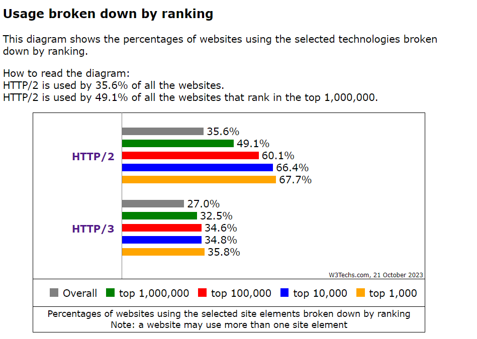

# HTTP/2

HTTP/2가 발표된 이후 2020년 주요 웹사이트 천만 개의 40%가 HTTP/2를 지원하고 있다.

2023년 10월 기준 약 27%정도는 HTTP/3를 사용하고 있고, 35.6%가 HTTP/2를 사용하고 있다.

HTTP/2의 주요 목표는 하나의 TCP연결상에서 멀티플렉싱 요청/응답 지연 시간을 줄이는 데 있으며, 요청 우선순위화, 서버 푸시, HTTP헤더 필드의 효율적인 압축 기능 등을 제공한다.

HTTP/2는 HTTP/1.1과 다른 점은 클라이언트와 서버 간의 데이터 포맷 방법과 전송 방법을 변경한 것이다.

HTTP/2의 필요성은 HTTP/1.1을 통해 확인할 수 있는데, HTTP/1.1에서는 웹페이지당 오직 하나의 TCP연결만 가능했다.

이는 브라우저 개발자 입장에서 모든 객체를 하나의 TCP로 보내면 HOL(Head of Line) 블로킹 문제가 발생할 수 있다는 사실을 발견하게 했다.

유튜브를 예시로 보면,

서버와 클라이언트 사이에 저속에서 중간 속도의 병목 링크가 있다고 했을 때,

하나의 TCP연결을이용해 비디오 클립은 병목 링크를 통과하는 데 오랜 시간이 걸리는 반면, 주변에 작은 객체들은 비디오 클립 뒤에서 계속 기다릴 수 밖에 없다.(아무래도 큐 형식이다 보니 앞에 객체들이 빠져나가야 하기 때문이다.)

이와 같은 현상을 HOL 블로킹라 한다.

HTTP/1.1에서는 병렬 TCP연결을 6개까지 열어서 HOL 블로킹 문제를 해결했다.(3장에서 이야기하는 TCP 혼잡 제어또한 병렬 TCP연결을 사용하여 브라우저에게 예상치 못한 혜택을 준다.)

HTTP/2의 주요 목표중 하나는 병렬 TCP연결의 수를 줄이거나 제거하는 데 있다.

이는 서버에서 열고 유지되는 소켓의 수를 줄이고 TCP혼잡 제어를 제어할 수 있게 하는데 있다.

그렇다면 병렬 TCP연결이 아닌 HTTP/2만의 HOL 블로킹을 막는 방법은 무엇일까?

### 프레이밍

HTTP/2에서는 각 메시지를 작은 프레임으로 나누고, 같은 TCP연결에서 요청과 응답 메시지를 인터리빙(사전적 의미: 끼워넣기)한다. (프레이밍)

이에 대한 예시로 보면

1. 유튜브에 비디오 클립 객체하나와 주변 객체 8개가 있다고 가정하고 비디오 클립은 1000프레임, 주변 객체는 각각 2프레임이 있다.
2. 먼저 비디오 클립1프레임을 보낸 후 주변 객체 각각 1프레임을 보낸다(지금까지 9프레임)
3. 바로 비디오 클립 2번째 프레임을 보낸후 주변 객체 각각 2번째 프레임을 보낸다(지금까지 18프레임)
4. 현재 주변 객체는 프레임을 다 보냈으므로 18프레임을 보낸후 주변 객체들을 전송되었다.
5. 남은 비디오 클립 프레임 전송한다.

이렇게 된다면 18프레임 후 주변 객체들이 나타나지만, 기존 방법이라면 1016프레임 후 주변 객체들이 나타난다.(이는 사용자에게 인지되는 지연시간을 줄일 수 있다.)

HTTP메시지를 독립된 프레임들로 쪼개고, 인터리빙하고 반대편 사이트에서 재조립하는 것이 HTTP/2의 가장 중요한 개선점이다.

- 프레이밍은 HTTP/2 프로토콜의 프레임으로 구현된 다른 프레이밍 서브 계층에 의해 이루어진다.
- 서버가 HTTP응답을 보낼때, 응답을 프레이밍 서브 계층에 의해 처리되며, 프레임들로 나눠진다.
- 응답의 헤더 필드는 하나의 프레임이 되며 메시지 본문은 하나의 프레임으로 쪼개진다.
- 응답 프레임들은 서버의 프레이밍 서브 계층에 의해 인터리빙된 후 하나의 지속적인 TCP연결 상에 전송된다.
- 프레임들이 클라이언트에 도착하면 프레이밍 서브 계층에서 처음 요청은 프레임으로 쪼개지고 인터리빙된다.
- 마찬가지로 클라이언트의 HTTP요청은 프레임으로 쪼개지고 인터리빙된다.

각 HTTP메시지를 프레임으로 쪼개는 것 말고도 프레이밍 서브 계층은 프레임을 바이너리 인코딩한다.

바이너리 프로토콜은 파싱하기 더 효율적이고, 작은 프레임을 갖고, 에러에 더 강하다.

### 메시지 우선순위화

개발자들로 하여금 요청들의 상대적 우선 순위를 조정할 수 있게 함으로써 애플리케이션의 성능을 최적화할 수 있게 해준다.

프레이밍 서브 계층은 같은 요청자로 향하는 메시지들을 병렬적인 데이터 스트림으로 쪼개준다.

클라이언트가 하나의 특정 서버로 동시에 여러개의 요청을 할 때, 각 메시지에 1에서 256사이의 가중치를 부여함으로써 요청에 우선 순위를 매길 수 있다.(높은 가중치일 수록 높은 우선순위이다.)

이런 가중치를 이용하여 서버는 가장 높은 우선순위의 요청을 위한 프레임을 먼저 보낼 수 있다.

클라이언트도 메시지의 ID를 지정함으로써 서로 다른 메시지들 간의 의존성을 나타낼 수 있다.

### 서버 푸싱

HTTP/2의 다른 특징은 클라이언트 요청에 대해 여러개의 응답을 보낼 수 있게 해주는 데 있다.

서버는 클라이언트 요청 없이도 추가적인 객체를 클라이언트에게 푸시하여 보낼 수 있다.

이는 HTML기반 페이지가 웹 페이지를 완벽하게 구동시킬 필요가 있는 객체들을 가리킬 수 있기에 가능하다.

서버는 HTTP요청을 기다리는 대신 HTML 페이지를 분석할 수 있다.

결론적으로 클라이언트의 요청이 보내지기 전에 서버에서 객체들을 보내줘서 해당 요청들을 기다리는 데 소요되는 추가 지연을 없앴다.

### HTTP/3

(3장)QUIC는 UDP 프로토콜 위에 위치하는 애플리케이션 계층에 구현되어 있다.

QUIC는 메시지 멀티플렉싱(인터리빙), 스트림별 흐름제어, 저지연 연결확립과 같은 HTTP에 의미 있는 여러 특징을 갖는다.

HTTP/2와 HTTP/3의 차이는 https://http3-explained.haxx.se/ko

- QUIC의 0-RTT 핸드쉐이크 덕에 HTTP/3에서는 이른 데이터 지원이 더 낫게 잘 동작한다. TCP Fast Open과 TLS는 더 적은 데이터를 보내지만, 종종 문제점에 직면한다.
- HTTP/3는 QUIC 덕에 TCP + TLS보다 훨씬 더 빠른 핸드쉐이크를 제공한다.
- HTTP/3에는 안전하지 않거나 암호화되지 않은 버전이 없다. 인터넷에서 드물기는 하지만 HTTP/2는 HTTPS 없이 구현하고 사용할 수 있다.
- HTTP/2가 ALPN 확장을 이용하여 즉시 TLS 핸드쉐이크 협상을 완료할 수 있는 반면 HTTP/3는 QUIC을 사용하므로 클라이언트에 이 사실을 알리기 위해 `Alt-Svc:` 헤더 응답이 먼저 있어야 한다.
