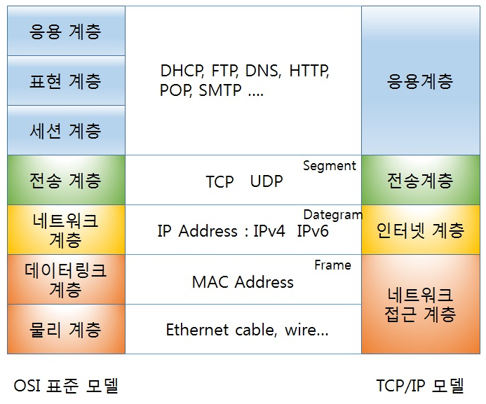

# 트랜스포트 계층 서비스 및 개요

트랜스포트 계층 프로토콜은 각기 다른 호스트에서 동작하는 애플리케이션 프로세스간의 논리적인 통신을 제공한다.

여기서 논리적 통신은 애플리케이션의 관점에서 프로세스들이 동작하는 호스트들이 직접 연결된 것처럼 보인다는 것을 의미한다.

위의 그림과 같이 트랜스포트 계층 프로토콜은 네트워크 라우터가 아닌 종단 시스템에서 구현된다.

송신 애플리케이션에서의 트랜스포트 계층으로부터 수신한 메시지를 트랜스포트 계층 세그먼트라고 알려진 트랜스포트 계층 패킷으로 변환한다. (세그먼트에 헤더 메시지를 붙이면 패킷이 된다.)

1. 애플리케이션에서 보내고자 하는 메시지를 매우 작게 분할하여
2. 각각의 조각에 트랜스포트 계층 헤더를 추가하면 세그먼트가 된다.
3. 그 후, 트랜스포트 계층은 송신 종단 시스템에 있는 네트워크 계층으로 세그먼트를 전달하고
4. 세그먼트가 네트워크 계층 패킷(데이터 그램)안에 캡슐화 되어 목적지로 전달된다.(네트워크 라우터는 오로지 데이터그램의 네트워크 계층 필드에 대해 동작한다. 그래서 캡슐화된 트랜스포트 계층 세그먼트의 필드를 검사하지 않는다.)
5. 수신 측에서 네트워크 계층은 데이터그램으로부터 트랜스포트 계층 세그먼트를 추출하고 트랜스포트 계층으로 세그먼트를 보낸다.
6. 트랜스포트 계층은 수신 애플리케이션에서 세그먼트 내부의 데이터를 이용할 수 있도록 수신된 세그먼트를 처리한다.

### 트랜스포트 계층과 네트워크 계층 사이의 관계

트랜스포트 계층은 프로토콜 스택에서 네트워크 계층 바로 상위에 존재한다.

트랜스포트 계층 프로토콜은 각기 다른 호스트에서 동작하는 `프로세스`들 사이의 논리적 통신을 제공하지만, 네트워크 계층 프로토콜은 `호스트`들 사이의 논리적 통신을 제공한다.

이 차이점을 집안과 비유해 보자면

- 두 집이 각각 동부와 서부에 있으며, 집안 마다 12명의 자식들이 있다.
- 이들 집안의 자식들은 사촌지간인데, 두 집안의 아이들은 편지쓰기를 좋아한다.
- 아이들은 사촌끼리 매주 편지를 쓰고, 편지들은 따로 봉투에 넣어서 일반 우편 서비스로 배달된다.
- 동부 집안은 빌, 서부 집안은 앤이 편지 수거와 분류를 담당하여 집안의 편지들을 수거해 집배원에게 우편물로 주고, 받은 우편물은 아이들에게 나눠준다.

이 예시처럼 우편 서비스는 두 집간의 논리적 통신을 제공한다.

반면에, 빌과 앤은 아이들 사이에서 논리적 통신을 제공한다.(빌과 앤은 단지 종단사이의 배달 프로세스의 한 일부이지만, 아이들입장에서는 빌과 앤이 우편서비스라는 것에 주목하자.)

이 비유를 실제 트랜스포트 계층과 네트워크 계층의 관련과 비교하자면 이렇게 된다.

- 애플리케이션 메시지: 봉투안의 편지
- 프로세스: 사촌 형제
- 호스트: 집
- 트랜스포트 계층 프로토콜: 빌과 앤
- 네트워크 계층 프로토콜: 우편 서비스(집배원 포함)

빌과 앤은 자기 집에서 그들의 일을 한다. 즉, 우편센터에서 어떤 일을 하지 않는 것이다.

마찬가지로, 트랜스포트 계층 프로토콜은 종단 시스템에 존재한다.

이 말은 트랜스포트 프로토콜이 애플리케이션 프로세스에서 네트워크 계층으로 혹은 그 반대로 메시지를 옮기는 역할만 할 뿐 메시지로 네트워크 계층 내부에서 어떻게 이동하는지 언급하지 않는다는 말이다.

맨 위의 사진처럼, 트랜스포트 계층이 애플리케이션 메시지에 추가한 어떤 정보도 인식하지 못하고 그 정보에 영향을 주지 않는다.

컴퓨터 네트워크 애플리케이션에서 서로 다른 서비스를 제공하도록 하는 개별 프로토콜을 갖는 다양한 트랜스포트 프로토콜을 만들 수 있다.

트랜스포트 계층이 제공할 수 있는 서비스는 하위 네트워크 계층 프로토콜의 서비스 모델에 의해 제약받는다.

예를 들어, 네트워크 계층 프로토콜이 호스트 사이에서 전송되는 트랜스포트 계층 세그먼트에 대한 지연 보장이나 대역폭 보장을 제공할 수 없다면, 트랜스포트 계층 프로토콜은 프로세스끼리 전송하는 메시지에 대한 지연 보장이나 대역폭 보장을 할 수 없다.

그럼에도 불구하고, 하위 네트워크 프로토콜이 상응하는 서비스를 제공하지 못할 때도, 특정 서비스는 트랜스포트 프로토콜에 의해 제공될 수 있다.

예를 들어, 하위 네트워크 프로토콜이 비신뢰적일때, 즉 네트워크 프로토콜이 패킷을 분실하거나 손상시키거나 복사본을 만들 때도, 애플리케이션에게 신뢰적인 데이터 전송 서비스를 제공할 수 있다.

다른 예시로 트랜스포트 프로토콜은 네트워크 계층이 트랜스포트 계층 세그먼트의 기밀성을 보장할 수 없을 때도 침입자가 애플리케이션 메시지를 읽지 못하도록 암호화를 사용할 수 있다.

### 인터넷 트랜스포트 계층의 개요

인터넷 애플리케이션 계층에게 두 가지 구별되는 트랜스포트 계층 프로토콜을 제공한다.(UDP와 TCP)

용어를 통일하기 위해 인터넷에서 트랜스포트 계층 패킷을 세그먼트로 일컫는다. 그러나 인터넷 문서에는 TCP에 대한 트랜스포트 계층 패킷을 세그먼트로 나타내면서 UDP에 대한 패킷을 데이터그램으로 표현하기도 한다.

또한 네트워크 계층 패킷에 대해 데이터그램이라 표현하므로, 책에서는 TCP와 UDP에 대한 트랜스포트 계층 패킷을 세그먼트, 네트워크 계층 패킷에 대해 데이터그램이라 표현한다.

인터넷의 네트워크 계층에 대한 용어 설명(간략히)

- 인터넷의 네트워크 계층 프로토콜은 인터넷 프로토콜(IP)이라는 이름을 가진다.
- IP서버스 모델은 호스트 간의 논리적 통신을 제공하는 최선형 전달 서비스다. 이 것은 IP가 통신하는 호스트들 간에 세그먼트를 전달하기 위해 최대한 노력하지만, 어떤 보장도 하지 않는다.
  특히, IP는 세그먼트의 전달을 보장하지 않고 세그먼트가 순서대로 전달되는 것을 보장하지 않는다. 그리고 IP는 세그먼트 내부 데이터의 무결성을 보장하지 않는다.
  그래서 IP를 비신뢰적인 서비스라고 불린다.
- 모든 호스트가 적어도 하나의 IP주소로 불리는 네트워크 계층 주소를 가진다.

UDP와 TCP의 서비스 모델을 보면, 가장 기본적인 기능은 종단 시스템 사이의 IP전달 서비스를 종단 시스템에서 동작하는 두 프로세스 간의 전달 서비스로 확장하는 것이다.

호스트 대 호스트 전달을 프로세스 대 프로세스 전달로 확장하는 것을 트랜스포트 계층 다중화와 역다중화라고 부른다.(3.2절)

UDP와 TCP는 헤더에 오류 검출 필드를 포함함으로써 무결성 검사를 제공한다.

위의 최소 두가지 트랜스포트 계층 서비스가 UDP에서 제공하는 유일한 두가지 서비스다.(프로세스 대 프로세스, 무결성 검사)(3.3절)

반면 TCP는 위의 두 기능과 함께 추가적으로 몇 가지 서비스를 제공한다.

1. 신뢰적인 데이터 전송

   흐름 제어, 순서 번호, 확인 응답, 타이머를 사용함으로써 TCP는 송신하는 프로세스로부터 수신하는 프로세스에게 데이터가 순서대로 정확하게 전달되도록 확실하게 한다.

2. 혼잡 제어

   인터넷에 대한 통상적인 서비스처럼 야기한 애플리케이션에게 제공되는 특정 서비스가 아니라, 전체를 위한 일반 서비스다.

   대략적으로 말하자면 한 TCP연결이 과도한 양의 트래픽으로 모든 통신하는 호스트들 사이의 스위치와 링크를 혼잡하게 하는 것을 방지하는 것이 TCP 혼잡 제어다.

   TCP는 혼잡한 네트워크 링크에서 각 TCP연결이 링크의 대역폭을 공평하게 공유하여 통과하도록 해준다.(이것은 송신측의 TCP가 네트워크에 보낼 수 있는 트래픽을 조절함으로써 수행된다.)

   하지만 UDP는 이것을 제공하지 않아 최대한 만족하는 속도로 전송할 수 있다.

참고로 위의 두가지 서비스는 복잡하므로 앞에서 따로 절로 나올 것이다.
