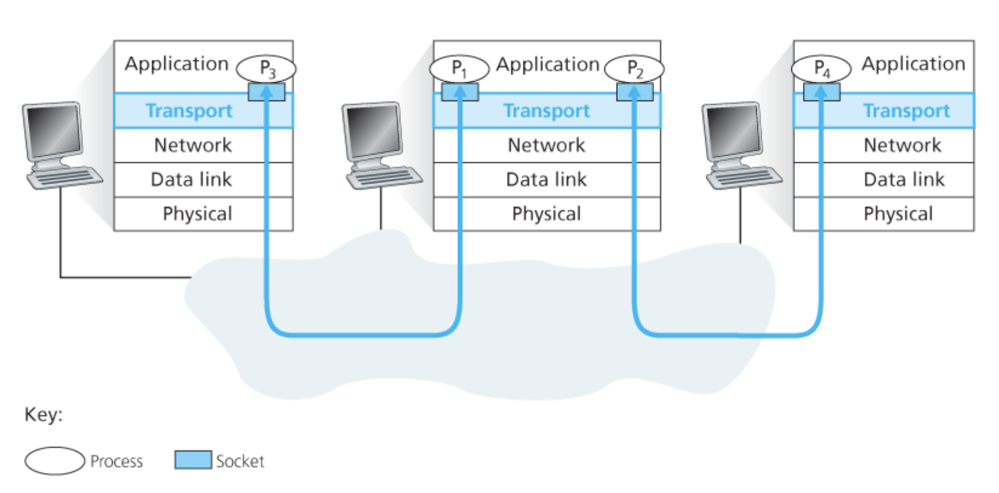
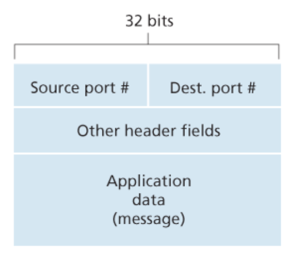
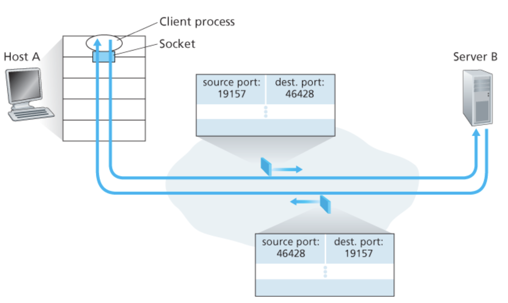
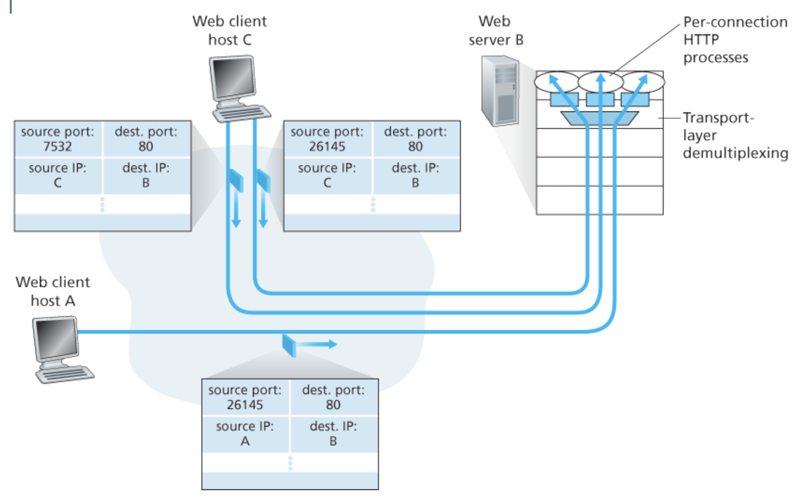
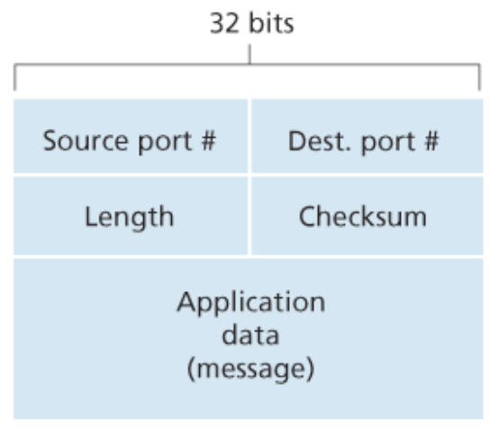

# Chapter 3 트랜스포트 계층

## 트랜스포트 계층 서비스 및 개요

### 트랜스포트 계층과 네트워크 계층 사이의 관계


**트랜스포트 계층 프로토콜**은 각기 다른 호스트에서 동작하는 **프로세스들 사이의 논리적 통신을 제공**하지만, **네트워크 계층 프로토콜**은 **호스트들 사이의 논리적 통신을 제공**한다.

> ℹ️ 논리적 통신이란?
>
> 논리적 통신은 **프로세스들 혹은 호스트들이** **직접 연결된 것처럼 보인다는 것을 의미**한다.

트랜스포트 프로토콜은 애플리케이션 프로세스에서 네트워크 경계(즉, 네트워크 계층)까지 메시지를 운반하며, 또한 반대 방향으로 네트워크 계층에서 애플리케이션 프로세스로 메시지를 운반한다. 그러나 트랜스포트 프로토콜은 메시지가 네트워크 계층 내부에서 어떻게 이동하는지는 언급하지 않는다.

### 인터넷 네트워크 계층의 개요

인터넷의 네트워크 계층 프로토콜은 **인터넷 프로토콜(Internet Protocol, IP)**이라는 이름을 갖는다. IP 서비스 모델은 **최선형 전달 서비스**(best-effort delivery service)다. 이것은 IP가 통신하는 호스들간에 세그먼트를 전달하기 위해 최대한 노력하지만, **어떤 보장도 하지 않는다**는 것을 의미한다.

* IP는 세그먼트의 전달을 보장하지 않고 세그먼트가 순서대로 전달되는 것을 보장하지 않는다.
* IP는 세그먼트 내부 데이터의 무결성(integrity)을 보장하지 않는다.

이러한 이유로 IP를 **비신뢰적인 서비스**(unreliable service)라고 부른다. 또한 모든 호스트가 적어도 하나의 IP 주소로 불리는 네트워크 계층 주소를 갖는다고 말해둔다.

### UDP와 TCP 서비스 모델

UDP와 TCP의 가장 기본적인 기능은 종단 시스템 사이의 IP 전달 서비스를 종단 시스템에서 동작하는 두 프로세스 간의 전달 서비스로 확장하는 것이다. **'호스트 대 호스트 전달'을 '프로세스 대 프로세스 전달'로 확장하는 것**을 **트랜스포트 계층 다중화**(transport-layer multiplexing)와 **역다중화**(demultiplexing)라고 부른다.

**UDP와 TCP는** 헤더에 오류 검출 필드를 포함함으로써 **무결성 검사**를 제공한다. 이러한 최소한의 두 가지 트랜스포트 계층 서비스(프로세스 대 프로세스 데이터 전달과 오류 검출)가 UDP가 제공하는 유일한 두 가지 서비스다. 여기서 UDP는 IP와 마찬가지로 비신뢰적인 서비스다.

**TCP는** **신뢰적인 데이터 전송**(reliable data transfer)을 제공한다. 흐름 제어, 순서 번호, 확인 응답, 타이머를 사용함으로써 TCP는 송신하는 프로세스로부터 수신하는 프로세스에게 데이터가 순서대로 정확하게 전달되도록 확실하게 한다. 또한 TCP는 **혼잡 제어**(congestion control)를 사용한다. 혼잡 제어는 인터넷에 대한 통상적인 서비스처럼 야기한 애플리케이션에게 제공되는 특정 서비스가 아니라, 전체를 위한 일반 서비스다.


## 다중화와 역다중화

컴퓨터의 트랜스포트 계층이 하위의 네트워크 계층으로부터 데이터를 수신할 때, 트랜스포트 계층은 여러 개의 프로세스 중 하나에게 수신한 데이터를 전달할 필요가 있다.

각 프로세스는 **소켓**(socket)을 통해 네트워크에서 프로세스로 데이터를 전달하거나 전달받는다. 각각의 소켓은 **하나의 유일한 식별자**를 갖으며 이 **식별자의 포맷은** 소켓이 **UDP 소켓인지 또는 TCP 소켓인지에 따라 달라진다**.

트랜스포트 계층 세그먼트의 데이터를 올바른 소켓으로 전달하는 작업을 **역다중화**(demultiplexing)라고 한다. 출발지 호스트에서 소켓으로부터 데이터를 모으고, 이에 대한 세그먼트를 생성하기 위해 각 데이터에 헤더 정보(나중에 역다중화에 사용된다)로 캡슐화하고, 그 세그먼트들을 네트워크 계층으로 전달하는 작업을 **다중화**(multiplexing)라고 한다.



트랜스포트 계층 다중화에는 다음 두 가지 요구사항이 있다.

1. 소켓은 유일한 식별자를 갖는다.
2. 각 세그먼트는 세그먼트가 전달될 적절한 소켓을 가리키는 특별한 필드(출발지 포트 번호, 목적지 포트 번호 필드)를 갖는다.



### 비연결형(UDP) 다중화와 역다중화

#### UDP 소켓 생성과 포트번호 할당

호스트에서 수행되는 파이썬 프로그램은 다음처럼 한 줄의 명령으로 UDP 소켓을 생성할 수 있다.

```python
clientSocket = socket(AF_INET, SOCK_DGRAM)
```

이 방법으로 UDP 소켓이 생성될 때, 트랜스포트 계층은 포트 번호를 현재 호스트에서 UDP 포트로 사용하지 않는 `1024~65535` 사이의 포트 번호를 소켓에게 자동으로 할당한다. 다른 방법으로는 우리가 소켓을 생성한 뒤에, 소켓 `bind()` 방식을 사용하여 특정 포트 번호를 UDP 소켓에 할당하기 위해 파이썬 프로그램에 한 줄을 추가할 수 있다.

```python
clientSocket.bind(('', 19157))
```

#### UDP에서의 다중화와 역다중화 예시

UDP 소켓 `19157` 을 가진 호스트 A의 프로세스가 호스트 B의 UDP 소켓 `46428` 을 가진 프로세스에게 애플리케이션 데이터 전송을 원한다고 가정하자.

1. 호스트 A의 트랜스포트 계층은 데이터, 출발지 포트번호(19157), 목적지 포트 번호(46428), 그리고 두 개의 다른 값을 포함하는 트랜스포트 계층 세그먼트를 생성한다. (다중화)
2. 트랜스포트 계층은 만들어진 세그먼트를 네트워크 계층으로 전달한다.
3. 네트워크 계층은 세그먼트를 IP 데이터그램으로 캡슐화하고 최선형 전달 서비스로 세그먼트를 수신 호스트로 전달한다.
4. 이제 이 세그먼트가 수신 호스트 B에 도착하면, 수신 호스트는 세그먼트 안의 목적지 포트 번호(`46428`)를 검사하고 그 세그먼트를 포트 `46428` 로 식별되는 소켓에 전달한다. (역다중화)



위 예시에서 **UDP 소켓은 목적지 IP 주소와 목적지 포트 번호로 식별된다**는 것을 이해해야 한다. 만약 2개의 UDP 세그먼트가 출발지 IP 주소와 출발지 포트 번호가 모두 다르거나 출발지 IP 주소와 출발지 포트번호 중 어느 하나가 다를지라도, 같은 목적지 IP 주소와 목적지 포트 번호를 가지면 2개의 세그먼트는 같은 목적지 소켓을 통해 같은 프로세스로 향할 것이다.

### 연결지향형(TCP) 다중화와 역다중화

TCP 소켓과 UDP 소켓의 다른 점은 **TCP 소켓은 4개 요소의 집합(four-tuple), 즉 `(출발지 IP주소, 출발지 포트 번호, 목적지 IP 주소, 목적지 포트 번호)` 에 의해 식별된다**는 것이다. 특히, UDP와는 다르게 다른 출발지 주소 또는 다른 출발지 포트 번호를 가지고 도착하는 2개의 TCP 세그먼트는 2개의 다른 소켓으로 향하게 된다.



### 웹 서버와 TCP

웹 서버는 각각의 연결에 따라서 새로운 프로세스를 만드는데, 이들 프로세스는 각자 연결 소켓을 가지며, 이 연결 소켓을 통해 HTTP 요청을 수신하고, HTTP 응답을 전송한다. 그러나 연결 소켓과 프로세스 사이에 항상 일대일 대응이 이루어지는 것은 아니다. 실제로, 오늘날의 많은 고성능 웹 서버는 하나의 프로세스만 사용한다. 그러면서, 각각의 새로운 클라이언트 연결을 위해 새로운 연결 소켓과 함께 새로운 스레드를 생성한다.

만약 클라이언트와 서버가 지속적인(persistent) HTTP를 사용한다면, 지속적인 연결의 존속 기간에 클라이언트와 서버는 같은 서버 소켓을 통해  HTTP 메시지를 교환할 것이다. 그러나 만약 클라이언트와 서버가 비지속적인(non-persistent) HTTP를 사용한다면 모든 요청/응답마다 새로운 TCP 연결이 생성되고 종료될 것이다. 이 빈번하게 발생하는 소켓 생성과 종료는 바쁘게 일하는 웹 서버 성능에 심한 부담을 줄 수도 있다.

## 비연결형 트랜스포트: UDP

### UDP 세그먼트 구조

**UDP 헤더**는 2바이트씩 구성된 단 4개의 필드만을 갖는다.

* **출발지 포트 번호**, **목적지 포트 번호** : 목적지 호스트가 목적지 종단 시스템에서 동작하는(역다중화 기능을 수행하는) 정확한 프로세스에게 애플리케이션 데이터를 넘기게 해준다.
* **체크섬** : 세그먼트에 오류가 발생했는지를 검사하기 위해 수신 호스트가 사용한다.
* **길이** : 헤더를 포함하는 UDP 세그먼트의 길이(바이트 단위)를 나타낸다.

**애플리케이션 데이터**는 UDP 데이터그램의 데이터 필드에 위치한다.



### UDP 체크섬

체크섬은 세그먼트가 출발지로부터 목적지로 이동했을 때(예: 링크의 잡음에 의해 또는 라우터에서 저장되는 동안), UDP 세그먼트 안의 비트에 대한 변경사항이 있는지 검사하는 것이다. 송신자 측에서 UDP는 세그먼트 안에 있는 모든 16비트 워드의 합산에 대한 다시 1의 보수를 수행하며, 합산 과정에서 발생하는 오버플로는 윤회식 자리올림(wrap around)을 한다. 이 결과값이 UDP 세그먼트 체크섬 필드에 삽입된다.

#### UDP 세그먼트 체크섬 예시

다음과 같은 3개의 16비트 워드가 있다고 하자.

```
01100110 01100000
01010101 01010101
10001111 00001100
```

이러한 16비트 워드에서 처음 2개의 워드 합은 다음과 같다.

```
01100110 01100000
01010101 01010101
-----------------
10111011 10110101
```

앞 계산의 합에 세 번째 워드를 더하면 다음과 같은 결과가 나온다.

```
10111011 10110101
10001111 00001100
-----------------
01001010 11000010
```

마지막 합을 오버플로(자리 넘침)가 있고 이를 윤회식 자리올림을 했음에 유의하자. 1의 보수는 모든 0을 1로 변환하고 1을 0으로 변환하면 구할 수 있다. 그래서 합 `01001010 11000010` 의 1의 보수는 `10110101 00111101` 이고, 이것이 체크섬이 된다. 수신자에서는 체크섬을 포함한 4개의 모든 16비트 워드들이 더해진다. 만약 패킷에 어떤 오류도 없다면, 수신자에서의 합은 `11111111 11111111` 이 될 것이다. 만약 비트 중에 하나라도 0이 있다면 패킷에 오류가 발생했음을 알 수 있다.

#### UDP 체크섬을 제공하는 이유

많은 링크 계층 프로토콜이 오류 검사를 제공하는데, 왜 UDP가 체크섬을 제공하는지 궁금할 것이다. 그 이유는 **출발지와 목적지 사이의 모든 링크가 오류 검사를 제공한다는 보장이 없기 때문이다**. 이러한 이유로 UDP는 오류 검사를 제공하지만, 오류를 회복하기 위한 어떤 일도 하지 않는다. 일부 UDP 구현에서는 손상된 세그먼트를 그냥 버리기도 하고, 다른 구현에서는 경고과 함께 손상된 세그먼트를 애플리케이션에게 넘겨주기도 한다.

