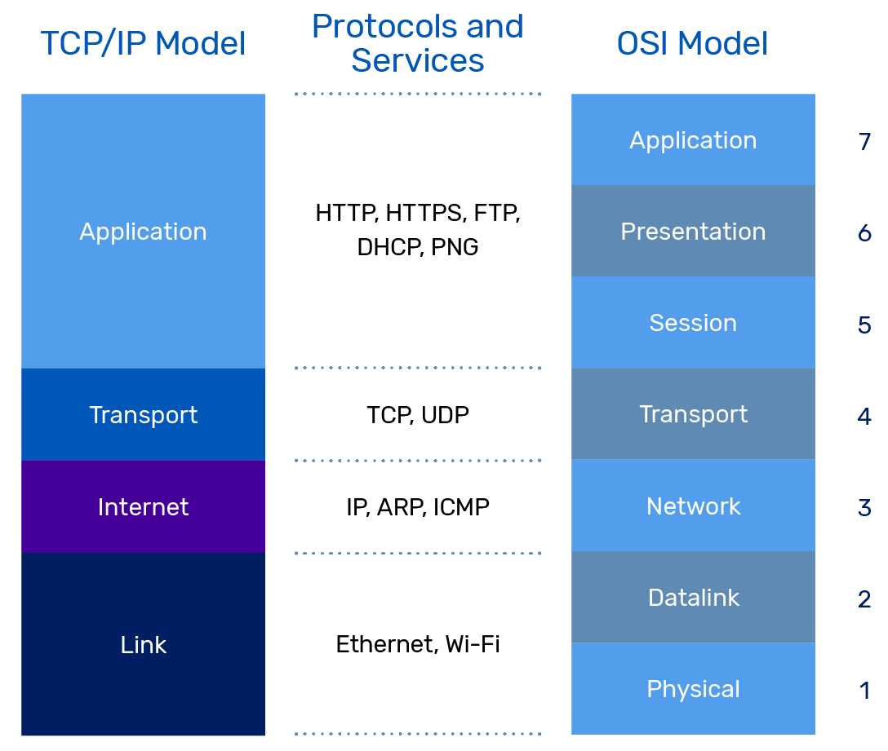
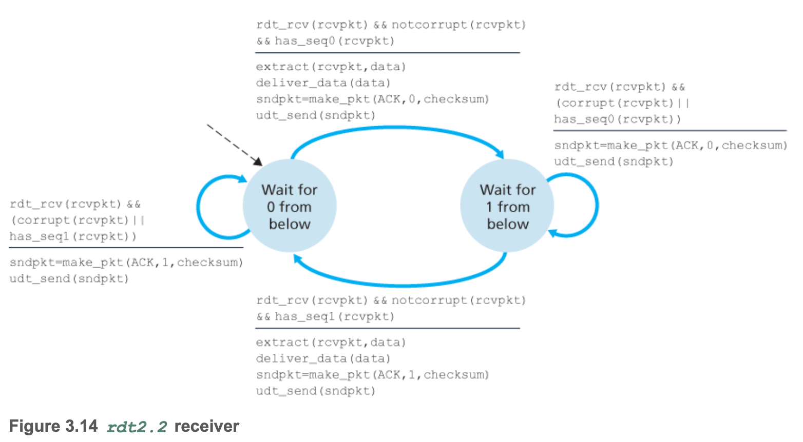
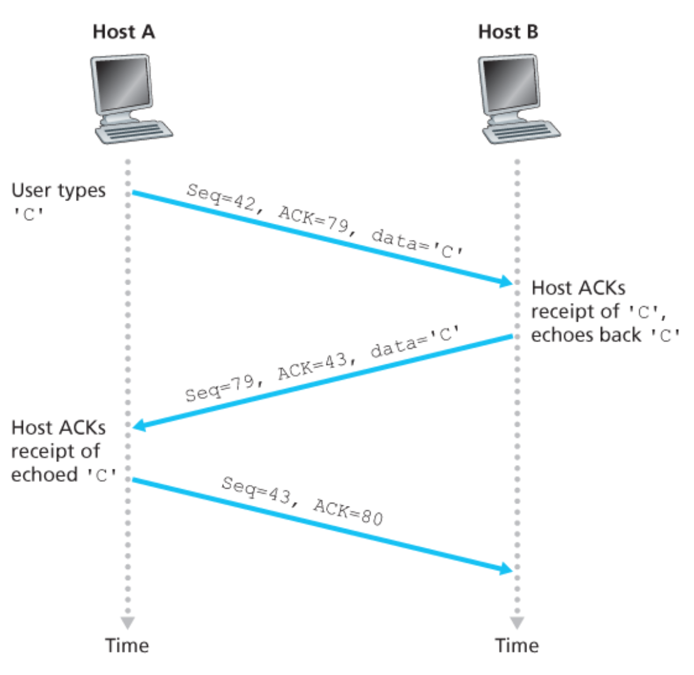
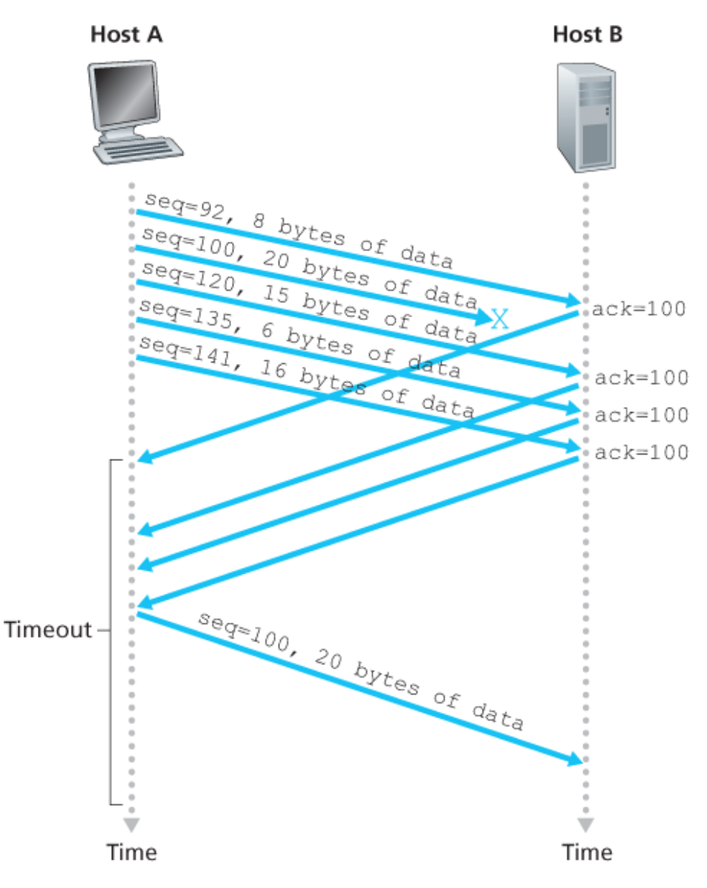
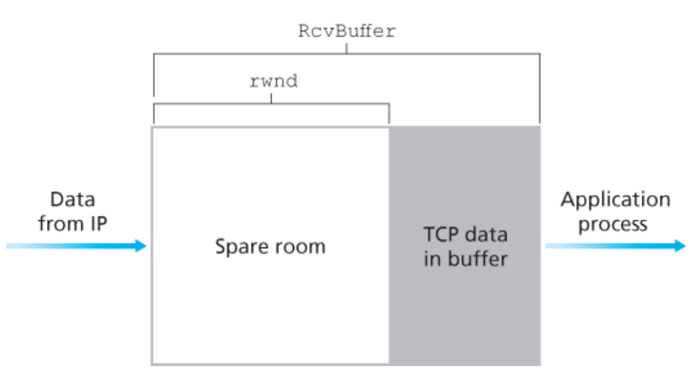

# Chapter 3 트랜스포트 계층

## 트랜스포트 계층 서비스 및 개요

### 트랜스포트 계층과 네트워크 계층 사이의 관계



**트랜스포트 계층 프로토콜**은 각기 다른 호스트에서 동작하는 **프로세스들 사이의 논리적 통신을 제공**하지만, **네트워크 계층 프로토콜**은 **호스트들 사이의 논리적 통신을 제공**한다.

> ℹ️ 논리적 통신이란?
>
> 논리적 통신은 **프로세스들 혹은 호스트들이** **직접 연결된 것처럼 보인다는 것을 의미**한다.

트랜스포트 프로토콜은 애플리케이션 프로세스에서 네트워크 경계(즉, 네트워크 계층)까지 메시지를 운반하며, 또한 반대 방향으로 네트워크 계층에서 애플리케이션 프로세스로 메시지를 운반한다. 그러나 트랜스포트 프로토콜은 메시지가 네트워크 계층 내부에서 어떻게 이동하는지는 언급하지 않는다.

### 인터넷 네트워크 계층의 개요

인터넷의 네트워크 계층 프로토콜은 **인터넷 프로토콜(Internet Protocol, IP)**이라는 이름을 갖는다. IP 서비스 모델은 **최선형 전달 서비스**(best-effort delivery service)다. 이것은 IP가 통신하는 호스들간에 세그먼트를 전달하기 위해 최대한 노력하지만, **어떤 보장도 하지 않는다**는 것을 의미한다.

* IP는 세그먼트의 전달을 보장하지 않고 세그먼트가 순서대로 전달되는 것을 보장하지 않는다.
* IP는 세그먼트 내부 데이터의 무결성(integrity)을 보장하지 않는다.

이러한 이유로 IP를 **비신뢰적인 서비스**(unreliable service)라고 부른다. 또한 모든 호스트가 적어도 하나의 IP 주소로 불리는 네트워크 계층 주소를 갖는다고 말해둔다.

### UDP와 TCP 서비스 모델

UDP와 TCP의 가장 기본적인 기능은 종단 시스템 사이의 IP 전달 서비스를 종단 시스템에서 동작하는 두 프로세스 간의 전달 서비스로 확장하는 것이다. **'호스트 대 호스트 전달'을 '프로세스 대 프로세스 전달'로 확장하는 것**을 **트랜스포트 계층 다중화**(transport-layer multiplexing)와 **역다중화**(demultiplexing)라고 부른다.

**UDP와 TCP는** 헤더에 오류 검출 필드를 포함함으로써 **무결성 검사**를 제공한다. 이러한 최소한의 두 가지 트랜스포트 계층 서비스(프로세스 대 프로세스 데이터 전달과 오류 검출)가 UDP가 제공하는 유일한 두 가지 서비스다. 여기서 UDP는 IP와 마찬가지로 비신뢰적인 서비스다.

**TCP는** **신뢰적인 데이터 전송**(reliable data transfer)을 제공한다. 흐름 제어, 순서 번호, 확인 응답, 타이머를 사용함으로써 TCP는 송신하는 프로세스로부터 수신하는 프로세스에게 데이터가 순서대로 정확하게 전달되도록 확실하게 한다. 또한 TCP는 **혼잡 제어**(congestion control)를 사용한다. 혼잡 제어는 인터넷에 대한 통상적인 서비스처럼 야기한 애플리케이션에게 제공되는 특정 서비스가 아니라, 전체를 위한 일반 서비스다.


## 다중화와 역다중화

컴퓨터의 트랜스포트 계층이 하위의 네트워크 계층으로부터 데이터를 수신할 때, 트랜스포트 계층은 여러 개의 프로세스 중 하나에게 수신한 데이터를 전달할 필요가 있다.

각 프로세스는 **소켓**(socket)을 통해 네트워크에서 프로세스로 데이터를 전달하거나 전달받는다. 각각의 소켓은 **하나의 유일한 식별자**를 갖으며 이 **식별자의 포맷은** 소켓이 **UDP 소켓인지 또는 TCP 소켓인지에 따라 달라진다**.

트랜스포트 계층 세그먼트의 데이터를 올바른 소켓으로 전달하는 작업을 **역다중화**(demultiplexing)라고 한다. 출발지 호스트에서 소켓으로부터 데이터를 모으고, 이에 대한 세그먼트를 생성하기 위해 각 데이터에 헤더 정보(나중에 역다중화에 사용된다)로 캡슐화하고, 그 세그먼트들을 네트워크 계층으로 전달하는 작업을 **다중화**(multiplexing)라고 한다.


트랜스포트 계층 다중화에는 다음 두 가지 요구사항이 있다.

1. 소켓은 유일한 식별자를 갖는다.
2. 각 세그먼트는 세그먼트가 전달될 적절한 소켓을 가리키는 특별한 필드(출발지 포트 번호, 목적지 포트 번호 필드)를 갖는다.


### 비연결형(UDP) 다중화와 역다중화

#### UDP 소켓 생성과 포트번호 할당

호스트에서 수행되는 파이썬 프로그램은 다음처럼 한 줄의 명령으로 UDP 소켓을 생성할 수 있다.

```python
clientSocket = socket(AF_INET, SOCK_DGRAM)
```

이 방법으로 UDP 소켓이 생성될 때, 트랜스포트 계층은 포트 번호를 현재 호스트에서 UDP 포트로 사용하지 않는 `1024~65535` 사이의 포트 번호를 소켓에게 자동으로 할당한다. 다른 방법으로는 우리가 소켓을 생성한 뒤에, 소켓 `bind()` 방식을 사용하여 특정 포트 번호를 UDP 소켓에 할당하기 위해 파이썬 프로그램에 한 줄을 추가할 수 있다.

```python
clientSocket.bind(('', 19157))
```

#### UDP에서의 다중화와 역다중화 예시

UDP 소켓 `19157` 을 가진 호스트 A의 프로세스가 호스트 B의 UDP 소켓 `46428` 을 가진 프로세스에게 애플리케이션 데이터 전송을 원한다고 가정하자.

1. 호스트 A의 트랜스포트 계층은 데이터, 출발지 포트번호(19157), 목적지 포트 번호(46428), 그리고 두 개의 다른 값을 포함하는 트랜스포트 계층 세그먼트를 생성한다. (다중화)
2. 트랜스포트 계층은 만들어진 세그먼트를 네트워크 계층으로 전달한다.
3. 네트워크 계층은 세그먼트를 IP 데이터그램으로 캡슐화하고 최선형 전달 서비스로 세그먼트를 수신 호스트로 전달한다.
4. 이제 이 세그먼트가 수신 호스트 B에 도착하면, 수신 호스트는 세그먼트 안의 목적지 포트 번호(`46428`)를 검사하고 그 세그먼트를 포트 `46428` 로 식별되는 소켓에 전달한다. (역다중화)


위 예시에서 **UDP 소켓은 목적지 IP 주소와 목적지 포트 번호로 식별된다**는 것을 이해해야 한다. 만약 2개의 UDP 세그먼트가 출발지 IP 주소와 출발지 포트 번호가 모두 다르거나 출발지 IP 주소와 출발지 포트번호 중 어느 하나가 다를지라도, 같은 목적지 IP 주소와 목적지 포트 번호를 가지면 2개의 세그먼트는 같은 목적지 소켓을 통해 같은 프로세스로 향할 것이다.

### 연결지향형(TCP) 다중화와 역다중화

TCP 소켓과 UDP 소켓의 다른 점은 **TCP 소켓은 4개 요소의 집합(four-tuple), 즉 `(출발지 IP주소, 출발지 포트 번호, 목적지 IP 주소, 목적지 포트 번호)` 에 의해 식별된다**는 것이다. 특히, UDP와는 다르게 다른 출발지 주소 또는 다른 출발지 포트 번호를 가지고 도착하는 2개의 TCP 세그먼트는 2개의 다른 소켓으로 향하게 된다.


### 웹 서버와 TCP

웹 서버는 각각의 연결에 따라서 새로운 프로세스를 만드는데, 이들 프로세스는 각자 연결 소켓을 가지며, 이 연결 소켓을 통해 HTTP 요청을 수신하고, HTTP 응답을 전송한다. 그러나 연결 소켓과 프로세스 사이에 항상 일대일 대응이 이루어지는 것은 아니다. 실제로, 오늘날의 많은 고성능 웹 서버는 하나의 프로세스만 사용한다. 그러면서, 각각의 새로운 클라이언트 연결을 위해 새로운 연결 소켓과 함께 새로운 스레드를 생성한다.

만약 클라이언트와 서버가 지속적인(persistent) HTTP를 사용한다면, 지속적인 연결의 존속 기간에 클라이언트와 서버는 같은 서버 소켓을 통해  HTTP 메시지를 교환할 것이다. 그러나 만약 클라이언트와 서버가 비지속적인(non-persistent) HTTP를 사용한다면 모든 요청/응답마다 새로운 TCP 연결이 생성되고 종료될 것이다. 이 빈번하게 발생하는 소켓 생성과 종료는 바쁘게 일하는 웹 서버 성능에 심한 부담을 줄 수도 있다.

## 비연결형 트랜스포트: UDP

### UDP 세그먼트 구조

**UDP 헤더**는 2바이트씩 구성된 단 4개의 필드만을 갖는다.

* **출발지 포트 번호**, **목적지 포트 번호** : 목적지 호스트가 목적지 종단 시스템에서 동작하는(역다중화 기능을 수행하는) 정확한 프로세스에게 애플리케이션 데이터를 넘기게 해준다.
* **체크섬** : 세그먼트에 오류가 발생했는지를 검사하기 위해 수신 호스트가 사용한다.
* **길이** : 헤더를 포함하는 UDP 세그먼트의 길이(바이트 단위)를 나타낸다.

**애플리케이션 데이터**는 UDP 데이터그램의 데이터 필드에 위치한다.


### UDP 체크섬

체크섬은 세그먼트가 출발지로부터 목적지로 이동했을 때(예: 링크의 잡음에 의해 또는 라우터에서 저장되는 동안), UDP 세그먼트 안의 비트에 대한 변경사항이 있는지 검사하는 것이다. 송신자 측에서 UDP는 세그먼트 안에 있는 모든 16비트 워드의 합산에 대한 다시 1의 보수를 수행하며, 합산 과정에서 발생하는 오버플로는 윤회식 자리올림(wrap around)을 한다. 이 결과값이 UDP 세그먼트 체크섬 필드에 삽입된다.

#### UDP 세그먼트 체크섬 예시

다음과 같은 3개의 16비트 워드가 있다고 하자.

```
01100110 01100000
01010101 01010101
10001111 00001100
```

이러한 16비트 워드에서 처음 2개의 워드 합은 다음과 같다.

```
01100110 01100000
01010101 01010101
-----------------
10111011 10110101
```

앞 계산의 합에 세 번째 워드를 더하면 다음과 같은 결과가 나온다.

```
10111011 10110101
10001111 00001100
-----------------
01001010 11000010
```

마지막 합을 오버플로(자리 넘침)가 있고 이를 윤회식 자리올림을 했음에 유의하자. 1의 보수는 모든 0을 1로 변환하고 1을 0으로 변환하면 구할 수 있다. 그래서 합 `01001010 11000010` 의 1의 보수는 `10110101 00111101` 이고, 이것이 체크섬이 된다. 수신자에서는 체크섬을 포함한 4개의 모든 16비트 워드들이 더해진다. 만약 패킷에 어떤 오류도 없다면, 수신자에서의 합은 `11111111 11111111` 이 될 것이다. 만약 비트 중에 하나라도 0이 있다면 패킷에 오류가 발생했음을 알 수 있다.

#### UDP 체크섬을 제공하는 이유

많은 링크 계층 프로토콜이 오류 검사를 제공하는데, 왜 UDP가 체크섬을 제공하는지 궁금할 것이다. 그 이유는 **출발지와 목적지 사이의 모든 링크가 오류 검사를 제공한다는 보장이 없기 때문이다**. 이러한 이유로 UDP는 오류 검사를 제공하지만, 오류를 회복하기 위한 어떤 일도 하지 않는다. 일부 UDP 구현에서는 손상된 세그먼트를 그냥 버리기도 하고, 다른 구현에서는 경고과 함께 손상된 세그먼트를 애플리케이션에게 넘겨주기도 한다.


## 신뢰적인 데이터 전송의 원리

**신뢰적인 데이터 전송 프로토콜**(reliable data transfer protocol)이란 전송된 데이터가 손상(0에서 1로 또는 1에서 0으로 바뀜)되거나 손실되지 않고 모든 데이터는 전송된 순서 그대로 전달되는 것이다.


### 신뢰적인 데이터 전송 프로토콜의 구축

#### 유한 상태머신

유한상태 머신(finite-state machine, FSM)은 **컴퓨터 프로그램과 전자 논리 회로를 설계하는 데에 쓰이는 수학적 모델**이다. 유한상태 머신은 한 번에 오로지 하나의 상태만을 가지게 되며, 현재 상태란 임의의 주어진 시간의 상태를 칭한다. 이러한 기계는 어떠한 사건에 의해 한 상태에서 다른 상태로 변화할 수 있으며, 이를 전이라 한다.

* **점선 화살표** : 초기 상태
* **화살표** : 한 상태로부터 다른 상태로의 전이를 나타낸다.
* **가로선 위** : 전이를 일으키는 이벤트를 나타낸다.
* **가로선 아래** : 이벤트에 의해 발생한 행동을 나타낸다.
* **기호 Λ** : 이벤트 발생 시 어떠한 행동도 취해지지 않거나 어떠한 이벤트 발생 없이 행동이 취해질 때, 동작이나 이벤트가 없음을 명확하게 표시하기 위해 사용한다.

#### rdt1.0

rdt1.0은 **완벽하게 신뢰적인 채널상**에서의 신뢰적인 데이터 전송 모델을 나타낸다.


#### rdt2.0

rdt2.0은 **비트 오류가 있는 채널상**에서의 신뢰적 데이터 전송 모델이다. 이러한 비트 오류는 패킷이 전송 또는 전파되거나 버퍼링될 때 네트워크의 물리적 구성요소에서 일반적으로 발생한다.

> 단, rdt2.0을 고려할 때는 패킷의 비트가 손상된다고 하더라도 전송된 모든 패킷이 송신된 순서대로 수신된다고 가정한다.

이러한 비트 오류를 처리하기 전에 먼저 전화 통화를 할 때 긴 메시지를 어떻게 받아쓸 수 있는지 고려해보자. 일반적으로 메시지 수신자는 각각의 문장을 듣고 이해하고 기록한 후에 "OK"라고 말할 수 있을 것이다. 만일 메시지 수신자가 문장을 올바로 듣지 못했다면 반복하라고 요청한다.

이러한 메시지 받아쓰기 프로토콜은 긍정 확인응답과 부정 확인응답을 둘 다 사용한다. 이러한 제어 메시지는 정확하게 수신되었는지 또는 잘못 수신되어 반복이 필요한지를 수신자가 송신자에게 알려줄 수 있게 한다. 컴퓨터 네트워크 설정에서 그러한 재전송을 기반으로 하는 신뢰적인 데이터 전송 프로토콜은 **자동 재전송 요구(Automatic Repeat reQuest, ARQ) 프로토콜**로 알려져 있다.

비트 오류를 처리하기 위해 기본적으로 다음과 같은 세 가지 부가 프로토콜 기능이 ARQ 프로토콜에 요구된다.

* **오류 검출** : 비트 오류가 발생했을 때 수신자가 검출할 수 있는 기능이 필요하다. UDP는 이러한 목적을 위해 인터넷 체크섬 필드를 사용한다.
* **수신자 피드백** : 송신자가 수신자의 상태를 알기 위한 유일한 방법은 수신자가 송신자에게 피드백을 제공하는 것이다. 긍정 확인응답(ACK)과 부정 확인응답(NAK)은 그러한 피드백의 예다. 이러한 패킷은 단지 한 비트 길이면 된다. 0 값은 NAK을 가리키고 1 값은 ACK을 가리킬 수 있다.
* **재전송** : 수신자에서 오류를 가지고 수신된 패킷은 송신자에 의해 재전송된다.


rdt2.0과 같은 프로토콜은 **전송 후 대기(stop-and-wait)** 프로토콜로 알려져 있는데, 송신자가 ACK 또는 NAK를 기다리는 상태에 있을 때, 상위 계층으로부터 더 이상의 데이터를 전달받을 수 없기 때문이다. 이는 송신자가 현재의 패킷을 정확하게 수신했음을 확신하기 전까지 새로운 데이터를 전달하지 않을 것이다.

#### rdt2.1

rdt2.1은 **비트 오류가 있는 채널상**에서 동작하고 **ACK와 NAK 패킷 손상을 고려**한 신뢰적 데이터 전송 모델이다.

* ACK와 NAK 패킷 손상에 대한 간단한 해결책은 송신자가 데이터 패킷에 **순서 번호(sequence number)**를 삽입하여 보내고, 수신자는 수신된 패킷이 재전송인지 새로운 데이터 패킷인지를 순서 번호를 확인하여 파악한다. 여기서 rdt2.1은 전송 후 대기 프로토콜이기 때문에 한 비트 순서 번호이면 송신자가 패킷을 재전송한 것인지 새로운 패킷을 전송한 것인지를 알 수 있다.
* 일반적으로 패킷을 손실하지 않는 채널을 가정하고 있으므로, ACK와 NAK 패킷 자체는 확인 중인 패킷의 순서 번호를 나타낼 필요는 없다. 송신자는 수신된 ACK와 NAK 패킷이 가장 최근에 전송된 데이터 패킷에 대한 응답으로 발생한 것임을 안다.


프로토콜 rdt2.1은 수신자로부터 송신자까지의 긍정 확인응답과 부정 확인응답을 모두 포함한다. 순서가 바뀐 패킷이 수신되면, 수신자는 이미 전에 수신한 패킷에 대한 긍정 확인응답을 전송한다. 손상된 패킷이 수신되면, 수신자는 부정 확인응답을 전송한다.

#### rdt2.2

rdt2.2에서는 rdt2.1에서의 NAK 메세지가 존재하지 않는다. rdt2.2는 확인 응답 패킷에 순서 번호를 포함하는데, 만약 메세지에 오류가 검출되었을 때는 수신한 메세지의 순서번호를 바꿔서 전송(#0 -> #1, #1 -> #0)한다.




#### rdt3.0

rdt3.0은 **비트 오류와 손실 있는 채널상**에서의 신뢰적 데이터 전송 모델이다.

패킷 손실에 대한 문제점을 다루려면 다음과 같은 두 가지 부가 내용을 프로토콜이 다루어야 한다.

* 어떻게 패킷 손실을 검출할 것인가?
* 패킷 손실이 발생했을 때 어떤 행동을 할 것인가?

위의 질문에 대해 **카운트다운 타이머**(countdown timer)를 도입하여 문제를 해결할 수 있다. 송신자는 패킷을 보낸 후에 최소한 송신자와 수신자 사이의 왕복 시간지연에 수신 측에서 패킷을 처리하는데 필요한 시간을 더한 만큼 기다린다. 만약 ACK가 이 시간 안에 수신되지 않는다면 패킷은 재전송된다.


### 파이프라이닝된 신뢰적인 데이터 전송 프로토콜

프로토콜 rdt3.0은 기능적으로는 정확한 프로토콜이다. 그러나 오늘날의 고속 네트워크에서 누구나 이것의 성능에 만족하는 것은 아니다. rdt3.0의 핵심적인 성능 문제는 rdt3.0이 전송 후 대기(stop-and-wait) 프로토콜이라는 점이다.


이러한 특별한 성능 문제의 간단한 해결책은 전송 후 대기 방식으로 동작하는 대신에 **송신자에게 확인응답을 기다리지 않고 여러 패킷을 전송하도록 허용**하는 것이다. 많은 전송 중인 송신자-수신자 패킷을 파이프라인에 채워 넣음으로써 나타낼 수 있다. 이 기술을 파이프라이닝(pipelining)이라고 부른다. 파이프라이닝 방식은 신뢰적인 데이터 전송 프로토콜에서 다음과 같은 중요성을 지니고 있다.

* **순서 번호의 범위가 커져야 한다**. 왜냐하면 각각의 전송 중인 패킷(재전송은 고려하지 않음)은 유일한 순서 번호를 가져야 하고 전송 중인 확인응답(ACK)이 안 된 패킷이 여러 있을지도 모르기 때문이다.
* 프로토콜의 송신 측과 수신 측은 **패킷 하나 이상을 버퍼링**해야 한다. 최소한 송신자는 전송되었으나 확인응답되지 않은 패킷을 버퍼링해야 한다. 정확하게 수신된 패킷의 버퍼링은 다음에 설명한 것처럼 수신자에게서도 필요하다.
* 필요한 순서 번호의 범위와 버퍼링 조건은 데이터 전송 프로토콜이 손실 패킷과 손상 패킷 그리고 상당히 지연된 패킷에 대해 응답하는 방식에 달려 있다. 파이프라인 오류 회복의 두 가지 기본적인 접근 방법으로 **GBN**(Go-Back-N, N부터 반복)과 **SR**(Selective Repeat, 선택적 반복) 등이 있다.

### GBN

https://www.youtube.com/watch?v=gaocB7unrqs

### SR

https://www.youtube.com/watch?v=Cs8tR8A9jm8


## 연결지향형 트랜스포트: TCP

신뢰적인 데이터 전송의 원칙을 다루었는데, 이제 TCP 프로토콜을 알아보자. TCP도 신뢰적인 데이터 전송을 제공하는데, 이것을 위해 TCP가 오류 검출, 재전송, 누적 확인응답, 타이머, 순서번호와 확인응답 번호를 위한 헤더 필드를 포함한다.

### TCP 연결 특징

#### 연결지향형

TCP는 애플리케이션 프로세스가 다른 프로세스에게 보내기 전에, 두 프로세스가 서로 '핸드셰이크를'하는데 이것을 **연결지향형(connection-oriented)**이라고 한다. 즉, 데이터 전송을 보장하는 파라미터들을 각자 설정하기 위한 어떤 사전 세그먼트들을 보내야한다. TCP 연결 설정의 일부로서, 연결의 양단은 TCP 연결과 연관된 많은 TCP 상태 변수를 초기화한다.

#### 전이중 서비스

TCP 연결은 **전이중 서비스(full-duplex)**를 제공한다. 만약 호스트 A의 프로세스와 호스트 B의 프로세스 사이에 TCP 연결이 있다면, 애플리케이션 계층 데이터는 B에서 A로 흐르는 동시에 A에서 B로 흐를 수 있다.

#### 점대점

TCP 연결은 항상 단일 송신자와 단일 수신자 사이의 **점대점(point-to-point)**이다. 단일 송신 동작으로 한 송신자가 여러 수신자에게 데이터를 전송하는 '멀티캐스팅'은 TCP에서 불가능하다.

### TCP 연결

이제 TCP 연결이 어떻게 설정되는지 살펴보자. 한 호스트에서 동작하는 프로세스가 다른 호스트의 프로세스와 연결을 초기화하기를 원한다고 가정하자.

1. 클라이언트 애플리케이션 프로세스는 서버의 프로세스와 연결을 설정하기를 원한다고 TCP 클라이언트에게 먼저 알린다.

   ```python
   clientSocket.connect((serverName, serverPort))
   ```

2. 클라이언트 트랜스포트 계층은 서버의 TCP와의 TCP 연결 설정을 진행한다. 즉, 클라이언트가 먼저 특별한 TCP 세그먼트를 보낸다.

3. 서버는 두 번째 특별한 TCP 세그먼트로 응답한다.

4. 클라이언트가 세 번째 특별한 세그먼트로 다시 응답한다.

처음 2개의 세그먼트에는 페이로드, 즉 애플리케이션 계층 데이터가 없다. 세번째 세그먼트는 페이로드를 포함할 수 있다. 두 호스트 사이에 3개의 세그먼트가 보내지므로, 이 연결 설정 절차는 **세 방향 핸드셰이크(three-way handshake)**라 부른다.


TCP 연결이 설정되면, 두 애플리케이션 프로세스는 서로 데이터를 보낼 수 있다. 클라이언트 프로세스에서 서버 프로세스로의 **데이터 송신을 고려**해보자.

1. 클라이언트 프로세스는 소켓을 통해 데이터의 스트림을 전달한다.
2. TCP는 초기 세 방향 헨드셰이크 동안 준비된 버퍼중의 하나인 송신 버퍼(send buffer)로 데이터를 보낸다.
3. TCP는 TCP 헤더와 클아이언트 데이터를 하나로 짝지어 TCP 세그먼트를 구성한다. 단, 세그먼트로 모아 담을 수 있는 최대 데이터의 양은 최대 세그먼트 크기(maximum segment size, MMS)로 제한되며, MMS는 가장 큰 링크 계층 프레임의 길이(최대 전송 단위(maximum transmission unit, MTU))에 의해 결정된다.
4. 세그먼트는 네트워크 계층에 전달되며, 네트워크 계층 IP 데이터 그램안에 각각 캡슐화 된다.
5. 이 세그먼트들은 네트워크로 송신된다.
6. TCP가 상대에게서 세그먼트를 수신했을 때, 세그먼트의 데이터는 TCP 연결의 수신 버퍼에 위치한다.
7. 애플리케이션은 이 버퍼로부터 데이터의 스트림을 읽는다.

### TCP 세그먼트 구조

TCP 세그먼트는 헤더 필드와 데이터 필드로 구성되어 있다.

#### 데이터 필드

데이터 필드는 애플리케이션 데이터의 일정량을 담는다. 여기서 MMS는 세그먼트의 데이터 필드의 크기를 제한하는데, 만약 TCP가 웹 문서의 이미지와 같은 큰 파일을 전송할 때, 일반적으로 MMS 크기로 파일을 분절한다.

#### 헤더 필드


* 상위 계층 애플리케이션으로부터 다중화와 역다중화를 하는 데 사용하는 16비트 **출발지 포트 번호**와 16비트 **목적지 포트 번호**를 포함한다.
* 오류 검출을 위해 16비트 **체크섬 필드**를 포함한다.
* 32비트 **순서 번호 필드**와 32비트 **확인응답 번호 필드**를 포함하는데, 이것은 신뢰적인 데이터 전송 서비스 구현에서 TCP 송신자와 수신자에 의해 사용된다.
* 16비트 **수신 윈도 필드**는 흐름제어에 사용된다. 이것은 수신자가 받아들이려는 바이트의 크기를 나타내는 데 사용된다.
* 4비트 헤더 길이 필드는 32비트 워드 단위로 TCP 헤더의 길이를 나타낸다. TCP 헤더는 TCP 옵션 필드 때문에 가변적인 길이가 될 수 있다.
* 선택적이고 가변적인 길이의 **옵션 필드**는 송신자와 수신자가 최대 세그먼트 크기를 협상하거나 고속 네트워크에서 사용하기 위한 윈도 확장 요소로 이용되며 타임스템프 옵션 또한 정의된다.
* **플래그 필드**는 6비트를 포함한다. **ACK 비트**는 확인응답 필드에 있는 값이 유용함을 가리키는 데 사용된다. 즉, 이 세그먼트는 성공적으로 수신된 세그먼트에 대한 확인응답을 포함한다. **RST**, **SYN**, **FIN 비트**는 연결 설정과 헤제에 사용된다. **PSH 비트**가 설정되면 수신자가 데이터를 상위 계층에 즉시 전달해야 한다는 것을 가리킨다. **URG 비트**는 이 세그먼트에서 송신 측 상위 계층 개체가 '긴급'으로 표시하는 데이터임을 가리킨다.

#### 순서 번호와 확인응답 번호

TCP는 데이터를 구조화되어 있지 않고 단지 순서대로 정렬되어 있는 바이트 스트림으로 본다. **세그먼트에 대한 순서 번호**는 세그먼트에 있는 첫 번째 바이트의 바이트 스트림 번호다.


호스트 A에서의 프로세스는 TCP 연결상에서 호스트 B의 프로세스로 데이터 스트림의 전송을 원한다고 가정하자. 데이터 스트림은 500,000 바이트로 구성된 파일이고 MMS는 1,000 바이트이고 데이터 스트림의 첫 번째 바이트는 0으로 설정했다고 가정하자. TCP는 데이터 스트림으로부터 500개의 세그먼트들을 구성한다. 첫 번째 세그먼트는 순서번호 0, 두 번째 세그먼트는 순서 번호 1,000 같은 식으로 할당된다. 각각의 순서 번호는 적절한 TCP 세그먼트의 헤더 내부의 순서 번호 필드에 삽입된다.

확인 응답번호를 보면, **호스트 A가 자신의 세그먼트에 삽입하는 확인응답 번호는 호스트 A가 호스트 B로부터 기대하는 다음 바이트의 순서 번호다**.

#### 텔넷: 순서 번호와 응답확인 번호 사례연구



### 왕복 시간(RTT) 예측과 타임 아웃

TCP와 같은 실질적인 프로토콜에서 타임아웃/재전송 메커니즘을 구현할 때는 미묘한 사항이 많다. 아마 대부분의 두드러진 질문은 타임아웃 주기일 것이다. 이 타임아웃 주기에 대해 다음과 같은 의문을 해소해 보자.

* 타임아웃은 얼마나 커야 할까?
* RTT는 처음에 어떻게 측정할까?
* 타이머는 승인되지 않은 모든 세그먼트와 연결되어야 할까?

#### 왕복 시간 예측

**`SampleRTT`** 라고 표시되는 세그먼트에 대한 RTT 샘플은 세그먼트가 송신된 시간으로부터 그 세그먼트에 대한 긍정응답이 도착한 시간까지의 길이다. 대부분의 TCP는 한 번에 하나의 `SampleRTT` 측정만을 시행하는데, 어떤 시점에서 `SampleRTT` 는 전송되었지만 현재까지 확인응답이 없는 세그먼트 중 하나에 대해서만 측정되며 이는 대략 왕복 시간마다 `SampleRTT`의 새로운 값을 얻게 한다.

`SampleRTT` 값은 라우터에서의 혼잡과 종다 시스템에서의 부하 변화 떄문에 세그먼트마다 다르다. 이러한 변동성 떄문에 주어진 `SampleRTT` 값은 불규칙 적이다. **대체로 RTT를 추정하기 위해 `SampleRTT` 값의 평균값을 채택한다**.

```
EstimatedRTT = (1 - a) * EstimatedRTT + a * SampleRTT
```

여기서 권장되는 `a` 의 값은 `a = 0.125 (1/8)` 이다.

```
EstimatedRTT = 0.875 * EstimatedRTT + 0.125 * SampleRTT
```


RTT의 예측 외에 RTT의 변화율을 측정하는 것도 매우 유용하다. **RTT 변화율을 의미하는 DevRTT** 를 `SampleRTT` 가 `EstimatedRTT` 로부터 얼마나 많이 벗어나는지에 대한 예측으로 정의한다.

```
DevRTT = (1 - b) * DevRTT + b * |SampleRTT - EstimatedRTT|
```

여기서 `b` 의 권장값은 `0.25` 다.

#### 재전송 타임아웃 주기의 설정과 관리

TCP 타임아웃 주기는 분명 `EstimatedRTT` 보다 크거나 같아야 한다. 그렇지 않다면 불필요한 재전송이 보내질 것이다. 그러나 타임아웃 주기는 `EstimeatedRTT` 보다 너무 크면 안 된다. 너무 크면 세그먼트를 잃었을 때, TCP는 세그먼트의 즉각적인 재전송을 하지 않게 된다. 그러므로 타임아웃 값은 `EstimatedRTT` 에 약간의 여윳값을 더한 값으로 설정하는 것이 바람직하다.

```
TimeoutInterval = EstimatedRTT + 4 * DevRTT
```

초기 `TimeoutInterval` 의 값으로 1초를 권고한다. 또한 타임아웃이 발생할 때, `TimeoutInterval` 의 값은 두배로 하여 조만간 확인응답할 후속 세그먼트에게 발생할 수 있는 조기 타임아웃을 피하도록 한다. 그러나 세그먼트가 수신되고 `EstimatedRTT` 가 수정되면 `TimeouteInterval` 은 다시 위의 공식에 따라 계산된다.

### 신뢰적인 데이터 전송

TCP가 어떻게 신뢰적인 데이터 전송을 제공하는지 2개의 점진적인 단계로 알아보자.  첫 번째로는 손실 세그먼트를 복구하기 위해 타임아웃만을 사용하는 TCP 송신자의 매우 간소화된 설명을 보여주고, 다음으로 타임아웃에 추가하여 중복 확인응답을 이용하는 좀 더 완전한 설명을 보여준다.


#### 몇 가지 흥미로운 시나리오


#### 타임아웃 주기의 두 배로 설정

타임아웃이 발생할 때마다 아직 확인 응답이 안 된 가장 작은 순서 번호를 가진 세그먼트를 재전송한다. 그러나 TCP는 재전송 때마다 마지막 EstimatedRTT 와 DevRTT 로부터 타임아웃값을 가져오는 것이 아니라 타임아웃 주기를 이전 값의 두 배로 설정한다. 이것은 제한된 형태의 혼잡 제어를 제공하는데 타이머 종료는 주로 네트워크에서의 혼잡에 의해 발생한다. 즉, 출발지와 목적지 사이의 경로에서 하나 이상의 라우터 버퍼에 도착한 많은 패킷은 패킷의 손실이나 오랜 큐 대기의 원인이 된다. 혼잡할 때 출발지에서 지속해서 패킷의 재전송을 고집하면 그 혼잡은 더욱 악화될 것이다. 대신에 TCP는 송신자가 더 긴 간격으로 재전송하도록 한다.

#### 빠른 재전송

송신자는 종종 많은 양의 세그먼트를 연속적으로 보낼 수 있으므로, 만약 하나의 세그먼트를 잃어버린다면 많은 연속적인 중복 ACK 가 존재할 수 있다. 만약 TCP 송신자가 가은 데이터에 대해 3개의 중복 확인 응답을 수신한다면, 이것은 ACK 된 세그먼트의 다음 3개의 세그먼트가 분실되었음을 의미한다. 3개의 중복 ACK 를 수신할 때, TCP는 세그먼트의 타이머가 만료되기 이전에 손실 세그먼트를 재전송하는 **빠른 재전송(fast retransmit)**을 한다.



### 흐름 제어

TCP 연결이 순서대로 올바르게 바이트를 수신할 때 TCP는 데이터를 수신 버퍼에 저장하는데, 만약 애플리케이션이 데이터를 읽는 속도가 비교적 느리다면, 송신자가 점점 더 많은 데이터를 빠르게 전송함으로써 연결의 수신 버퍼에 아주 쉽게 오버플로를 발생시킬 것이다.

이처럼 TCP는 **송신자가 수신자의 버퍼를 오버플로시키는 것을 방지하기 위해** 애플리케이션에게 **흐름 제어 서비스(flow-control service)**를 제공한다. 즉, 흐름 제어는 수신하는 애플리케이션이 읽는 속도와 송신자가 전송하는 속도를 같게 하는 것이다.

#### 수신 윈도

TCP는 송신자가 **수신 윈도(receive window)**라는 변수를 유지하여 흐름 제어를 제공한다. 수신 윈도는 수신 측에서 가용한 버퍼 공간이 얼마나 되는지를 송신자에게 알려주는데 사용된다. TCP는 전이중(full-duplex)이므로 연결의 각 측의 송신자는 별개의 수신 윈도를 유지한다.

TCP 연결상에서 호스트 A가 호스트 B에게 큰 파일을 전송한다고 가정할 때, 호스트 B는 이 연결에 수신 버퍼를 할당한다. 이때 할당된 수신 버퍼의 크기를 `RcvBuffer` 라고 명명한다. 호스트 B의 애플리케이션 프로세스는 버퍼로부터 데이터를 읽으며 다음과같은 변수들을 정의한다.

* `LastByteRead` : 호스트 B의 애플리케이션 프로세스에 의해 **버퍼로부터 읽힌 데이터 스트림의 마지막 바이트의 번호**
* `LastByteRcvd` : 호스트 B에서 네트워크로부터 도착하여 **수신 버퍼에 저장된 데이터 스트림의 마지막 바이트의 번호**

TCP는 할당된 버퍼의 오버플로를 허용하지 않으므로 다음 수식이 가능하다.

```
LastByteRcvd - LastByteRead <= RcvBuffer
```

`rwnd` 로 명명된 수신 윈도는 버퍼의 여유 공간으로 설정된다.

```
rwnd = RcvBuffer - [LastByteRcvd - LastByteRead]
```



여기서 `rwnd` 변수는 호스트 B가 호스트 A에게 전송하는 모든 세그먼트의 윈도 필드에 현재의 `rwnd` 값을 설정함으로써 연결 버퍼에 얼마만큼의 여유 공간이 있는지를 호스트 Adㅔ게 알려준다. 단, 초기에는 호스트 B가 `rwnd = RcvBuffer` 로 설정한다.

#### `rwnd = 0` 일 경우

호스트 B의 수신 버퍼가 `rwnd = 0` 으로서 가득 찼다고 가정하자. 이렇게 된다면 호스트 B에서의 애플리케이션 프로세스가 버퍼를 비우더라도, TCP는 호스트 A에게 새로운 `rwnd` 로 새로운 세그먼트를 전송하지 않는다. 즉, TCP는 전송할 데이터가 있거나 전송해야할 확인응답을 가진 경우에만 호스트 A에게 세그먼트를 전송할 것이기 때문에, 호스트 A는 호스트 B의 수신 버퍼에 약간의 공간이 있다는 것을 모른다. 따라서 호스트 A는 차단되고 더는 데이터를 전송할 수 없다.

이러한 문제를 해겨랗기 위해 TCP 명세서는 **호스트 A가 호스트 B의 수신 윈도가 0일 때, 1바이트 데이터로 세그먼트를 계속해서 전송**하도록 요구한다.

#### UDP의 흐름 제어

**UDP는 흐름 제어를 제공하지 않는데**, 전형적인 UDP 구현의 경우, UDP는 대응하는 소켓(프로세스의 문)의 '앞에' 위치한 유한 크기의 버퍼에 세그먼트를 쌓을 것이다. 프로세스는 버퍼로부터 한 번에 하나의 전체 세그먼트를 읽는다. **프로세스가 버퍼로부터 매우 빠르게 세그먼트를 읽지 못한다면, 버퍼는 오버플로될 것이고 세그먼트를 잃어버릴 것이다**.

### TCP 연결 관리

TCP 연결이 어떻게 설정되고 해제되는지 더 자세히 살펴보자.


#### 연결 설정

1. 먼저 클라이언트 측 TCP는 서버 TCP에게 특별한 TCP 세그먼트를 송신한다. 이 특별한 세그먼트는 애플리케이션 계층 데이터를 포함하지 않는다. 그러나 세그먼트의 헤더에 SYN 비트라고 불리는 하나의 플래그 비트를 1로 설정한다. 이러한 이유로, 이 특별한 세그먼트를 SYN 세그먼트라고 부른다. 추가로 클라이언는 최초의 순서번호(`client_isn`)를 임의로 선택하고, 최초의 TCP SYN 세그먼트의 순서 번호 필드에 이 번호를 넣는다.
2. TCP SYN 세그먼트를 포함하는 IP 데이터그램이 서버 호스트에 도착하면, 서버는 데이터그램으로부터 TCP SYN 세그먼트를 추출한다. 그리고 연결에 TCP 버퍼와 변수를 할당한다. 그리고 클라이언트 TCP로 연결 승인 세그먼트를 송신한다. 또한 이 연결 승인 세그먼트도 애플리케이션 계층 데이터를 포함하지 않는다. 그러나 세그먼트 안에 3개의 중요한 정보를 포함한다. 첫째, SYN 비트는 1로 설정된다. 둘째, TCP 세그먼트 헤더의 확인응답 필드는 `client_isn + 1` 로 설정된다. 마지막으로, 서버는 자신의 최초의 순서 번호(`server_isn`)를 선택하고, TCP 세그먼트 헤더의 순서 번호 필드에 이 값을 넣는다. 이 연결 승인 세그먼트는 때때로 SYNACK 세그먼트로 불린다.
3. 연결 승인 세그먼트를 수신하면, 클라이언트는 연결에 버퍼와 변수를 할당한다. 그 다음에 클라이언트 호스트는 서버로 또 다른 세그먼트를 송신한다. 마지막 세그먼트가 서버의 연결 승인 세그먼트를 확인하는 것이다.(클라이언트는 TCP 세그먼트 헤더의 확인응답 필드 안에 `server_isn + 1` 값을 넣음으로써 그 일을 한다.) 연결이 설정되었기 때문에 SYN 비트는 0으로 설정된다. 세 방향 핸드셰이크의 세 번째 단계는 클라이언트에서 서버로의 데이터를 세그먼트 페이로드에서 운반할 수 있다.

이처럼 연결 설정을 위해 두 호스트 사이에서 3개의 패킷이 송신되는데, 이러한 이유로 TCP 연결 설정 절차를 **세 방향 핸드셰이크(three-way handshake)**라고 부른다.

#### 연결 해제

TCP 연결에 참여하는 두 프로세스 중 하나가 연결을 끝낼 수 있다. 연결이 끝날 때, 호스트의 '자원'(버퍼와 변수)은 회수된다. 만약 클라이언트가 연결 종료를 결정한다고 가정하자. 클라이언트 애플리케이션 프로세스는 종료 명령을 내리고, 이것은 클라이언트 TCP가 서버 프로세스에게 특별한 TCP 세그먼트를 보내도록 한다. 이 특별한 세그먼트는 1로 설정된 FIN 비트라 불리는 플래그 비트를 세그먼트 헤더에 포함하고 있다. 서버가 이 세그먼트를 수신하면, 서버는 클라이언트에게 확인응답 세그먼트를 보낸다. 그 다음에 FIN 비트가 1로 설정된 자신의 종료 세그먼트를 송신한다. 마지막으로 클라이언트는 서버의 종료 세그먼트에 확인 응답을 한다. 이 시점에서 두 호스트의 모든 자원은 할당이 해제된다.

#### RST 플래그

호스트가 호스트 내부에서 진행되는 어떤 소켓과 관계없는 포트 번호와 출발지 IP 주소를 가진 TCP 세그먼트를 수신하면 무슨 일이 발생하는지 고려해보자. 예를 들어, 목적지 포트 80를 포함하는 TCP SYN 패킷을 수신하지만, 호스트는 포트 80에서 연결을 수락하지 않고 있다고 가정하자(즉, 포트 80에서 웹 서버로 동작하지 않고 있다). 그러면 호스트는 출발지로 특별한 리셋 세그먼트를 보낸 것이다. 이 TCP 세그먼트는 1로 설정한 RST 플래그 비트를 갖는다. 그러므로 호스트가 리셋 세그먼트를 전송할 때, 출발지에게 '그 세그먼트에 대한 소켓을 가지고 있지 않으니 세그먼트를 재전송하지 말라'고 말하는 것이다.
