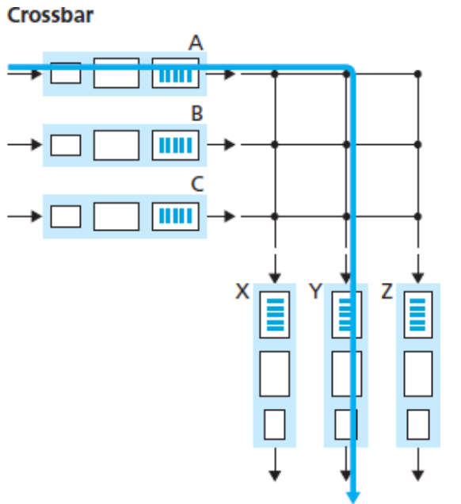

# Chapter 4 네트워크 계층: 데이터 평면

## 네트워크 계층 개요

### 포워딩과 라우팅: 데이터 평면과 제어평면

네트워크 계층의 역할은 **송신 호스트에서 수신 호스트로 패킷을 전달**하는 것이다. 네트워크 계층의 중요한 두 가지 기능은 다음과 같다.

* **포워딩(전달)** : 패킷이 라우터의 입력 링크에 도달했을 때 라우터가 그 패킷을 적절한 출력 링크로 이동시키는 것이다. 포워딩을 할 때는 **포워딩 테이블**을 사용하며, 라우터는 도착하는 패킷 헤더의 필드값을 조사하여 포워딩 테이블에 매칭되는 출력 링크 인터페이스로 패킷을 전달한다.
* **라우팅** : 네트워크 계층이 라우팅 알고리즘을 사용해 패킷 경로를 계산해서 결정하는 것이다.

#### 제어 평면: 전통적인 접근 방법

* 모든 라우터는 라우팅 알고리즘을 사용하며 포워딩과 라우팅 기능을 모두 갖고 있다.
* **라우팅 알고리즘은 라우터의 포워딩 테이블의 내용을 결정**하는데, 라우터 사이에 라우팅 메시지를 교환하며 서로 다른 라우터의 라우팅 알고리즘과 소통하며 포워딩 테이블의 값을 계산한다.

#### 제어 평면: SDN 접근 방법

* SDN 접근 방법은 인간이 포워딩 테이블을 수동으로 구성할 수 있다는 접근 방법이며, 라우터로부터 물리적으로 분리된 원격 컨트롤러 컴퓨터와 각각의 라우터에 의해 사용될 포워딩 테이블을 분배하는 방식을 사용한다.
* 라우터와 원격 컨트롤러는 포워딩 테이블과 그 밖의 라우팅 정보를 포함한 메시지를 교환함으로써 소통한다.

### 네트워크 서비스 모델

**네트워크 서비스 모델**은 송수신 호스트 간 패킷 전송 특성을 정의한다. 네트워크 계층에서 제공할 수 있는 대표적인 서비스들은 다음과 같다.

* **보장된 전달** : 패킷이 출발지 호스트에서부터 목적지 호스트까지 도착하는 것을 보장한다.
* **지연 제한 이내의 보장된 전달** : 패킷의 전달을 보장할 뿐만 아니라 호스트간의 특정 지연 제한(예: 100ms 이내) 안에 전달한다.
* **순서화 패킷 전달** : 패킷이 목적지에 송신된 순서대로 도착하는 것을 보장한다.
* **최소 대역폭 보장** : 송신과 수신 호스트 사이에 특정한 비트율(예: 1Mbps)의 전송 링크를 에뮬레이트한다. 송신 호스트가 비트들을 특정한 비트율 이하로 전송하는 한, 모든 패킷이 목적지 호스트까지 전달되는 것을 보장한다.
* **보안 서비스** : 모든 데이터그램을 출발지 호스트에서는 암호화, 목적지 호스트에서는 해독을 할 수 있게하여 트랜스포트 계층의 모든 세그먼트에 대해 기밀성을 보장한다.
* **최선형 서비스** : 패킷을 보내는 순서대로 수신됨을 보장할 수 없을 뿐만 아니라, 목적지까지의 전송 자체도 보장하지 않는다. 또한 종단 시스템 간 지연도 보장되지 않으며, 보장된 최소 대역폭도 없다.

## 라우터 내부에는 무엇이 있을까?

### 라우터의 요소

* **입력 포트** : 입력 포트의 맨 왼쪽 박스와 출력 포트의 맨 오른쪽 박스는 라우터로 들어오는 입력 링크로써 **물리 계층 기능을 수행**하며, 들어오는 링크의 반대편에 있는 링크 계층과 상호 운용하기 위해 필요한 **링크 계층 기능을 수행**한다. 또한 입력 포트에서 가장 오른쪽 박스에서 포워딩 테이블을 참조하여 도착된 패킷이 스위치 구조를 통해 라우터 출력 포트를 결정하도록 **검색 기능을 수행**한다.
* **스위치 구조** : 라우터의 입력 포트와 출력 포트를 연결한다.
* **출력 포트** : 스위치 구조에서 수신한 패킷을 저장하고 필요한 링크 계층 및 물리 계층 기능을 수행하여 출력 링크로 패킷을 전송한다.
* **라우팅 프로세서** : 전통적인 접근 방법에서는 라우팅 프로토콜을 실행하고 라우팅 테이블과 연결된 링크 상태 정보를 유지 관리하며 라우터의 포워딩 테이블을 계산한다. SDN 접근 방법에서는 원격 컨트롤러와 통신하여 원격 컨트롤러에서 계산된 포워딩 테이블 엔트리를 수신하고 라우터의 입력 포트에 이러한 엔트리를 설치한다.

### 입력 포트 처리 및 목적지 기반 전송

입력 포트에서 수행되는 기능 중 **검색**은 다음과 같은 방식으로 수행된다.

| 목적지 주소 범위                                             | 링크 인터페이스 |
| ------------------------------------------------------------ | --------------- |
| `11001000 00010111 00010000 00000000` ~ `11001000 00010111 00010111 11111111` | 0               |
| `11001000 00010111 00011000 00000000` ~ `11001000 00010111 00011000 11111111` | 1               |
| `11001000 00010111 00011001 00000000` ~ `11001000 00010111 00011111 11111111` | 2               |
| 그 외                                                        | 3               |

| 프리픽스(prefix)             | 링크 인터페이스 |
| ---------------------------- | --------------- |
| `11001000 00010111 00010`    | 0               |
| `11001000 00010111 00011000` | 1               |
| `11001000 00010111 00011`    | 2               |
| 그 외                        | 3               |

* 포워딩 테이블에서 라우터는 패킷의 목적지 주소의 **프리픽스(prefix)**를 테이블의 엔트리와 매치한다. 다수의 매치가 있을 때 라우터는 **최장 프리픽스 매치 규칙(longest prefix matching rule)**을 사용하여 테이블에서 가장 긴 매치 엔트리를 찾고, 여기에 연관된 링크 인터페이스로 패킷을 보낸다.
* 예시) `11001000 00010111 00011000 10101010` 는 링크 인터페이스 2번으로 패킷을 보낸다.

### 스위칭

스위치 구조는 패킷이 입력 포트에서 출력 포트로 실제로 스위칭(즉, 포워딩)되는 구조를 통과하므로 라우터의 핵심이다. 다음과 같이 여러가지 방법으로 스위칭을 수행할 수 있다.

#### 메모리를 통한 교환

* 운영체제에서 전통적인 **I/O 장치처럼 작동**한다.
* 패킷이 도착하면 입력 포트는 라우팅 프로세서에게 인터럽트를 보내 패킷을 프로세서 메모리에 복사한다. 그런 다음 라우팅 프로세서는 헤더에서 목적지 주소를 추출하고 포워딩 테이블에서 적절한 출력 포트를 찾은 다음 패킷을 출력 포트의 버퍼에 복사한다.
* 메모리 대역폭이 초당 최대 `B` 인 패킷을 메모리에 쓰거나 메모리에서 읽을 수 있는 경우, **전체 전달 처리량은 `B/2` 보다 작아야 한다**. 또한 목적지 포트가 다른 경우라도 공유 시스템 버스를 통해 한 번에 하나의 메모리 읽기/쓰기 작업을 수행할 수 있기 때문에 **두 패킷을 동시에 전달할 수 없다**.

#### 버스를 통한 교환

* 이 방식에서 입력 포트는 **라우팅 프로세서의 개입 없이 공유 버스를 통해 직접 출력 포트로 패킷을 전송**한다.
* 미리 준비된 입력 포트 스위치 내부 레이블이 로컬 출력 포트를 나타내는 패킷에게 전송되거나 버스에 패킷을 전송하여 수행된다. 모든 출력 포트에 패킷이 수신되지만 레이블과 매치되는 포트만 패킷을 유지한다. 레이블은 스위치 내에서 버스를 통과하기 위해서만 사용되므로 출력 포트에서 제거된다.
* **동시에 여러 패킷이 다른 입력 포트에 있는 라우터에 도착하면** 한 번에 하나의 패킷만 버스를 통과할 수 있기 때문에 **하나를 제외한 모든 패킷이 대기**해야 한다. 모든 패킷이 하나의 버스를 건너가야 하므로, **라우터의 교환 속도는 버스 속도에 의해 제한**된다.

#### 상호연결 네트워크를 통한 교환

* **공유 버스의 대역폭 제한을 극복하는 한 가지 방법은 좀 더 복잡한 상호연결 네트워크를 사용**하는 것이다.
* 크로스바 스위치(crossbar switch)는 `N` 개의 입력 포트를 `N` 개의 출력 포트에 연결하는 `2N` 버스로 구성된 상호연결 네트워크다. 각 수직 버스는 교차점에서 각 수평 버스와 교차하며 스위치 구조 컨트롤러에 의해 언제든지 열거나 닫을 수 있다.
* 예를 들어, 패킷이 포트 A에 도착하여 포트 Y로 전달되어야 하는 경우, 스위치 컨트롤러는 A와 Y 버스들과 포트 A의 교차로에서 교차점을 닫고, 버스로 패킷을 전달한다. 이는 Y 버스만으로 픽업한다. A에서 Y로, B에서 X로의 패킷들은 다른 입출력 버스를 사용하므로 B 포트에서의 패킷을 동시에 X로 전달 될 수 있으므로 **여러 패킷을 병렬로 전달할 수 있다**.
* 그러나 2개의 서로 다른 입력 포트에서 나오는 2개의 패킷이 동일한 출력 포트로 보내지는 경우 한 번에 하나의 패킷만 특정 버스에서 전송될 수 있기 때문에 입력을 기다려야 한다.

### 출력 포트 처리

출력 포트 처리는 **메모리에 저장된 패킷을 가져와서 출력 링크를 통해 전송**한다. 여기에는 전송을 위한 패킷 선택(즉, 스케줄링) 및 큐 제거, 필요한 링크 계층 및 물리 계층 전송 기능을 수행하는 것이 포함된다.

### 어디에서 큐잉이 일어날까?

입출력 포트의 기능적인 측면과 구조적인 측면을 고려한다면, **패킷 큐는 입력 포트와 출력 포트 모두에서 형성**될 수 있다.

#### 입력 큐잉

지연 없이 구조를 통해 도착하는 모든 패킷을 전송하기에 스위치 구조가 충분히 빠르지 않다면, 패킷이 스위치 구조를 통해 출력 포트로 전송되기 위해 차례를 기다려야 한다. 즉 입력 큐잉이 형성되어야 한다.

* 예를 들어, 입력 큐 앞쪽에 있는 2개의 패킷(짙은 색)이 동일한 상단의 출력 포트로 보내진다면, 왼쪽 하단 큐에 짙은 색으로 처리된 두 번째 패킷이 대기해야 한다. 아래쪽 밝은 패킷은 이동하려는 출력 링크가 경쟁이 없는 상태이지만 바로 앞의 검정 패킷 때문에 기다려야 한다. 이러한 현상을 **HOL(head-of-the-line) 차단(블로킹)**이라고 한다. 즉, 라인의 앞쪽에서 다른 패킷이 막고 있으므로 입력 큐에서 대기 중인 패킷은 사용할 출력 포트가 사용 중이지 않아도 스위치 구조를 통해 전송되기 위해 기다려야 한다.

#### 출력 큐잉

스위치 구조가 포트 라인 속도보다 N배 빠른 경우에도 패킷 큐잉이 출력 포트에서 발생할 수 있다.

* 예를 들어, 시각 t에서 패킷은 각각의 입력 포트에 도달하고 각각의 포트는 맨 앞의 출력 포트로 향한다. 동일한 라인 속도를 가지고, 라인 속도의 3배로 동작하는 것으로 가정하면 기존의 패킷 3개가 모두 출력 포트로 전송되어 대기 중일 것이다. 이 패킷 중 하나는 다음번에 출력 라인을 통해 전송된 것이다.
* 들어오는 패킷을 저장할 메모리가 충분하지 않을 때 도착한 패킷을 삭제하거나 이미 대기 중인 하나 이상의 패킷을 제거하여 새로 도착한 패킷을 저장하기 위한 공간을 확보해야 한다. 이런 경우에는 버퍼가 가득 차기 전에 패킷을 삭제하여 송신자에게 혼잡 신호를 제공하는 것이 바람직하다.

#### 얼마나 많은 버퍼가 요구되는가?

* 몇 년 동안 버퍼 크기에 대한 규칙은 링크 용량이 C일 때, 버퍼링의 양(B)은 평균 왕복 시간(RTT)과 같아야 한다는 것이다. 따라서 RTT가 250ms인 10Gbps 링크는 버퍼들의 `B = RTT * C = 2.5 Gb` 와 같은 버퍼의 양이 필요하다.
* 좀 더 최근에는 독립적인 TCP 흐름(N)이 링크를 통과할 때, 필요한 버퍼링은 `B = RTT * C / N ^ 1/2)` 이라고 제안하고 있다.

### 패킷 스케줄링

큐에 있는 패킷이 출력 링크를 통해 전송되는 순서를 결정하기 위해 **FCFS(first-come-first-served) 방식을 사용**한다. 흔히 FIFO(first-in-first-out)로도 잘 알려져 있다. 또한 **라운드 로빈 큐잉(round-robin queueing) 방식**도 있다.

#### FIFO

FIFO(또는 FCFS) 스케줄링 규칙은 **출력 링크 큐에 도착한 순서와 동일한 순서로 출력 링크에서 전송할 패킷을 선택**한다.

#### 우선순위 큐잉

우선순위 큐잉에서 출력 링크에 도착한 패킷은 큐에 도착하면 우선순위 클래스로 분류된다. 예를 들어, 네트워크 오퍼레이터는 네트워크 관리 정보를 운반하는 패킷이 사용자 트래픽보다 우선순위를 수신하도록 큐를 구성할 수 있다. 또한 실시간 VoIP 패킷은 전자메일 패킷과 같은 트래픽보다 우선순위를 받을 수 있다.

각 우선순위 클래스에는 일반적으로 고유한 큐가 있다. 전송할 패킷을 선택할 때 우선순위 큐는 전송 대기 중인 패킷으로 차 있는 상태이고 **가장 높은 우선순위 클래스에서 패킷을 전송**한다. **우선순위가 동일한 패킷들 중에서의 선택은 전형적으로 FIFO 방식**으로 행해진다.

#### 라운드 로빈과 WFQ

**라운드 로빈 큐잉** 규칙에서 패킷은 우선순위 큐잉과 같이 클래스로 분류된다. 그러나 클래스 간에는 엄격한 서비스 우선순위가 존재하지 않으며, 라운드 로빈 스케줄러가 **클래스 간에 서비스를 번갈아서 제공**한다.

**WFQ**(Weighted Fair Queuing)는 각 클래스마다 다른 양의 서비스 시간을 부여받는다는 점에서 라운드 로빈과 차이가 있다. 특히 각 클래스 i는 가중치(weight)를 할당 받는다.

## 인터넷 프로토콜(IP): IPv4, 주소체계, IPv6 등

### IPv4 데이터그램 포맷

인터넷 네트워크 계층 패킷을 **데이터그램(datagram)**이라고 부른다. IPv4 데이터그램의 주요 필드는 다음과 같다.

* **버전 번호** : 4비트로 데이터그램의 IP 프로토콜 버전을 명시한다. 라우터는 버전 번호를 확인하여 데이터 그램의 나머지 부분을 어떻게 해석할지 결정한다.
* **헤더 길이** : IPv4 데이터그램은 헤더에 가변 길이의 옵션을 포함하므로 이 네 비트로 IP 데이터그램에서 실제 페이로드가 시작하는 곳을 결정한다. 대체로 IPv4 데이터그램 헤더는 20바이트다.
* **서비스 타입** : 각기 다른 유형의 IP 데이터그램을 구별한다. 예를 들어 실시간 데이터그램(IP 전화 통신 애플리케이션)과 비실시간 트래픽(예: FTP)을 구분하는데 유용하다.
* **데이터그램 길이** : 바이트로 계산한 IP 데이터그램(헤더 + 데이터)의 전체 길이다.
* **식별자, 플래그, 단편화 오프셋** : 이 세 필드는 IP 단편화와 관련이 있다. 큰 IP 데이터그램이 여러 개의 작은 IP 데이터그램으로 분할된 다음 목적지로 독립적으로 전달되며, 여기서 페이로드 데이터가 최종 호스트의 트랜스포트 계층으로 전달되기 전에 다시 모이게 된다. 단, IPv6는 단편화를 허용하지 않는다.
* **TTL(time-to-live)** : 네트워크에서 데이터그램이 무한히 순환하지 않도록 한다(라우팅 루프). 이 필드값은 라우터가 데이터그램을 처리할 때마다 감소한다. TTL 필드가 0이 되면 라우터가 데이터그램을 폐기한다.
* **프로토콜** : 일반적으로 IP 데이터그램이 최종 목적지에 도착했을 때만 사용된다. 이 필드값은 IP 데이터그램에서 데이터 부분이 전달될 목적지의 트랜스포트 계층의 특정 프로토콜을 명시한다. 예를 들어 값 6은 데이터 부분을 TCP로, 값 17은 UDP로 데이터를 전달하라는 뜻이다.
* **헤더 체크섬** : 라우터가 수신한 IP 데이터그램의 비트 오류를 탐지하는데 도움을 준다. 라우터는 수신한 각 IP 데이터그램마다 헤더 체크섬을 계산하고 이 값과 데이터그램 헤더의 체크섬이 다르면 오류 상태임을 감지한다. 라우터는 보통 오류가 검출된 데이터그램을 폐기한다. 네트워크 계층에서 오류 검사를 수행하는 이유는 첫째, IP 헤더만 IP 계층에서 체크섬을 수행하기 때문이며, 둘째, TCP/UDP와 IP는 동일한 프로토콜 스택에 속할 필요가 없기 때문이다.
* **출발지와 목적지 IP 주소** : 출발지가 데이터그램을 생성할 때, 자신의 IP 주소를 출발지 IP 주소 필드에 삽입하고 목적지 IP 주소를 목적지 IP 주소 필드에 삽입한다. 종종 출발지 호스트는 DNS 검색을 통해 목적지 주소를 결정한다.
* **옵션** : 옵션 필드는 IP 헤더를 확장한다.
* **데이터(페이로드)** : 대부분 IP 데이터그램의 데이터 필드는 목적지에 전달하기 위해 트랜스포트 계층 세그먼트(TCP나 UDP)를 포함하지만 ICMP 메시지 같은 유형의 데이터를 담기도 한다.

### IPv4 주소체계

* **IP 주소는 각 인터페이스를 구분**하는데 사용되며, 인터페이스란 호스트와 물리적 링크 사이의 경계를 뜻하기도 하고 라우터와 링크 사이의 경계를 뜻하기도 한다.
* 각 IP 주소는 32비트 길이(4바이트)이며, 점(.)으로 구분하는 십진 표기범을 사용한다. 예를 들어,  IP 주소가 193.32.216.9라고 하면 이 IP 주소를 이진수로 나타내면 다음과 같다. `11000001 00100000 11011000 00001001`

#### 서브넷

위 그림에서 3개의 인터페이스를 갖는 하나의 라우터는 7개의 호스트를 연결한다. 왼쪽에 세 호스트들의 인터페이스들과 하나의 라우터 인터페이스로 연결된 네트워크는 **서브넷(subnet)**을 구성한다고 말한다. IP 주소 체계는 이 서브넷에 223.1.1.0/24 라는 주소를 할당하는데, 여기서 /24 는 서브넷 마스크(subnet mask)라 부르며, 32비트 주소의 왼쪽 24비트가 서브넷 주소라는 것을 가리킨다.

서브넷의 IP 정의는 여러 호스트를 라우터 인터페이스에 연결하는 이더넷 세그먼트만을 의미하는 것은 아니다. 각 라우터의 인터페이스를 연결하는 것도 서브넷이다. 위 그림에서는 총 6개의 서브넷이 존재한다. 즉, 호스트나 라우터에서 각 인터페이스를 분리하여 고립된 네트워크를 만드는데 이렇게 **고립된 네트워크 각각을 서브넷이라고 부른다**.

#### CIDR

* 인터넷 주소 할당 방식에 **CIDR**(Classless InterDomain Routing, 사이다(cider)로 발음)라는 것이 있다. CIDR는 서브넷 주소체계 표기를 일반화하고 있다. a.b.c.d/x 형식 주소에서 최상위 비트(most significant bit, MSB)를 의미하는 x는 **프리픽스(prefix)** 또는 **네트워크 프리픽스**라고 부른다.
* 한 기관은 통상 연속적인 주소의 블록을 할당 받으며, 기관 장비들의 IP 주소는 공통 프리픽스를 공유한다. 즉, 외부 기관의 라우터는 목적지 주소가 내부 기관인 데이터그램을 전달할 때, 단지 앞의 x비트들만 고려하면 되므로 포워딩 테이블의 크기를 상당히 줄여준다.
* 주소의 나머지 32-x 비트들은 기관 내부에 같은 네트워크 프리픽스를 갖는 모든 장비를 구별한다고 보면된다. 이 비트들은 기관 내부의 라우터에서 패킷을 전달할 때 사용되는 것이다.

#### 브로드캐스트 주소

* IP 주소의 또 다른 형태인 브로드캐스트 주소 255.255.255.255가 있다. 호스트가 목적지 주소가 255.255.255.255인 데이터그램을 보내면, 이 메시지는 같은 서브넷에 있는 모든 호스트에게 전달된다. 마찬가지로 라우터는 선택적으로 이웃 서브넷에 메시지를 전달한다.

#### 주소블록 획득

* 기관의 서브넷에서 사용하기 위한  IP 주소 블록을 얻기 위해, 네트워크 관리자는 먼저 이미 할당받은 주소의 큰 블록에서 주소를 제공하는 ISP와 접촉하여 주소 블록을 할당 받거나, ICANN으로부터 IP 주소를 할당 받는다. ICANN은 비영리 단체이며 IP 주소 할당과 DNS 루트 서버를 관리하는 역할을 담당한다.

#### 호스트 주소 획득: 동적 호스트 구성 프로토콜 (DHCP)

* 한 기관은 ISP로부터 주소 블록을 획득하여 개별 IP 주소를 기관 내부의 호스트와 라우터 인터페이스에 수동으로 할당하거나 **동적 호스트 구성 프로토콜(Dynamic Host Configuration Protocol, DHCP)**을 사용하여 자동으로 IP 주소를 할당한다.
* DHCP는 네트워크에서 자동으로 호스트와 연결해주는 능력 때문에 **플러그앤 플레이 프로토콜(plug-and-play protocol)** 또는 **제로 구성 프로토콜(zero-configuratio protocol)**이라고도 한다. 예를 들어, 학생이 랩톱을 가지고 기숙사에서 도서관으로 또 강의실로 이동한다고 생각해보자. 학생은 각 지역에서 새로운 서브넷에 접속할 것이며, 각 지역마다 새로운 IP 주소가 필요할 것이다. 많은 사용자가 이동하고, 주소들이 제한된 시간 동안에만 필요할 경우 DHCP는 더할 나위 없이 적절하다.

* 새로운 호스트가 도착할 경우, 위 그림처럼 설정된 네트워크상에서 수행될 DHCP 프로토콜은 4단계의 과정을 거친다.

1. **DHCP 서버 발견** : **DHCP 발견 메시지**(DHCP discover message)를 사용하여 수행되며, 클라이언트는 출발지 IP 주소를 0.0.0.0으로 설정하고 목적지 주소는 255.255.255.255로 설정하여 포트 67번으로 UDP 패킷을 보낸다. 이 데이터그램은 서브넷에 연결된 모든 노드로 브로드캐스트된다.
2. **DHCP 서버 제공** : DHCP 발견 메시지를 받은 DHCP 서버는 **DHCP 제공 메시지**(DHCP offer message)를 클라이언트로 응답한다. 이때에도 다시 IP 브로드캐스트 주소 255.255.255.255를 사용하여 서브넷의 모든 노드로 이 메시지를 브로드캐스트한다. 이렇게 브로드캐스트 하는 이유는 여러 DHCP 서버가 존재하기 때문에, 클라이언트는 여러 DHCP 제공 메세지로부터 가장 최적의 위치에 있는 DHCP 서버를 선택한다. 각각의 서버 제공메시지는 수신된 발견 메시지의 트랜잭션 ID, 클라이언트에 제공된  IP 주소, 네트워크 마스트, IP 주소 임대기간을 포함한다.
3. **DHCP 요청** : 새롭게 도착한 클라이언트는 하나 또는 그 이상의 서버 제공자 중에서 선택할 것이고 선택된 제공자에게 파라미터 설정으로 되돌아오는 **DHCP 요청 메시지**(DHCP request message)로 응답할 것이다.
4. **DHCP ACK** : 서버는 DHCP 요청 메시지에 대해 요청된 파라미터를 확인하는 **DHCP ACK 메시지**(DHCP ACK message)로 응답한다.
