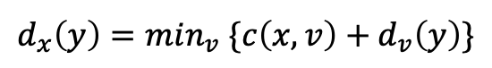
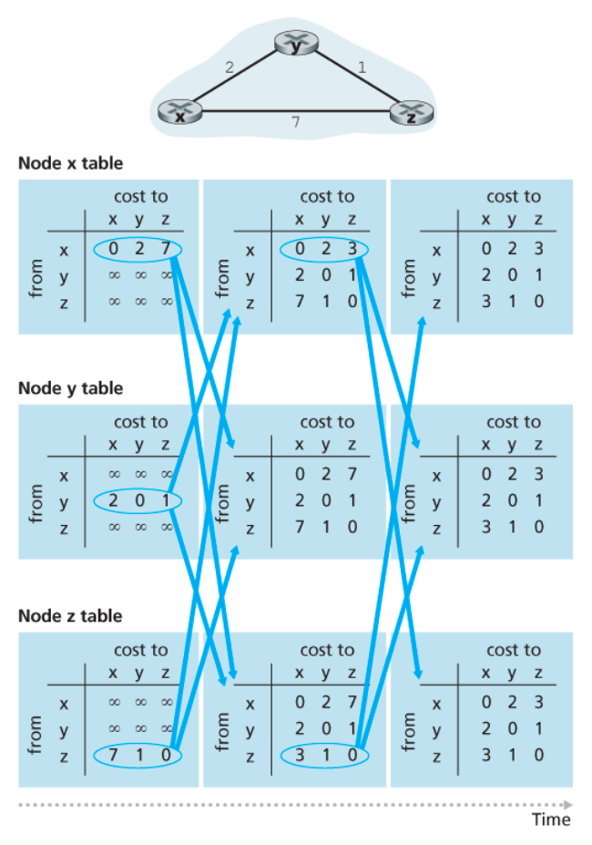
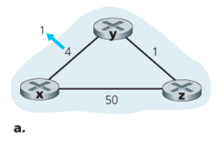
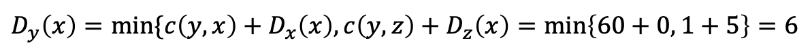

# Chapter 5 네트워크 계층: 제어 평면

## 라우팅 알고리즘

### 거리 벡터(DV) 라우팅 알고리즘

링크 상태 알고리즘이 네트워크 전체 정보를 이용하는 알고리즘인 반면에, 거리 벡터(distance-vector, DV) 알고리즘은 반복적이고 비동기적이며 분산적이다.

* **분산적** : 각 노드는 하나 이상의 직접 연결된 이웃으로부터 정보를 받고, 계산을 수행하며, 계산된 결과를 다시 그 이웃들에게 배포한다는 점에서 분산적(distributed)이다.
* **반복적** : 이웃끼리 더 이상 정보를 교환하지 않을 때까지 프로세스가 지속된다는 점에서는 반복적(iterative)이다.
* **비동기적** : 톱니바퀴 돌듯이 모든 노드가 서로 정확히 맞물려 동작할 필요가 없다는 점에서 비동기적(asynchronous)이다.

### 벨만-포드(Bellman-Ford) 식

노드 x부터 y까지 최소 비용 경로의 비용을 다음과 같이 나타낼 수 있다.

- min.v는 x의 모든 이웃에 적용된다.
- x에서 v로 이동한 후, v에서 y까지의 최소 비용 경로를 택한다면, 경로 비용은 `c(x, v) + d.v(y)`일 것이다.
- 반드시 하나의 이웃 v로 가는 것부터 시작해야 하므로, x에서 y까지의 최소 비용은 모든 이웃 노드 v에 대해 계산된 `c(x, v) + d.v(y) 중 최솟값`이 된다.

### 거리 벡터(DV) 알고리즘

LS 알고리즘은 다익스트라 알고리즘을 수행하기 전에 각 노드가 네트워크에 대한 전체 지도를 먼저 얻어야 한다는 면에서 중앙 집중형 알고리즘인 반면 DV 알고리즘은 분산적이고 하나의 노드가 갖는 정보는 단지 자신에게 직접 연결된 이웃으로의 링크 비용과 그 이웃들로부터 수신하는 정보뿐이다.

거리 벡터 알고리즘은 다음과 같이 수행되며 더 이상의 갱신 메시지가 없을 때까지 계속된다.

1. 각 노드는 이웃으로부터의 갱신을 기다린다.
2. 업데이터를 수신하면 새로 거리 벡터를 계산한다.
3. 이 새로운 거리 벡터를 이웃들에게 배포한다.

### 거리 백터(DV) 알고리즘: 링크 비용 변경과 링크 고장

#### 링크 비용이 감소한 경우

아래는 y에서 x로의 링크 비용이 4에서 1로 변한 상황을 나타낸 것이다.

이 상황에서의 DV 알고리즘은 다음과 같은 일련의 사건을 발생시킨다.

1. 시각 t0 : `y`가 링크 비용의 변화를 감지하고, 자신의 거리 벡터를 갱신한 후 이 변경값을 이웃에게 알린다.
2. 시각 t1 : `z`는 y로부터 갱신 정보를 받고 자신의 테이블을 갱신한다.
   - z는 x까지의 새로운 최소 비용을 계산한다.
   - 이웃에게 자신의 새로운 거리 벡터를 전송한다.
3. 시각 t2 : `y`는 z로부터 갱신 정보를 받고 자신의 테이블을 갱신한다.
   - **y의 최소 비용은 변화가 없으므로 y는 z에게 아무런 메시지를 보내지 않는다.**
   - 이에 알고리즘은 정지 상태가 된다.

따라서 거리 벡터 알고리즘은 정지 상태가 될 때까지 두 번만 반복하면 된다.

#### 링크 비용이 증가한 경우

아래는 y에서 x로의 링크 비용이 4에서 60로 변한 상황을 나타낸 것이다.

이 상황에서의 DV 알고리즘은 다음과 같은 일련의 사건을 발생시킨다.

1. 시각 t0 : `y`가 링크 비용 변화를 감지하고 노드 x까지 다음의 비용을 갖는 새로운 최소 비용 경로를 계산한다.

   

   - 이때 우리는 네트워크 전체를 한눈에 볼 수 있기 때문에 z를 경유하는 이 새로운 비용이 **잘못되었다**는 사실을 알 수 있지만,
     노드 y의 입장에서는 아니다.

2. 시각 t1

   - x로 가기 위해 y는 z로 경로 설정을 하고, z는 y로 경로 설정을 하는 **라우팅 루프(routing loop)**가 발생한다.

     > t1에 x를 목적지로 하는 패킷이 y나 z에 도착하면 포워딩 테이블이 변할 때까지 이 두 노드 사이에서 왔다 갔다 순환할 것이다.

   - 노드 y는 x까지의 새로운 최소 비용을 계산했으므로 z에게 새로운 거리 벡터를 알린다.

3. 시각 t2 : z는 y로부터 갱신 정보를 받고 새로운 최소 비용을 계산한다.

   - D.z(x) = min{50+0, 1+6} = 7
   - x까지의 z의 최소 비용이 증가했으므로, 새로운 거리 벡터를 y에 알린다.

4. 시각 t3 : y는 z로부터 새로운 거리 벡터를 수신하고 새로운 최소 비용을 계산한다.

   - Dy(x) = min{60+0, 1+7} = 8
   - x까지의 y의 최소 비용이 증가했으므로, 새로운 거리 벡터를 z에 알린다.

5. …

이렇게 계속 반복되는 문제를 **무한 계수 문제(count-to-infinity)**라고 한다.

### 거리 벡터 알고리즘: 포이즌 리버스 추가

거리 벡터 알고리즘에서 링크 비용이 증가한 경우 무한 계수 문제를 해결하기 위한 방법으로는 포이즌 리버스(poisoned reverse)라는 방법을 사용해 방지할 수 있다.

즉, 만약 z가 y를 통해 목적지 x로 가는 경로 설정을 했다면, **z는 y에게 x까지의 거리가 무한대라고 알린다.** *z는 y를 통과해서 x로 가는 동안은 이러한 거짓말을 계속한다.* 이에 y는 z에서 x로 가는 경로가 없다고 믿으므로, z가 계속해서 y를 통해 x로 가는 경로를 사용하는 동안은 y는 z를 통해 x로 가는 경로를 시도하지 않을 것이다.

**하지만 포이즌 리버스는 모든 무한 계수 문제를 해결할 수는 없다.** 단순히 직접 이웃한 2개의 노드가 아닌, 3개 이상의 노드를 포함한 루프는 포이즌 리버스로는 감지할 수 없다.

### 링크 상태 알고리즘과 거리 벡터 라우팅 알고리즘의 비교

#### ✅ 경로 계산 방법

LS와 DV 알고리즘은 경로를 계산할 때 서로 대비되는 방법을 취한다.

#### LS 알고리즘

- 전체 정보를 필요로 한다.
- 각 노드는 다른 **모든** 노드와 (브로드캐스트를 통해) 통신한다.
- **오직** 자신에게 직접 연결된 링크의 비용만 알린다.

#### DV 알고리즘

- 각 노드는 **오직** 직접 연결된 이웃과만 메시지를 교환한다.
- 자신으로부터 네트워크 내 (자신이 알고 있는) **모든** 노드로의 최소 비용 추정값을 이웃들에게 제공한다.

### ✅ 메시지 복잡성

#### LS 알고리즘

- 각 노드는 네트워크 내 각 링크 비용을 알아야 하며, 이를 위해서는 `O(|N| |E|)`개의 메시지가 전송되어야 한다.
- 링크 비용이 변할 때마다 새로운 링크 비용이 모든 노드에게 전달되어야 한다.

#### DV 알고리즘

- 매번 반복마다 직접 연결된 이웃끼리 메시지를 교환한다.
- 알고리즘의 결과가 수렴하는 데 걸리는 시간은 많은 요소에 좌우된다.
- 링크 비용이 변하고, 이 새로운 링크 비용이 이 링크에 연결된 어떤 노드의 최소 비용 경로에 변화를 준 경우에만
  DV 알고리즘은 수정된 링크 비용을 전파한다.

### ✅ 견고성

라우터가 고장나거나 오동작하거나 파손된다면 어떤 일이 발생할까?

#### LS 알고리즘

- 라우터는 연결된 링크에 대해 잘못된 비용 정보를 브로드캐스트할 수 있다.
- 노드는 링크 상태 브로드캐스트를 통해 받은 패킷을 변질시키거나 폐기할 수 있다.
- 그러나 **하나의 링크 상태 노드는 자신의 포워딩 테이블만 계산하기 때문에** 링크 상태 알고리즘에서 경로 계산은 어느 정도 분산되어 수행된다. 따라서 링크 상태 알고리즘은 어느 정도의 견고성을 제공한다.

#### DS 알고리즘

- 노드는 잘못된 최소 비용 경로를 일부 혹은 모든 목적지에 알릴 수 있다.
- 각 반복마다 한 노드의 거리 벡터 계산이 이웃에게 전달되고 다음 반복에서 이웃의 이웃에게 간접적으로 전달된다. 따라서 거리 벡터 알고리즘을 사용하는 네트워크에서 한 노드의 잘못된 계산은 **전체로 확산될 수 있다.**
