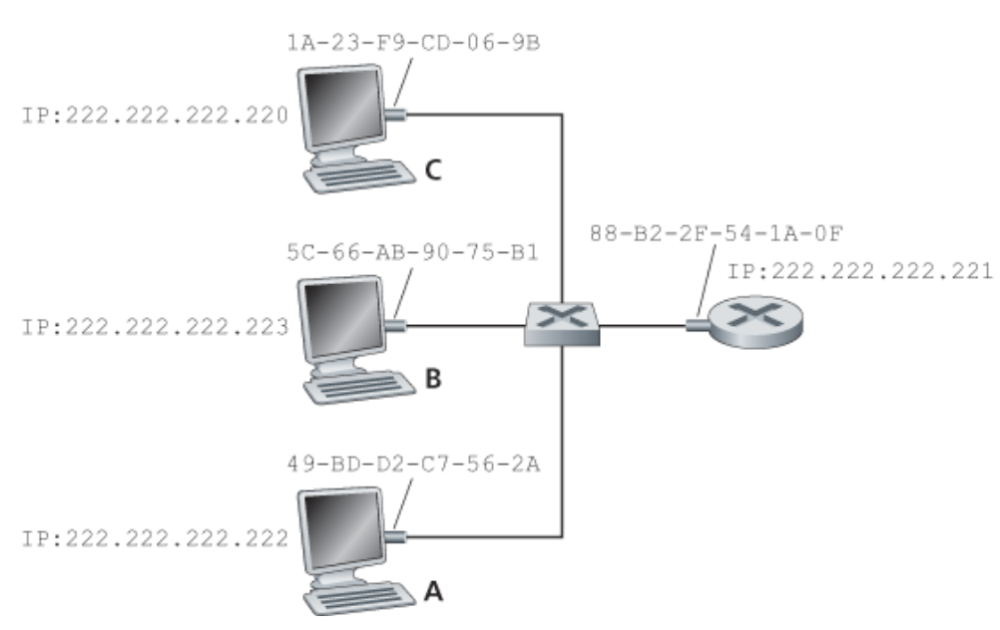

# 6.3 다중 접속 링크와 프로토콜

### 두 종류의 네트워크 링크

- **점대점 링크(point-to-point link)**
  - 링크의 한쪽 끝에 한 송신자와 링크의 다른 쪽 끝에 한 수신자가 있다.
  - `PPP(point-to-point protocol)`과 `HDLC(high-level data link control)`이 여기에 속한다.

- **브로드캐스트 링크(broadcast link)**
  - 동일한 하나의 공유된 브로드캐스트 채널에 다수의 송신 노드 및 수신 노드가 연결된다.
  - 임의의 한 노드가 프레임을 전송하면 채널이 그 프레임을 브로드캐스트해서 다른 모든 노드가 그 프레임의 복사본을 수신하기 때문에 브로드캐스트 용어가 쓰인다.

### 다양한 다중 접속 채널

[](https://user-images.githubusercontent.com/76640167/214252181-cbe924c1-ba6e-4194-bb26-cb62090a1d55.png)

### 다중 접속 문제(multiple access problem)

모든 노드가 프레임을 전송할 수 있으므로 2개 이상의 노드가 브로드캐스트 채널에서 직접 통신할 수 있고, 이런 일이 발생하면 **모든 노드는 동시에 여러 개의 프레임을 받게 된다.**

즉, **전송된 프레임들이 각 수신자에서 충돌하게 되고 어떤 수신 노드도 전송된 프레임의 의미를 파악할 수 없게 된다.**

따라서 충돌에 관련된 모든 프레임은 손실되며, 다수의 노드가 빈번히 프레임을 전송하려 한다면 많이 충돌할 것이고 따라서 브로드캐스트 채널의 대역폭이 많이 낭비된다.

### 다중 접속 프로토콜(multiple access protocol)

초당 R 비트의 전송률을 갖는 브로드캐스트 채널에 대한 다중 접속 프로토콜은 다음과 같은 특성을 지니는 것이 바람직하다.

1. 단 하나의 노드가 전송할 데이터가 있을 때는 그 노드가 R bps의 처리율을 갖는다.
2. M개의 노드가 전송할 데이터가 있을 때는 각 노드가 R/M bps의 처리율을 갖는다.
   - 항상이 아니며 각 노드가 정의된 시간 동안 R/M의 평균 처리율을 가짐을 의미한다.
3. 분산되어 있어 고장으로 인해 전체 시스템을 정지시킬 수 있는 마스터 노드가 없다.
4. 단순해서 구현하는 데 비용이 적게 든다.


## 6.3.1 채널 분할 프로토콜

[](https://user-images.githubusercontent.com/76640167/214252177-bf3b863e-80dd-4ae6-a463-0c2c67af4e4e.png)

### 시분할 다중화(time-division multiplexing, TDM)

채널이 N개 노드를 지원하고 채널 전송률이 R bps라고 하자.

TDM은 시간을 `시간 프레임(time frame)`으로 나누고 또한 각 시간 프레임을 N개의 `시간 슬롯(time slot)`으로 나눈다.

그 후 N개의 노드에게 시간 슬롯을 각각 할당한다.

노드는 전송할 패킷이 있을 때마다 **TDM 프레임에서 자신에게 할당된 시간 슬롯 동안 패킷을 전송**한다.

**장점**

- 충돌을 제거할 수 있다.
- 매우 공정하다.

**단점**

- 전송할 패킷이 있는 노드가 단 하나인 경우에도 노드 전송률이 R/N으로 제한된다.
- 노드가 전송 순서상 자신의 차례를 항상 기다려야 한다.

### 주파수 분할 다중화 (frequency-division multiplexing, FDM)

R bps의 채널을 R/N의 대역폭을 갖는 다른 주파수로 나눠서 각 주파수를 N개의 노드 중 하나에게 할당한다.

즉, 하나의 큰 R bps 채널로부터 N개의 R/N bps의 작은 채널을 만든다.

TDM과 같은 장단점을 갖는다.

### 코드 분할 다중 접속(code division multiple access, CDMA)

CDMA는 다른 **코드**를 각 노드에게 할당한다.

노드는 **전송하는 데이터 비트들을 자신의 유일한 코드로 인코딩**한다.

**장점**

- CDMA 네트워크에서 코드들을 신중하게 선택하면 여러 노드들이 동시에 전송할 수 있다.
- 다른 노드들에 의해 전송이 간섭되더라도 각 수신자들이 송신자의 인코딩된 데이터 비트를 정확하게 수신할 수 있다.

## 6.3.2 랜덤 접속 프로토콜

랜덤 접속 프로토콜에서 전송 노드는 항상 채널의 최대 전송률인 R bps로 전송한다.

충돌이 생기면 충돌과 관련된 각 노드는 프레임이 충돌 없이 전송될 때까지 자신의 프레임을 계속해서 재전송한다.

프레임이 충돌했을 때 즉시 재전송하지 않고, 랜덤 지연 시간 동안 기다린 후 재전송 한다.

즉, 출동했던 노드 중 하나는 다른 노드가 선택한 지연 시간보다 충분히 작은 지연시간을 선택함으로써 충돌 없이 자신의 프레임을 채널로 전송할 수 있다.

### 슬롯 알로하(slotted ALOHA)

[](https://user-images.githubusercontent.com/76640167/214252171-bb6a376c-f16c-4984-91a6-6360d106db1e.png)

**동작 과정**

1. 전송할 새 프레임이 있으면 다음 슬롯이 시작할 때까지 기다렸다가 그 슬롯에 전체 프레임을 전송한다.
2. 만약, 충돌하지 않으면 노드는 성공적으로 자신의 프레임을 전송한 것이다. 따라서 그 프레임을 재전송할 필요가 없다.
3. 만약 충돌하면, 노드는 그 슬롯이 끝나기 전에 충돌을 검출한다. 노드는 그 프레임이 충돌 없이 전송될 때까지 확률 p(0~1 사이)로 해당 프레임을 다음 슬롯들에서 재전송한다.
4. 충돌하지 않을 때까지 3번 과정을 반복한다.

**장점**

- 하나의 활성노드로 하여금 채널의 전속력 R로 계속해서 프레임을 전송할 수 있도록 허용한다.
- 노드가 충돌을 감지하고 언제 재전송할지 각자 결정하므로 분산되어있다.
- 매우 단순하다.

**단점**

- 노드는 슬롯이 언제 시작하는지 동기화되어있어야 한다.
- 활성 노드가 많이 있으면 일부 슬롯이 충돌로 인해 결과적으로 낭비 된다.
- 모든 활성 노드가 확률적인 전송 정책 때문에 전송을 억제하는 경우 일부 슬롯이 비게 된다.

낭비되지 않는 슬롯은 정확히 한 노드만 전송하는 슬롯이고, 이 노드를 `성공한 슬롯(successful slot)`이라 한다.

**효율성**

노드가 N개가 있을 때 하나의 슬롯이 성공적인 슬롯일 확률은 노드들 중 한 노드만 전송하고 나머지 N-1 개의 노드는 전송하지 않는 확률이다.

노드가 전송할 확률이 p라하면 해당 노드가 성공할 확률은 `p x (1-p)^(N-1)` 이다.

노드가 N개 있으므로 임의의 한 노드가 성공할 확률은 `N x p x (1-p)^(N-1)` 이다.

최대의 효율을 구하기 위해서는 이 식을 최대화 하는 p를 구해야 한다.

활성 노드가 많은 경우의 최대 효율을 구하기 위해 N이 무한대가 될 때의 극한값을 취한다.

이렇게 계산하면 최대 효율은 `p = 1/e = 0.37` 임을 알 수있다.

**즉, 많은 노드가 전송할 프레임이 많을 때 기껏해야 37%의 슬롯만 낭비되지 않는다.**

### 알로하(ALOHA)

[](https://user-images.githubusercontent.com/76640167/214252168-877732ca-dd9d-4dba-8dcd-253213b0a71c.png)

순수 알로하 프로토콜에서는 슬롯 개념이 없다.

**동작 과정**

1. 프레임이 도착하면 노드는 즉시 프레임 전체를 브로드캐스트 채널로 전송한다.
2. 만약 충돌하면, 노드는 확률 p로 즉시 재전송 한다.
3. 즉시 재전송하지 않는 경우, 노드는 프레임 전송 시간 동안 기다린다.
4. 기다리고 나서 확률 p로 전송하거나 아니면 1-p 확률로 또 다른 프레임 시간 동안 기다린다.

**효율성**

임의의 시점에 노드가 프레임을 전송할 확률은 p다.

시간 t0에 프레임 전송을 시작한다고 가정하자.

이 프레임이 성공적으로 전송되기 위해서는 `[t0-1,t0]` 동안 다른 노드들이 전송을 해서는 안된다. 만일 전송을 하게 되면 노드 i가 전송 시작 부분과 겹쳐 충돌하게 된다.

이 시간동안 다른 모든 노드가 전송을 시작하지 않을 확률은 `(1-p)^(N-1)` 이다.

마찬 가지로 노드 i가 전송하는 동안에 다른 노드가 전송을 시작해서는 안되고, 이 확률 또한, `(1-p)^(N-1)` 이다.

즉, 성공적으로 전송할 확률은 `(1-p)^(2x(N-1))` 이다. 슬롯 알로하처럼 극한값을 취하면 최대 효율은 `p = 1/2e` 로 슬롯 알로하의 절반이다.

즉, 순수 알로하는 완전히 분산되어 동기화하는 것을 안하는 대신, 효율성을 포기한다.

### CSMA

위 두 프로토콜에서는 다른 노드가 전송하고 있건 말건 일단 보낸다.

즉, 충돌이 생기고 결과적으로 효율이 떨어진다.

이러한 충돌을 없애기 위한 규칙을 보자.

- 캐리어 감지(carrier sensing)
  - 만일 다른 노드가 프레임을 채널로 전송하고 있는 경우, 노드는 임의의 짧은 시간 동안 전송 중단을 감지하면 프레임을 전송하기 시작한다.
- 충돌 검출(collision detection)
  - 만일 다른 노드가 방해 프레임을 전송하고 있음을 검출하면, 자신의 전송을 중단하고 랜덤 시간 동안 기다린 후 유휴 시 감지 및 전송과정을 반복한다.

**CSMA에서 충돌이 발생하는 경우**

[](https://user-images.githubusercontent.com/76640167/214252166-c56ee5cb-eb17-48e2-92a5-f4d67029ce34.png)

1. 시각 t0에 노드 B가 다른 노드가 아무도 전송하고 있지 않으므로 채널이 비어 있는 것으로 감지한다.
2. B는 전송을 시작하고, 전송한 비트들이 브로드캐스트 매체를 따라 양방향으로 전송된다.
   - 시간이 경과함에 따라 아래쪽으로 전파되는 것은 B의 비트들이 실제로 브로드캐스트 매체로 전파할 때 0보다 큰 시간이 필요하다는 것을 의미한다.
3. D가 t1 시점에 전송할 프레임이 생겼고, 노드 B가 t1에 전송을 하고 있음에도 불구하고, B에 의해 전송되는 비트들은 D에 도달하지 못했고, 따라서 D는 t1일 때 채널이 사용되지 않는 것으로 감지한다.
4. D가 전송을 시작하고, 약간의 시간 후에 B가 전송한 비트와 D의 전송한 비트가 간섭을 일으키기 시작한다.

즉, 브로드캐스트 `채널 종단 간의 채널 전파 지연(channel propagation delay)`이 길수록 다른 노드에서 이미 시작된 전송을 캐리어 감지 노드가 감지할 수 없는 경우가 증가하기 때문에 `채널 종단 간의 채널 전파 지연(channel propagation delay)` 는 CSMA의 성능을 결정하는데 중요한 역할을 한다.

### CSMA/CD

[](https://user-images.githubusercontent.com/76640167/214252158-5f9891cb-21c6-4792-8f30-d72bc2207215.png)

CSMA는 충돌 검출을 수행하지 않는 반면, CSMA/CD는 충돌 검출을 수행한 후 즉시 전송을 취소한다.

**동작 과정**

1. 어댑터는 네트워크 계층으로부터 데이터그램을 받아서 링크 계층 프레임을 만든 후에 그 프레임을 어댑터 버퍼에 저장한다.

2. 어댑터는 채널이 유휴(idle) 상태임을 감지하면 프레임 전송을 시작한다.

   - 만일 어댑터가 채널이 바쁜(busy) 상태임을 감지하면, **어떤 신호 에너지도 감지되지 않을 때까지 더 기다렸다가 프레임을 전송하기 시작**한다.

3. 전송하는 동안 어댑터는 브로드캐스트 채널을 사용하는 **다른 어댑터로부터의 신호 에너지가 있는지 감시**한다.

4. 프레임 전체를 전송하는 동안 다른 어댑터로부터의 신호 에너지가 감지되지 않으면, 프레임 전송을 완료한다.

   - 감지되면 **자신의 프레임 전송을 취소**한다.

5. 전송 취소 후

    

   임의의 랜덤 시간

   만큼 기다린 후 2단계로 돌아간다.

   - 만일 랜덤 시간이 아니라 고정 시간이라면 동시에 프레임을 전송했을 때 똑같은 시간을 기다린 후 전송을 하므로 계속해서 충돌하게 된다.

**랜덤 시간을 결정하는 알고리즘: 이진 지수적 백오프(binary exponential backoff)**

충돌을 n번 경험한 프레임을 전송할 때 노드는 `{0,1,2,…,2^n - 1}` 중에서 랜덤하게 K 값을 선택한 후 `K x 비트 시간` 만큼 기다린다.

이더넷의 경우 K x 512 비트 시간(이더넷으로 512 비트를 전송하는데 걸리는 시간 x K)가 되며 n의 최댓값을 10으로 제한한다.

즉, 충돌을 많이 경험할수록 K의 범위가 지수적으로 커지게 된다.

새 프레임을 준비할 때는 최근 발생한 충돌을 고려하지 않고 CSMA/CD를 수행하여 충돌을 경험한 노드보다 먼저 전송될 수도 있다.

**효율성**

```
d(prop) = 신호 에너지가 임의의 두 어댑터 사이에서 전파되는 데 걸리는 최대 시간
d(trans) = 최대 크기의 이더넷 프레임을 전송하는데 걸리는 시간

효율 = 1/(1+5d(prop)/d(trans))
```


전파 지연이 0이 되면 충돌한 노드는 채널을 장비하지 않고 즉시 취소하기 때문에 d(prop)이 0이되면 효율은 1에 근접한다.

d(trans)가 아주 크면 프레임이 채널을 한번 차지하면 아주 오랫동안 채널을 사용하기 때문에 효율은 1에 근접한다.

따라서 채널은 거의 모든 시간 동안 유용하게 쓰인다.

## 6.3.3 순번 프로토콜

다중 접속 프로토콜에서 요구되는 두가지 특성은 다음과 같다.

1. 단 하나의 노드만이 활성이면 Rbps의 처리율을 갖는다.
2. M개의 노드가 활성이면 각 노드가 거의 R/M bps의 처리율을 갖는다.

알로하와 CSMA 프로토콜은 첫번째 특성은 지니고 있으나 두 번째 특성은 없다.

이것이 `순번 프로토콜(taking-turns protocol)` 을 개발하게된 동기다.

### 폴링 프로토콜(polling protocol)

노드 중 하나를 마스터 노드로 지정한다.

**마스터 노드는 각 노드를 라운드 로빈 방식으로 폴링**한다.

특히, 마스터 노드는 먼저 노드 1에게 노드 1이 최대로 보낼 수 있는 프레임 수에 대한 메시지를 전송하고, 노드 1이 프레임을 전부 보낸 다음 다음 노드도 똑같이 수행하여 순환적으로 각 노드를 폴링하는 방식으로 이 과정을 계속한다.

**장점**

- 빈슬롯을 제거할 수 있다.

**단점**

- 폴링 지연이 있다.
  - 한 노드만 활성이면 활성 노드가 프레임을 최대 개수만큼 보낼 때마다 마스터 노드는 비활성 노드들을 차례로 폴링해야만한다.
- 마스터 노드가 고장나면 전체 채널이 동작하지 못한다.

### 토큰 전달 프로토콜(token-passing protocol)

`토큰(token)` 이라고 알려진 작은 특수 목적 프레임이 정해진 순서대로 노드 간에 전달된다.

예를 들어, 노드 1은 항상 노드 2에 노드 2는 노드 3에 노드 N은 노드 1에 토큰을 전송한다.

노드가 토큰을 수신하면, 전송할 프레임이 있을 때만 토큰을 붙잡고, 그렇지 않으면 토큰을 전달한다.

프레임을 최대 개수까지 전송한 뒤 토큰을 다음 노드로 전달한다.

**장점**

- 분산 방식으로 효율이 매우 높다

**단점**

- 노드 하나가 실패하면 채널이 동작하지 않는다.
- 노드가 토큰을 놓아주지 않으면, 토큰이 다시 돌 수 있도록 하는 회복 절차가 수행되어야 한다.

## 6.3.4 DOCSIS: 케이블 인터넷 접속을 위한 링크 계층 프로토콜

[](https://user-images.githubusercontent.com/76640167/214252151-206f9c41-58d2-4547-915a-25b1389c9e20.png)

`DOCSIS(Data-over-Cable Service Interface Specificaitions)`는 케이블 데이터 네트워크의 구조와 프로토콜들을 정의한다.

DOCSIS는 하향 및 상향 네트워크 세그먼트들을 다수의 주파수 채널로 나누기 위해 FDM을 사용한다.

각 상향 및 하향 채널은 브로드캐스트 채널이다.

### 하향 채널

각 하향 채널은 24~192 MHz 대역에 약 1.6 Gbps의 최대 처리율을 제공한다.

CMTS에 의해 하향 채널로 전송된 프레임은 그 채널을 통해 수신하는 모든 케이블 모뎀에 의해 수신된다. (하향 채널로 전송하는 CMTS가 하나이기 때문에 다중 접속 문제는 발생하지 않는다.)

CMTS는 하향 채널상으로 MAP 메시지로 알려진 제어 메시지를 보냄으로써 어떤 케이블 모뎀이 MAP 메시지에서 명시한 시간 간격 동안 어떤 `미니슬롯(mini slot)`으로 전송할 수 있는지 알려준다.

### 상향 채널

상향 채널은 6.4~96 MHz 대역에 약 1 Gps의 최대 상향 처리율을 제공한다.

다수의 케이블 모뎀이 CMTS로의 동일한 상향 채널(주파수)을 공유하여 충돌이 발생할 수 있다.

상향 채널은 TDM처럼 시간 간격으로 나뉘어 있고, 각 시간 간격은 케이블 모뎀이 CMTS로 전송할 수 있는 일련의 `미니슬롯(mini slot)`들로 구성되어 있다.

`미니슬롯(mini slot)` 이 케이블 모뎀마다 명시적으로 할당되어 있기 때문에 CMTS는 `미니슬롯(mini slot)` 동안은 충돌이 발생하지 않는 것을 확신할 수 있다.

`미니슬롯(mini slot)`에는 `미니슬롯 요청(mini-slot-request) 프레임`을 CMTS에게 전송하기 위한 특정 `미니슬롯(mini slot)` 들이 있다.

각 케이블 모뎀은 `미니슬롯 요청(mini-slot-request) 프레임` 을 CMTS에게 전송하여 어떤 케이블 모뎀이 전송할 데이터가 있는지 알 수 있다.

`미니슬롯 요청(mini-slot-request) 프레임` 은 랜덤 접속 방식으로 전송되기 때문에 충돌이 발생할 수 있다.

케이블 모뎀은 충돌 검출을 수행하지 않고, 요청된 할당에 대한 응답을 다음 하향 제어 메시지에서 수신하지 못한다면 미니슬롯 요청 프레임이 충돌됐다고 추청한다.

이렇게 추정한 케이블 모뎀은 재전송을 지연시키기 위해 `이진 지수적 백오프`를 사용한다.

# 6.4 스위치 근거리 네트워크

[](https://user-images.githubusercontent.com/76640167/214864184-93f04822-630e-4fb7-82e4-1453028bf915.png)

스위치는 링크 계층에서 동작하기 때문에 링크 계층 프레임을 교환한다.

또한, 네트워크 계층 주소를 인식하지 않으며, 2계층 스위치들로 구성된 네트워크에서 경로를 결정하는 데 OSPF 같은 라우팅 알고리즘을 사용하지 않는다.

즉, IP 주소가 아닌 **링크 계층 주소를 사용**한다.

## 6.4.1 링크 계층 주소체계와 ARP

### 네트워크 계층 주소와 링크 계층 주소

네트워크 계층 주소 체계가 있는데도 링크 계층 주소를 갖는 이유

1. 랜은 IP와 인터넷만을 위해서가 아니라 임의의 네트워크 계층 프로토콜을 위해 설계되었기 때문이다.
2. 만일 어댑터가 MAC 주소 대신에 네트워크 계층 주소를 사용한다면, 네트워크 계층 주소를 어댑터 RAM에 저장하고 어댑터를 이동할 때마다 재구성해야 한다.

즉, 네트워크 구조에서 계층이 독립적인 구성요소가 되도록 하려면 각 계층은 자신만의 주소 기법을 가져야만 한다.

### MAC 주소

[](https://user-images.githubusercontent.com/76640167/214864181-000d5599-c0e3-451f-98ad-266d5e54debd.png)

실제로 링크 계층 주소를 가진 것은 호스트나 라우터가 아닌 호스트나 라우터의 어댑터(네트워크 인터페이스)다.

즉, 다수의 네트워크 인터페이스를 갖고있으므로 여러 개의 링크 계층 주소를 갖게된다.

그러나 링크 계층 스위치는 호스트와 라우터 간에 데이터그램을 전달하는 일을 하기 때문에 호스트나 라우터를 연결해주는 인터페이스에 링크 계층 주소를 할당받지 않는다.

**MAC 주소 표기법**

MAC 주소는 링크 계층 주소로, 대부분의 랜의 경우 MAC 주소는 길이가 6바이트이며, 따라서 2^48개만큼의 사용 가능한 랜 주소가 있다.

위 그림처럼, 주로 각 바이트는 2개의 16진수로 표기된다.

본래 MAC 주소는 영구적으로 설계되었으나, 이제는 소프트웨어를 사용해서 어댑터의 MAC 주소를 변경할 수 있다.

IEEE가 MAC 주소 공간을 관리하여 모든 어댑터가 다른 주소를 갖게끔 한다.

즉, 어떤 회사가 어댑터를 제조하려면 2^24개의 주소로 이루어진 주소 영역을 구매 후 첫 24비트를 고정하고, 나머지 24비트는 회사로 하여금 각 어댑터에게 유일하게 부여하는 방식으로 2^24개 주소를 할당한다.

MAC 주소는 계층 구조가 아닌 평면 구조를 가지고, 위치가 변하더라도 바뀌지 않는다.

IP 주소가 마치 우편번호 처럼 쓰였다면 MAC주소는 주민등록번호처럼 사용되는 것이다.

**MAC 주소를 활용한 어댑터의 송수신**

1. 송신 어댑터는 프레임에 목적지 어댑터의 MAC 주소를 넣고 랜상으로 전송한다.
   - 스위치는 종종 프레임을 자신의 모든 인터페이스로 브로드캐스트한다.
   - 즉, 자신을 목적지로 하지 않는 프레임을 수신할 수도 있다.
2. 프레임을 수신한 어댑터는 프레임 안의 목적지 MAC 주소와 자신의 MAC 주소가 일치하는지 검사한다.
3. 일치하면 데이터그램을 추출하여 프로토콜 스택의 위쪽으로 전달한다.
4. 일치하지 않으면 폐기한다.

랜상의 다른 모든 어댑터가 자신이 전송한 프레임을 수신하고 처리하기를 원할 때 `MAC 브로드캐스트 주소(broadcast address)`를 넣는다.

이 주소는 모든 비트가 1로된 6바이트 주소이다.

### ARP

[](https://user-images.githubusercontent.com/76640167/214864178-a1d7eb1b-8a60-47a3-8784-dc2fd974ed64.png)

네트워크 계층 주소와 링크 계층 주소가 있으므로 이들 주소 사이에 변환을 해주는 프로토콜을 `ARP(Address Resolution Protocol)` 이라고 한다.

`ARP 모듈`은 IP와 MAP 주소와 마찬가지로 인터페이스마다 존재한다.

위 그림에서 A에서 C로 데이터그램을 전송하려고 한다고 가정해보자.

데이터그램을 전송하기 위해 목적지 IP 뿐만 아니라 MAC 주소도 주어야만 랜이 적절하게 C로 전달할 수 있다.

송신 호스트 즉, A는 목적지 IP주소를 가진 호스트의 MAC 주소를 알아야하는데 이를 ARP가 해준다.

송신 호스트의 ARP 모듈은 입력값으로서 동일한 랜상의 임의의 IP 주소에 대해 대응되는 MAC 주소를 돌려준다.

이러한 면에서 DNS와 비슷한 면이 있다.

그러나 DNS는 인터넷의 임의의 장소에 있는 호스트의 호스트 네임을 해결하는 반면에, A**RP는 동일한 서브넷상에 있는 호스트나 라우터 인터페이스의 IP 주소만을 해결**한다.

**ARP 동작 과정**

각 호스트와 라우터는 자신의 메모리에 `ARP 테이블(ARP table)`을 갖고 있다.

이 테이블은 IP 주소와 MAC 주소 간의 매핑 정보를 포함하며, 테이블에서 각 매핑이 언제 삭제되는지를 나타내는 `TTL(time-to-live)` 값을 포함한다.

일반적으로 삭제 시간은 엔트리가 테이블에 들어간 후 20분이다.

테이블에 서브넷상의 모든 호스트와 라우터에 대한 엔트리를 갖고 있지 않아도 된다.

즉,데이터그램을 전송하려할 때, ARP 테이블에 목적지 노드에 대한 엔트리가 없을 수 있다.

다음 동작 과정을 보자.

1. 송신 노드는 MAC 주소를 해결하기 위해 ARP 프로토콜을 사용하여

    

   ```
   ARP 패킷
   ```

   이라는 특수 패킷을 어댑터에 보낸다.

   - ARP 패킷은 송수신 IP주소와 MAC 주소를 포함하는 필드를 가지며 질의 패킷과 응답 패킷 모두 같은 형식을 갖는다.
   - 질의 패킷의 목적은 해결하려는 IP주소에 대응되는 MAC 주소를 결정하기 위해 서브넷의 다른 모든 호스트와 라우터들에게 질의하는 것이다.
   - 질의 패킷은 브로드캐스트 프레임으로 전송된다.

2. 어댑터는 ARP패킷을 링크 계층 프레임에 캡슐화하고, 목적지 주소를 MAC 브로드캐스트 주소(FF-FF-FF-FF-FF-FF)로 하여 패킷을 전송한다.

3. 이 질의는 서브넷 상의 다른 모든 어댑터에 의해 수신되며, 브로드캐스트 주소 때문에 각 어댑터는 프레임에 들어있는 ARP 패킷을 자신의 ARP 모듈로 전달한다.

4. ARP 모듈은 자신의 IP 주소가 ARP 패킷에 들어 있는 목적지 IP주소와 일치하는지 검사한다.

5. 일치하는 노드는 요구된 매핑 정보가 포함된 응답 패킷을 돌려보낸다.

   - 질의 패킷은 브로드캐스트 프레임으로 전송되는 반면 응답 패킷은 표준 프레임으로 전송된다.

6. 질의 호스트는 자신의 ARP 테이블을 갱신한다.

즉, 노드의 `ARP 테이블(ARP table)` 은 `플러그 앤 플레이(plug-and-play)`다. 즉, 관리자가 구성하지 않아도 자동으로 구축된다.

ARP는 링크 계층 주소도 포함하고, 네트워크 계층 주소도 포함하기 때문에 네트워크 계층과 링크 계층의 경계에 있는 프로토콜이다.

### 서브넷에 없는 노드로의 데이터그램 전송

[](https://user-images.githubusercontent.com/76640167/214864175-d885eaa2-fff3-4b6b-8d02-1ccb4e6a109a.png)

위 그림에서 호스트 `111.111.111.111`이 호스트 `222.222.222.222`로 IP 데이터그램을 전송하려한다고 가정하자.

라우터는 2개의 IP 주소, 2개의 ARP 모듈, 2개의 어댑터(어댑터는 고유한 MAC 주소를 가지고 있으므로 MAC주소도 2개다.)를 가지고 있다.

송신 호스트는 적절한 목적지 MAC 주소와 IP 주소가 포함된 데이터그램을 자신의 어댑터로 전달해야한다.

만약, 송신 어댑터가 목적지 MAC 주소를 `49-BD-D2-C7-56-2A` 를 사용한다면 목적지 주소는 `111.111.111.111` 호스트가 포함된 서브넷에 있는 어떤 어댑터의 MAC 주소와도 일치하지 않으므로 서브넷에 있는 어떤 어댑터도 IP 데이터 그램을 자신의 네트워크 계층으로 전달하지 않는다.

즉, 데이터그램은 전달되지 않고 사라진다.

데이터그램이 전달되기 위해서는 라우터 인터페이스 `111.111.111.110`으로 전달해야만 한다. 따라서 이 프레임에 대한 적절한 MAC 주소는 라우터 인터페이스의 `E6-E9-00-17-BB-4B` 이다.

**동작 과정**

1. 송신 호스트가 `111.111.111.110` 의 MAC 주소를 ARP를 사용하여 알게된다.
2. MAC주소를 알게 되면 송신 호스트는 IP 목적지 주소가 `222.222.222.222` 를 포함하는 **데이터그램을 알아낸 MAC 주소와 함께 서브넷으로 전송**하고 서브넷의 라우터 어댑터는 MAC 주소가 일치하므로 네트워크 계층까지 전달한다.
3. 라우터의 포워딩 테이블을 통해 라우터에게 데이터그램을 라우터 인터페이스 `222.222.222.220` 을 거쳐서 전달하도록 지시한다.
4. 인터페이스는 데이터그램을 자신의 어댑터로 전달하고 어댑터는 데이터그램을 새 프레임에 캡슐화하여 그 프레임을 다른 서브넷으로 전달한다.
   - 여기서의 목적지 MAC 주소는 당연히 ARP를 통해 알게된다.


## 링크 계층 스위치

스위치의 역할은 들어오는 링크 계층 프레임을 수신해서 출력 링크로 전달하는 것이다.

스위치는 그 자체가 서브넷의 호스트와 라우터들에게 투명하다.

즉, 호스트/라우터는 프레임을 스위치가 아닌 다른 호스트/라우터를 목적지로해서 랜상으로 보내며, 중간에 스위치가 프레임을 받아서 다른 노드에게 전달하는 것을 알지 못한다.

프레임이 스위치 출력 인터페이스들 중 하나에 도착하는 속도가 그 인터페이스의 링크 용량을 일시적으로 초과할 수 있다.

이 문제를 해결하기 위해, 스위치 출력 인터페이스는 버퍼를 갖고 있다.

### 포워딩과 필터링

- ```
  필터링(filtering)
  ```

  - 프레임을 인터페이스로 전달할지 또는 폐기(drop)할지 결정하는 스위치의 기능
  - `스위치 테이블(switch table)`을 이용

- ```
  포워딩(forwarding)
  ```

  - 프레임이 전송될 인터페이스를 결정하고 프레임을 해당 인터페이스로 내보내는 기능
  - `스위치 테이블(switch table)`을 이용

- ```
  스위치 테이블(switch table)
  ```

  - 랜상의 모든 호스트와 라우터는 아니지만 일부 노드에 대한 엔트리가 포함되어 있다.
  - 스위치 테이블 엔트리 구성
    - MAC 주소
    - MAC 주소로 가게 하는 스위치 인터페이스
    - 해당 엔트리가 만들어진 시점

**스위치 테이블 엔트리의 동작**

목적지 주소를 가진 프레임이 스위치 인터페이스 x에 도달했다고 하자.

- 테이블에

   

  목적지 주소에 대한 엔트리가 없는 경우

  - 스위치는 프레임의 복사본을 프레임이 수신된 인터페이스를 제외한 모든 인터페이스의 출력 버퍼로 전달한다.
  - 즉, 브로드캐스트한다.

- 테이블에 목적지 주소가 x

   

  인터페이스에 연관된 엔트리

  가 있는 경우

  - 프레임은 송신자 어댑터를 포함하는 랜 세그먼트로부터 왔다.
  - 프레임을 다른 인터페이스로 전달할 필요가 없으며, 프레임을 제거함으로써 필터링 기능을 수행한다.

- 테이블에 목적지 주소가 y≠x 인터페이스와 연관된 엔트리가 있는 경우

  - 프레임은 y 인터페이스에 접속된 랜 세그먼트로 전달되어야 한다.
  - 즉, 해당 인터페이스 출력 버퍼에 프레임을 넣음으로써 포워딩 기능을 수행한다.

### 자가학습

스위치는 테이블을 자동으로, 동적으로, 자치적으로 `자가학습(self-learning)`하는 특징이 있다.

**동작 과정**

1. 스위치 테이블은 초기에 비어있다.

2. 인터페이스로 수신한 각 프레임에 대해 스위치는 다음과 같은 정보를 저장한다.

   - 프레임의 출발지 주소 필드에 있는 MAC 주소
     - 즉, 다음번 수신 때 다른 랜에서 목적지 주소 필드를 해당 MAC 주소를 갖게되면 프레임을 알맞게 전달할 수 있게 된다.
   - 프레임이 도착한 인터페이스
   - 현재 시간

3. 랜에 있는 모든 호스트가 프레임을 송신하면, 결국 모든 호스트에 대한 정보가 테이블에 기록된다.

4. ```
   수명 시간(aging time)
   ```

   이 지난 후에도 스위치가 해당 주소를 출발지 주소로 하는 프레임을 수신하지 못하면 테이블에서 이 주소를 삭제한다.

   - 즉, PC가 다른 PC로 대체되면 원래 PC의 MAC 주소는 스위치 테이블에서 삭제된다.

스위치는 네트워크 관리자나 사용자의 개입을 요구하지 않으므로 `플러그 앤 플레이 장치(plug-and-play device)`다.

### 링크 계층 스위치의 특성

- 충돌 제거
  - 스위치로 구축된 랜에는 충돌로 인해 낭비되는 대역폭이 없다.
  - 프레임을 버퍼링하며 어느 시점이든 세그먼트에 하나 이상의 프레임을 전송하지 않는다.
  - 브로드캐스트 링크를 사용하는 랜보다 성능이 월등히 향상된다.
- 이질적인 링크들
  - 링크들을 별개로 분리하기 때문에 랜의 각 링크는 상이한 속도로 동작할 수 있으며 상이한 매체를 사용할 수 있다.
- 관리
  - 스위치는 향상된 보안을 제공할 뿐만 아니라 네트워크 관리를 쉽게 할 수 있게 한다.
  - e.g. 케이블이 끊긴다면 그쪽 호스트의 연결만 끊어진다, 오동작으로 프레임을 계속 보내는 경우 이 문제를 감지하고 오동작하는 어댑터의 연결을 의도적으로 끊는다.
  - 대역폭 사용, 충돌률, 트래픽 종류에 대한 통계치를 수집하여 볼 수 있다.

### 보안 초점

- 스위치 테이블에 엔트리가 있을 때

  - 호스트가 스위치에 연결되면 보통 자신을 목적지로 해서 전송된 프레임만 수신하기 때문에 다른 호스트는 프레임을 훔쳐볼 수 없다.

- 스위치 테이블에 엔트리가 없을 때

  - 스위치가 프레임을 브로드캐스트하기 때문에 스니퍼는 자신을 목적지로 하지 않는 일부 프레임을 훔쳐볼 수 있다.

  - 이를 이용해

     

    ```
    스위치 독(switch poisoning)
    ```

    이라는 공격 수법을 사용하여 프레임을 훔쳐본다.

    - `스위치 독(switch poisoning)` 은 여러 가짜 출발지 MAC 주소를 갖는 패킷을 상당수 보내 스위치 테이블을 가짜 엔트리로 가득채워 합법적인 호스트들의 MAC 주소를 넣을 공간을 없애는 것을 말한다.

### 스위치 대 라우터

[](https://user-images.githubusercontent.com/76640167/214864160-537f30f6-bca5-4b5a-a30f-f00fab1c9b5a.png)

- 라우터
  - 네트워크 계층 주소를 사용해서 패킷을 전달하는 저장 후 전달 패킷 스위치다.
  - 3계층 패킷 스위치이다.
- 스위치
  - 저장후 전달 패킷 스위치이지만 MAC 주소를 사용해서 패킷을 전달한다.
  - 2계층 패킷 스위치이다.

이 둘은 근본적으로 다르지만(MAC 주소, IP 주소를 사용한다는 점에서), 네트워크 관리자는 상호연결 장치를 설치할 때 종종 이들 중에서 선택해야만 한다.

실제로, 라우터는 충돌 없이 학과 간의 통신이 가능하게 할 수 있다.

**스위치의 장점**

- `플러그 앤 플레이 장치(plug-and-play device)` 로 관리자가 크게 신경쓸 필요가 없다.
- 높은 패킷 필터링 및 전달률을 갖는다.

**스위치의 단점**

- 브로드캐스트 프레임의 순환을 방지하기 위해 스위치 네트워크의 실제 사용되는 토폴로지는 스패닝 트리로 제한된다.
- 대규모 스위치 네트워크에서는 호스트와 라우터가 커다란 ARP 테이블을 갖게 되며 상당한 양의 ARP 트래픽이 생성되고 처리된다.
- 브로드캐스트 트래픽의 폭주에 대비한 방안을 제공하지 않는다.

**라우터의 장점**

- 계층구조이므로, 네트워크에 중복된 경로가 있을 때 조차도 패킷은 라우터를 따라 순환하지 않는다. 즉, 스패닝 트리로 제한받지 않고 최상의 경로를 사용할 수 있다.
- 제한이 없으므로 인터넷 토폴로지가 자유롭게 구축될 수 있게 한다.
- 브로드캐스트 폭풍에 대비한 방화벽 보호기능이 있다.

**라우터의 단점**

- `플러그 앤 플레이 장치(plug-and-play device)` 가 아니다.
- 스위치보다 패킷당 처리 시간이 더 크다.

일반적으로, 작은 네트워크는 트래픽이 지역적으로 제한되어 있고 IP 주소의 구성을 요구하지 않으면서도 총 처리율을 증가시키므로 스위치로도 충분하다.

그러나 보통 수천 개의 호스트로 구성된 큰 네트워크에서는 라우터도 포함한다.