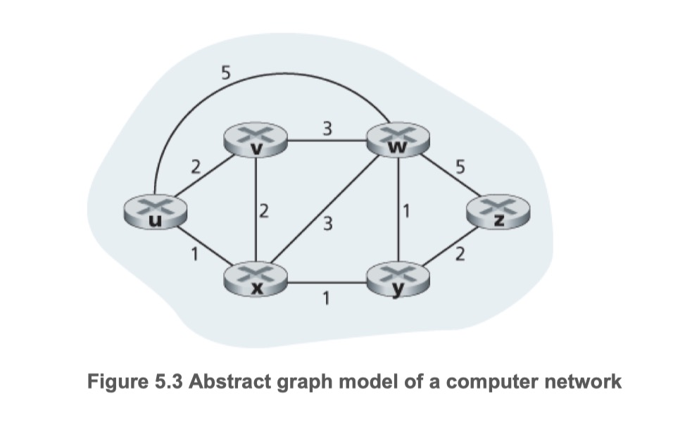

## 링크상태 라우팅 알고리즘 (Link State Routing Algorithm) 이란?
- 최소 비용 기준 알고리즘
- 링크 상태 데이터베이스(LSD)를 사용하여 목적지까지의 여러 가능한 경로들 중에서
  - 각 링크 비용 합에 기반하여, 최소의 경로 비용을 계산하는 라우팅 알고리즘
  
## 링크상태 라우팅 알고리즘 주요 특징
- 전체 네트워크에 대한 토폴로지와 관련된 모든 정보로써의 LSD(Link State Database)를 각각의 라우터가 소유
  - 이 LSD를 통해 SPF(Shortest Path First) 트리를 만들고
  - 이를 토대로 최적 경로에 대한 라우팅 테이블을 구축하게 됨
- 네트워크 토폴로지 및 모든 링크 비용이 알려져 있고, 이들 값이 입력으로 사용됨
  - 이에 참여하는 모든 라우터는 항상 전체 네트워크에 대한 맵(지도, 그림 등)을 그리고
  - 이를 토대로 최적의 경로를 계산하는 방식을 취함
- 어떤 링크의 변화가 있는 경우만 정보를 전달하는 방식을 취함
  - 따라서, 라우팅 정보의 교환에 따른 부하는 작은 편임
- Link State(링크 상태)에 기반하는 최적의 경로 선택을 위한 알고리즘
  - 이는 OSPF 등에 적용되어 사용됨

## 다익스트라(Dijkstra) 알고리즘
- D(v): 알고리즘의 현재 반복시점에서 출발지 노드부터 목적지 v까지의 최소 비용 경로의 비용
- p(v): 출발지에서 v까지의 현재 최소 비용 경로에서의 v의 직전 노드
- N’: 노드의 집합. 출발지에서 v까지의 최소 비용 경로가 명확히 알려져 있다면 v는 N에 포합된다

```
Initialization:
  N’ = {u}
  for all nodes v
    if v is a neighbor of u
      then D(v) = c(u,v)
    else D(v) = ∞

Loop
  find w not in N’ such that D(w) is a minimum
  add w to N’
  update D(v) for each neighbor v of w and not in N’:
      D(v) = min( D(v), D(w) + c(w,v) )
    /* new cost to v is either old cost to v or known
    least path cost to w plus cost from w to v */
until N’= N
```

- 중앙 집중형 라우팅 알고리즘은 초기화 단계와 반복 부분으로 구성
- 반복 부분의 수행 횟수는 네트워크의 노드 수와 같다
- 반복 부분 수행이 종료되면 알고리즘은 출발지 노드 u에서 네트워크 상의 다른 모든 노드로의 최단경로를 산출할 수 있다.



| step | N’ | D (v), p (v) | D (w), p (w) | D (x), p (x) | D (y), p (y) | D (z), p (z) |
| -- | -- | -- | -- | -- | -- | -- |
| 0 | u | 2, u | 5, u | 1,u | ∞ | ∞ |
| 1 | ux | 2, u | 4, x |  | 2, x | ∞ |
| 2 | uxy | 2, u | 3, y |  |  | 4, y |
| 3 | uxyv |  | 3, y |  |  | 4, y |
| 4 | uxyvw |  |  |  |  | 4, y |
| 5 | uxyvwz |  |  |  |  |  |

- 각 노드에 대해 출발지 노드로부터의 최소 비용 경로상의 직전 노드를 알 수 있다.
- 각각의 직전 노드는 또 그 직전 노드를 가지며,
  - 이러한 방식으로 출발지에서 모든 목적지까지의 전체 경로를 구축할 수 있다.
  - e.g. 출발지 노드 u에서 목적지 노드 z까지의 경로를 구한다면: uxyz

## 참고
- [컴퓨터 네트워킹 하향식 접근 5장](https://gaia.cs.umass.edu/kurose_ross/index.php)
- [Link State Algorithm   링크상태 알고리즘 - 정보통신기술용어해설](http://www.ktword.co.kr/test/view/view.php?m_temp1=2478)