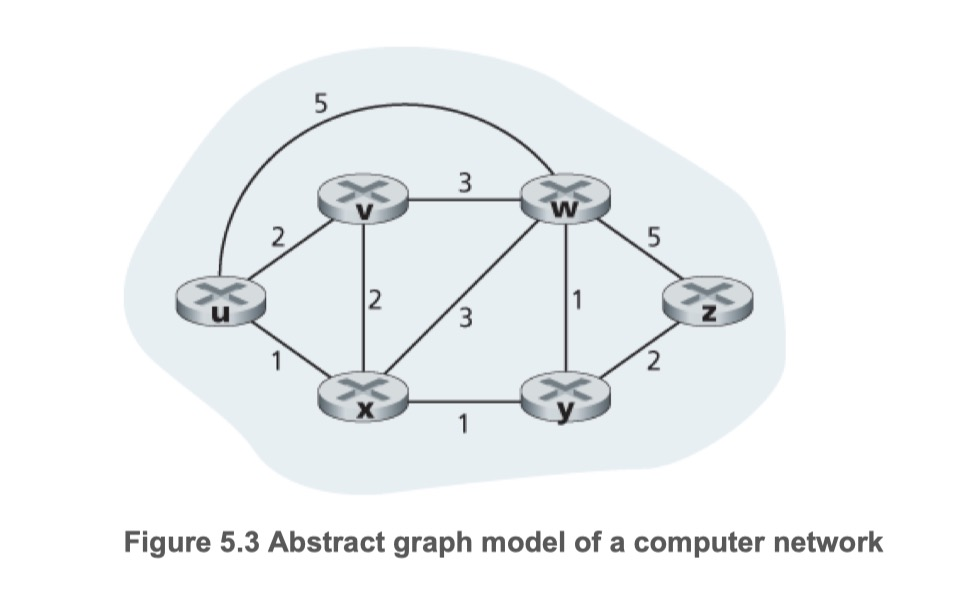

## 라우팅 알고리즘
- 라우팅 알고리즘의 목표는 송신자부터 수신자까지 라우터의 네트워크를 통과하는 좋은 경로를 결정하는 것
- 일반적으로 '좋은' 경로란 최소 비용 경로를 말한다
- 라우팅 문제를 나타내는데는 그래프가 사용된다

- 그래프(graph)는 G(N, E)로 나타낸다
  - N: 노드(node)
  - E: 에지(edge)
    - 하나의 에지는 집합 N에 속하는 한 쌍의 노드로 표시
    - 에지는 그 비용을 나타내는 값을 갖는다
- 네트워크 계층 라우팅 상황에서
  - 노드는 패킷전달 결정이 이루어지는 라우터
  - 에시는 라우터들간의 물리 링크
- 집합 E에 포함된 어떤 에지(x, y)에 대해 c(x, y)는 노드 x와 y간의 비용을 의미
- 노드 쌍(x, y)의 집합 E에 포함여부에 따라
  - 포함되지 않으면 c(x, y) = ∞ 로 둔다
  - 포함되면 노드 y는 노드 x의 이웃(neighbor)이라고 한다

## 라우팅 알고리즘을 분류하는 일반적인 방법
- 중앙 집중형 라우팅 알고리즘(centralized routing algorithm)
  - 네트워크 전체에 대한 완전한 정보를 가지고 출발지와 목적지 사이의 최소 비용 경로를 계산
  - 모든 노드 사이의 연결 상태와 링크 비용을 필요로 한다
  - 링크 상태(link-state, LS) 알고리즘이 속한다
- 분산 라우팅 알고리즘(decentralized routing algorithm)
  - 최소 비용 경로의 계산이 라우터들에 의해 반복적으로 분산된 방식으로 수행
  - 반복된 계산과 이웃 노드와의 정보교환을 통해 점차적으로 최소 비용 경로를 계산
  - 거리 벡터(distance-vector, DV) 알고리즘이 속한다

## 라우팅 알고리즘을 분류하는 두 번째 방법
- 정적 라우팅 알고리즘(static routing algorithms)
  - 경로가 아주 느리게 변화
  - 종종 사람의 개입(e.g. 직접 링크 비용을 수정)의 결과
- 동적 라우팅 알고리즘(Dynamic routing algorithms)
  - 네트워크 트래픽 부하(load)나 *토폴로지* 변화에 따라 라우팅 경로를 변경
  - 네트워크 변화에 빠르게 대응한다는 장점이 있지만 경로의 루프(loop)나 경로 진동(oscillation) 같은 문제에 취약

***토폴로지(topology)***
- 통신 노드의  외형적인 연결모양
- 통신망을 구성하기 위한 물리적 결선 방식
- 다수의 디바이스가 통신 링크로 상호 연결되어 있는 방식/형태/모양 을 의미

## 라우팅 알고리즘을 분류하는 세 번째 방법
- 부하에 민감한 알고리즘(load-sensitive algorithm)
  - 링크 비용이 해당 링크의 혼잡 수준을 나타내기 위해 동적으로 변화
  - 결과적으로 라우팅 알고리즘은 혼잡한 링크를 우회하는 경향을 보일 것
  - 오늘날의 라우팅 알고리즘(RIP, OSPF, BGP 등)은 링크 비용이 현재의 혼잡을 반영하지 않기 때문에,
    - 부하에 민감하지 않다

## 참고
- [컴퓨터 네트워킹 하향식 접근 5장](https://gaia.cs.umass.edu/kurose_ross/index.php)
- [Topology   토폴로지, 토폴리지, 통신망 구성 - 정보통신기술용어해설](http://www.ktword.co.kr/test/view/view.php?m_temp1=356)