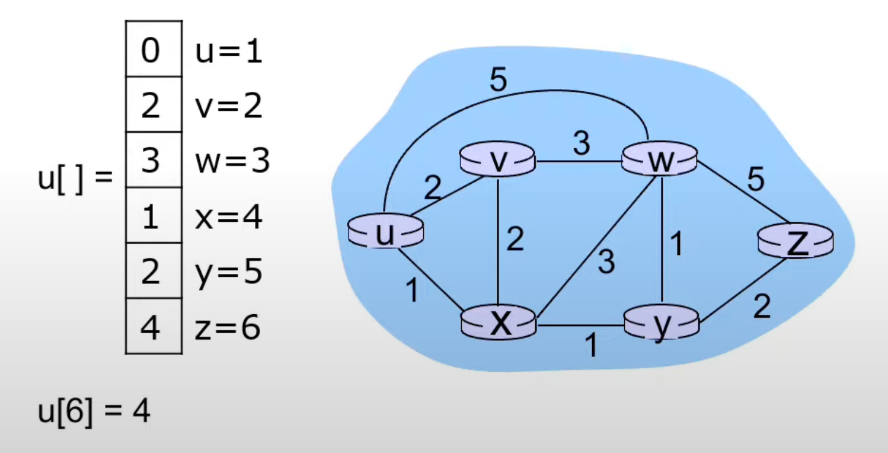
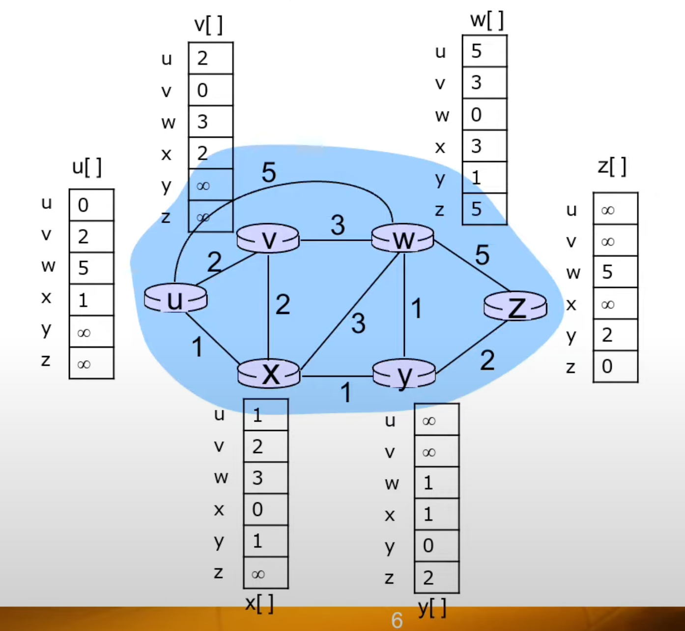
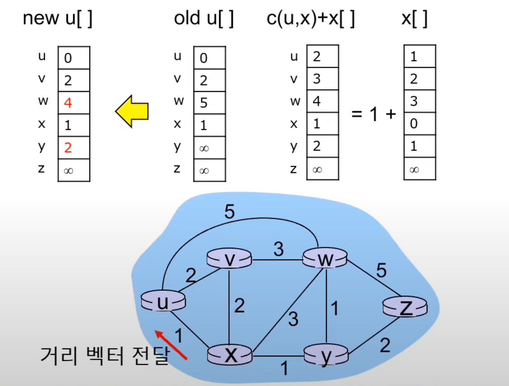
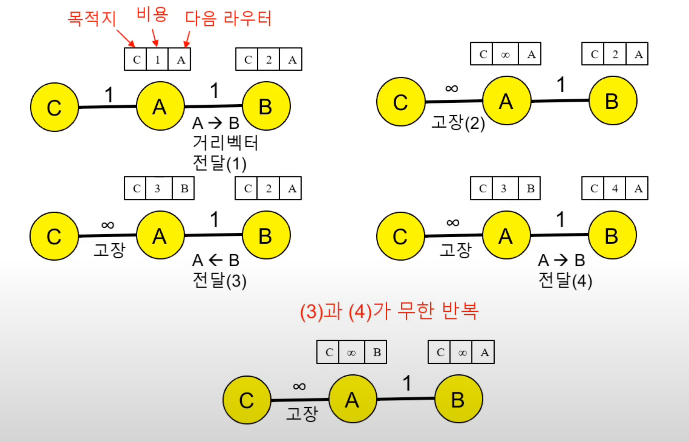
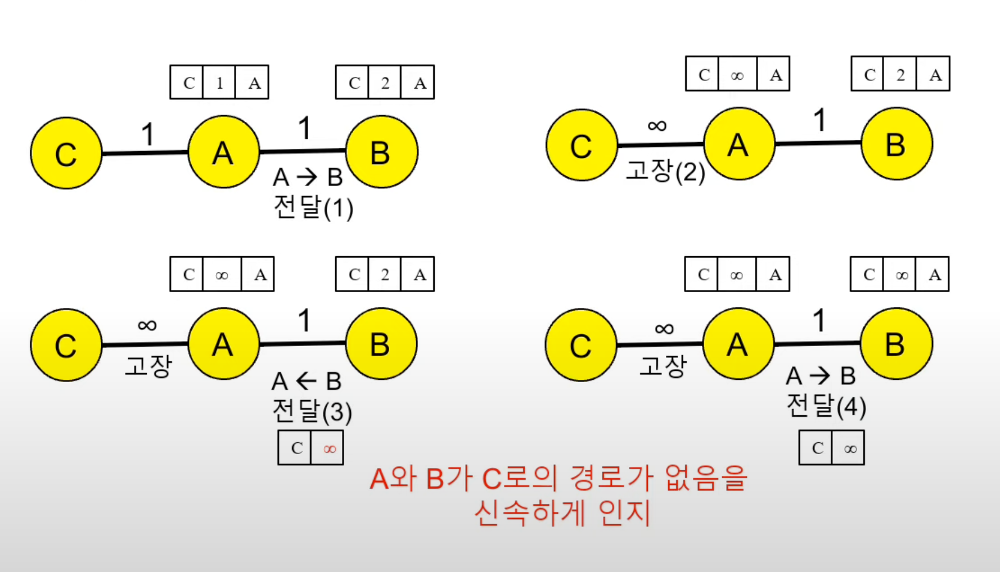
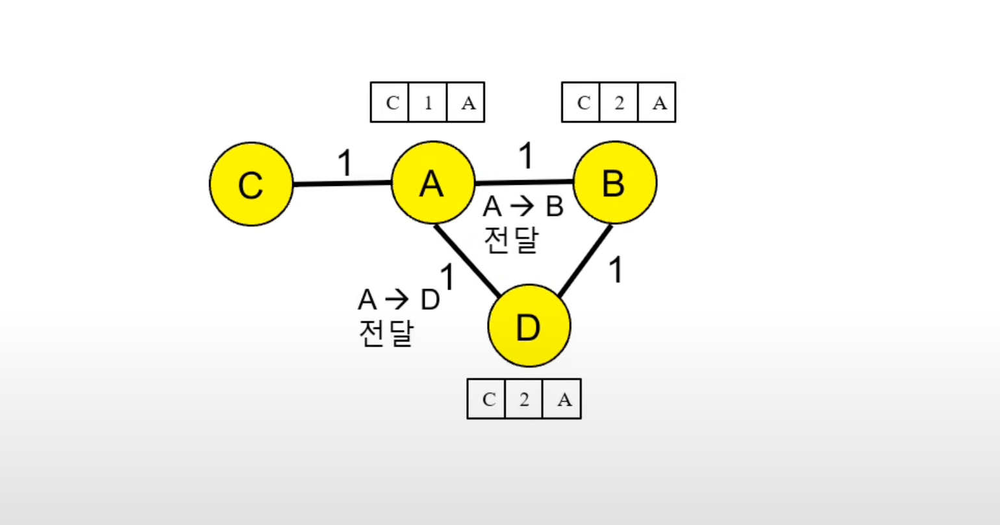
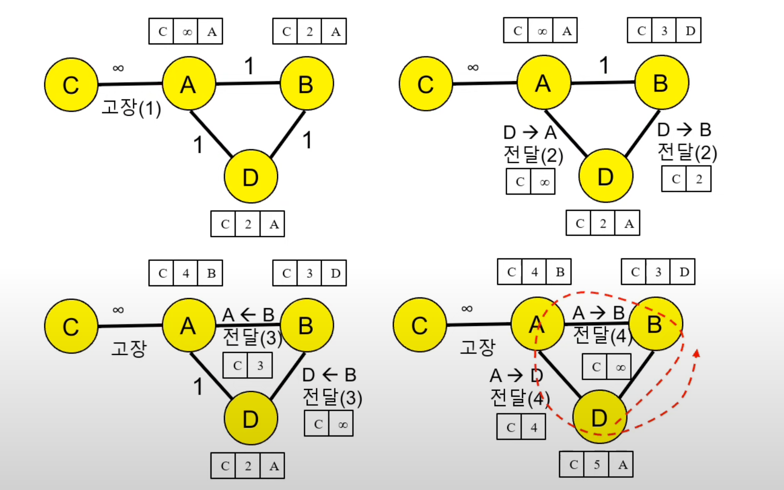

## 거리 벡터 라우팅 알고리즘 (Distance Vector Routing Algorithm) 이란?
- 라우팅 결정방식에 사용되는 알고리즘 중의 하나
- 모든 라우터가 경로 결정을 주로 거리(distance)에 의존하는 방식
- Bellman-Ford 알고리즘에 기초하여 1969년 설계됨

## 거리 벡터 라우팅 알고리즘 주요 특징
- 분산적
  - 각 노드는 직접 연결된 이웃들이 보내는 정보로부터 계산하고,
    - 그 계산결과(자신의 거리벡터 계산 복사본)를 이웃에게 알림
- 반복적
  - 이웃끼리 라우팅 정보를 반복적으로 주고받음 
- 비동기적
  - 모든 노드가 비동기적으로 제각각 동작하며 계산
  - 이웃에서 보내준 경로 예측 값들과 자신이 가지고 있는 경로 예측 값을 비교하여,
    - 적은 값을 최적 경로로 삼게됨

## 거리 벡터 (Distance Vector) 란


- 특정 라우터에서 다른 모든 라우터까지의 최소 경로 비용을 갖는 1열 벡터
- u[] : 라우터 u의 전체 거리 벡터
- u[x] : 라우터 u에서 라우터 x까지의 거리(최소 경로 비용)
  - 네트워크의 각 라우터가 거리 벡터의 인덱스
  - e.g. `u[6] = 4` : 라우터 u에서 라우터 z까지의 비용은 4 (아래 이미지 참고)

### 초기 거리 벡터 : 라우터 연결 시점의 거리 벡터


- 직접 연결 라우터(이웃) 거리 : 링크 비용
- 간접 연결 라우터 거리 : ∞

### 거리 벡터 공유를 통한 거리 벡터 갱신 : x -> u로 거리 벡터 전달


- u[] = min(u[], c(u, x) + x[])
  - `u[] =`
    - 거리 벡터 갱신
  - `min(u[], c(u, x) + x[])`
    - u[] : 라우터 u가 기존에 가지고 있는 거리 벡터 (위 그림에서 *old u[]*)
    - c(u, x) + x[] : x를 거쳐서 다른 라우터로 이동할 경우의 거리 벡터
      - 라우터 x의 거리 벡터에, *u -> x* 비용 1을 더한다
- 라우터 u의 기존 거리 벡터와 비교하여 적은 비용 선택
- e.g. *u -> w* 이동 시
  - 기존 거리 벡터 : *u[3], u -> w* = 5
  - x를 경유한 거리 벡터 : *u[3], u -> x -> w* = 4
    - 새로운 거리 벡터로 선택 됨

## 벨만-포드(Bellman-Ford) 알고리즘
- Dx(y) : 라우터 x에서 라우터 y까지의 최소 경로 비용
- c(x, v) : 라우터 x에서 이웃 라우터 까지의 링크 비용
- Dx(y) = minv{c(x, v) + Dv(y)} : v는 x의 모든 이웃 라우터

```
Initialization:
  for all destinations y in N:
    Dx(y) = c(x, y)/* if y is not a neighbor then c(x, y)= ∞ */
  for each neighbor w
    Dw(y) = ? for all destinations y in N
  for each neighbor w
    send distance vector Dx = [Dx(y): y in N] to w

loop
  wait (until I see a link cost change to some neighbor w or
         until I receive a distance vector from some neighbor w)

  for each y in N:
    Dx(y) = minv{c(x, v) + Dv(y)}

if Dx(y) changed for any destination y
  send distance vector Dx = [Dx(y): y in N] to all neighbors 18

forever
```

1. 이웃 라우터와 자신의 초기 거리 벡터 공유
1. 이웃 라우터의 거리 벡터와 벨만-포드 방정식으로 자신의 거리 벡터 갱신
1. 갱신된 거리 벡터를 이웃 라우터에 전달

## 무한 계산 문제(Count to Infinity)
### 무한 계산 문제 예
- 이웃 라우터를 경유하는 경로로 최소 경로 비용을 갱신하고,
  - 해당 이웃 라우터에게 다시 전송하는 과정이 반복되는 문제
- 링크가 고장나거나 비용이 증가할 때 발생
- 이웃 라우터가 자신을 경유하는 최소 경로 비용 전송
- 2개의 이웃 라우터 간에 순환 경로(loop path) 발생



### 포이즌 리버스(Poison Reverse)
- 상대방 이웃 라우터를 경유하는 최소 경로 비용을 ∞로 변경하여 통보



### 3개 노드 불완전성 문제(Three-Node Instability)
- 3개 이상의 라우터 간에 순환 경로(loop path) 발생 시,
  - 포이즌 리버스가 무한 계산 문제 완전 해결 불가




### 해결
- 규모가 작은 네트워크에서는 RIP 라우팅 프로토콜을 사용하며 16으로 무한대를 나타낸다
  - 16번 반복되면 스탑
- 규모가 큰 네트워크에서는 거리 벡터 알고리즘을 사용하기 곤란하다

## 참고
- [컴퓨터 네트워킹 하향식 접근 5장](https://gaia.cs.umass.edu/kurose_ross/index.php)
- [Distance Vector Algorithm   거리 벡터 알고리즘 - 정보통신기술용어해설](http://www.ktword.co.kr/test/view/view.php?nav=2&no=528&sh=%EA%B1%B0%EB%A6%AC+%EB%B2%A1%ED%84%B0)
- [컴퓨터네트워크 제24강 거리 벡터(Distance Vector) 라우팅 알고리즘 - 한국기술교육대학교박승철교수](https://www.youtube.com/watch?v=0UvOCb0t7y0)