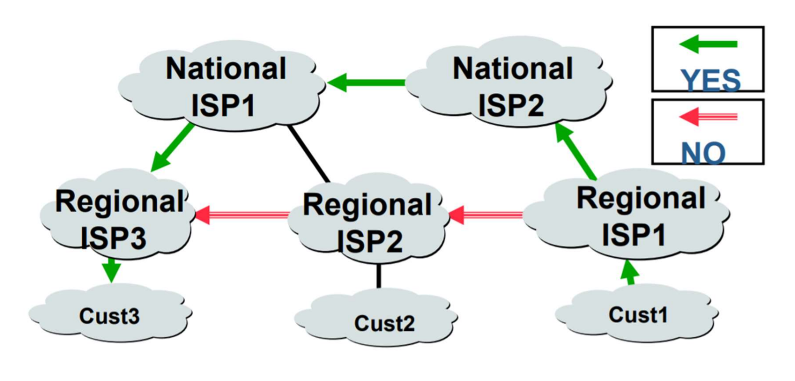

## BGP (Border Gateway Protocol)란
- 자율 시스템(autonomous system, AS) 상호 간에 적용되는 라우팅 프로토콜
  - Inter-Domain Routing Protocol
  - 즉, 독립 운용되는 대규모 네트워크 (AS) 간에, 네트워크 정보를 교환하기 위해 주로 사용됨
- 서로 다른 AS의 목적지에 대한 경로 정보 제공
- 경로 벡터 라우팅 알고리즘 기반

***라우팅 프로토콜 별 알고리즘***
- OSPF: 링크 상태 알고리즘
- RIP: 거리 벡터 알고리즘
- BGP: 경로 벡터 알고리즘

## 경로 벡터(Path Vector)
- 모든 목적지까지 전체 경로 정보(Entire Path) 자료 구조 -> 순환 경로(loop) 탐지 가능
- 다양한 경로 속성들(Path Attribute)의 조합으로 경로 정보 제공
- 송신자는 경로 벡터의 경로 속성들을 사용하여 다양한 경로 선택 정책 적용 가능

## 경로 선택 정책의 예 : 경쟁 ISP 회피

- `Cust1 -> Cust3` 로 이동한다고 할 때,
- 경쟁관계에 있는 최단경로인 Regional ISP2로 가지 않고,
  - `National ISP2 -> National ISP1 -> Regional ISP3 -> Cust3 ` 순으로 이동할 수 있다

## BGP 특징
- AS 영역 별로 상호 간의 라우팅 정보 교환을 위한 라우팅 프로토콜  
  - EGP(Exterior Gateway Protocol) 또는 Inter-Domain Routing Protocol 라고 함
    - 즉, 물리적인 라우터 간에 라우팅하는 관점이 아니라, AS 영역 간에 라우팅이 이루어짐
    - 따라서, 라우터 간의 정보 교환이 아니라, AS 간의 정보 교환이 됨
- 인터넷을 AS 간 연결 경로(Path)로 이루어진 방향성 그래프의 집단으로 봄
  - 인터넷을, 각각 유일한 AS 번호를 갖는 AS들이, 방향성을 갖고 연결된 AS 집합인 그래프로 봄
  - AS 간에 *Mesh Type* 구성
- 끝없이 순환되는 문제점이 없도록 확실히 함
  - 순환을 피할 수 있도록, 목적지 AS까지 거치게되는 경로를 담은, AS 경로 정보를 제공 함
- 보안 중시
  - 신뢰할 만한 TCP 연결에 의해, 라우팅 정보를 교환 
  - 교환되는 라우팅 정보는, BGP 라우터간에, 포트번호 179번을 통해, TCP에 의해 신뢰성있게 전달
- 라우팅 정보의 점진적 부분 갱신  (Incremental, Partial, Triggered Update)
  - BGP는 주기적으로 정보를 갱신하지 않고, 
    - 단지 변화가 있을때 만, 이웃 라우터에게 갱신 정보를 Advertising 함
  - 전체 라우팅 정보는, 두 피어 라우터 간에, 처음 BGP Session을 맺은 직후에 만 필요
    - 이후 변화된 것 만 필요
- 최상의 경로 선택을 위해 다양하고 풍부한 *Routing Metric* 사용  (Path Attribute)
  - 우선순위가 있는 각 Metric을 차례대로 참조하여 최상의 경로를 선택
- 클래스 없는 주소체계 지원
  - CIDR (Classless Inter-Domain Routing) 지원
  - BGP는 각 주소 정보에 덧붙여 Prefix의 길이도 함께 전달
- 정책 기반의 라우팅 프로토콜  (Policy-based Routing)
  - BGP는 상대 영역의 라우팅 정책을 침범하지 않고도, 자신의 라우팅 정책을 구현 가능
  - 서로 경쟁적인 AS 간에 자신의 피해 예방을 위해 최소한의 정보 공유 등,
    - 정치적 이유,보안 등에 의해 각 경로에 대해 선택적으로 버리거나 무시하거나,
    - 또는 정책적인 가중치 부여가 가능함

***Mesh Type***
- 망형 (Mesh Type, Mesh Topology)
- 토폴로지 상으로 모든 노드가 마치 그물처럼 완전히 직접 연결되어 있는 구조
- 비록 회선의 효율성이 낮고 비경제적이나, 안정성은 매우 높은 구조

***Routing Metric***
- 라우팅 메트릭 (Routing Metric)
- 라우터가 목적지에 이를 수 있는 여러 경로 중,
  - 최적의 경로를 결정하는데 서열 기준을 매길 수 있게끔 숫자로 환산하는 변수

## 참고
- [BGP, BGP-4, BGPv4   Border Gateway Protocol   BGP 라우팅 프로토콜 - 정보통신기술용어해설](http://www.ktword.co.kr/test/view/view.php?nav=2&no=1326&sh=BGP)
- [Mesh Topology, Mesh Type, Full-mesh   망형, 그물형, 그물망, 메쉬형, 망형 토폴로지 - 정보통신기술용어해설](http://www.ktword.co.kr/test/view/view.php?m_temp1=1209&id=288)
- [Routing Metric, Link Metric, Routing Metrics, Link Metrics, Route Cost   라우팅 메트릭, 링크 메트릭 - 정보통신기술용어해설](http://www.ktword.co.kr/test/view/view.php?m_temp1=1919&id=853)
- [컴퓨터네트워크 제28강 라우팅프로토콜 BGP - 한국기술교육대학교박승철교수](https://www.youtube.com/watch?v=0h7hKi_j1GE&list=LL&index=1)