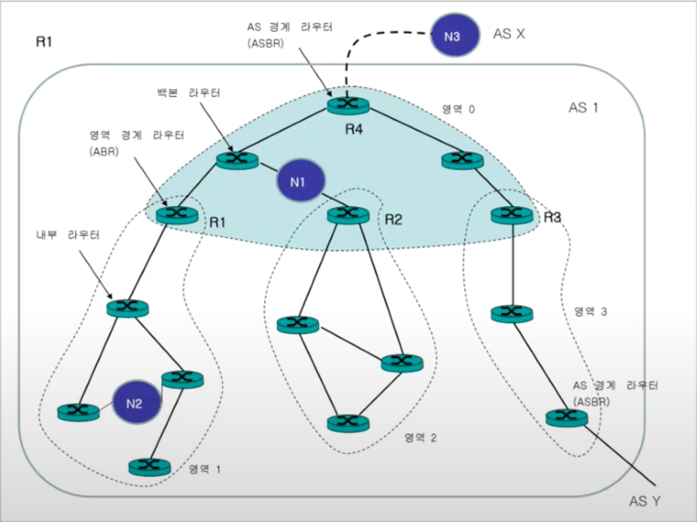

## OSPF (Open Shortest Path First)란
- 링크상태(Link State) 라우팅 알고리즘에 기초하여, 
  - 자율 시스템(autonomous system, AS) 내부의 라우터들끼리 링크의 상태에 변화가 있는 경우에만
  - 변화의 내용을 모든 라우터에게 플러딩(flooding)함으로서 갱신된 상태 정보를 모든 라우터와 공유

## OSPF 동작 절차
1. OSPF가 설정된 라우터 간에 주기적으로(10초)으로 헬로(hello) 패킷을 주고 받으며 인접 이웃 관계(Adjacent Neighbor Relationship) 형성
1. 각 라우터는 갱신된 링크 상태 정보가 포함된 LSP(Link State Packet) 또는 LSA(Link State Advertisement) 생성
1. LSA를 모든 라우터들에게 플러딩(flooding)함으로써 링크 상태 갱신 정보 공유
1. 모든 라우터는 동일한 링크 상태 데이터베이스(Link State DataBase, LSDB) 유지
1. 각 라우터는 자신의 LSDB에 대해 다익스트라 알고리즘을 적용하여 모든 라우터에 대한 최소 비용 경로 계산
1. 계산된 최소 비용 경로를 바탕으로 라우팅 테이블 설정

## OSPF 문제점과 계층 구조
### 문제점
- 자율 시스템(AS)의 규모가 커지면 메시지 플러딩으로 인한 라우팅 트래픽 증가
- AS의 규모가 커지면 각 라우터가 유지해야 되는 네트워크의 상태 정보의 양 증가

### 계층 구조 적용
- 이를 해결하기 위해 하나의 AS를 여러 개의 영역(Area)로 나눔
- 각 영역은 독립적으로 OSPF 라우팅 수행
- 영역 간의 라우팅은 백본 영역(Backbone Area)를 통해서 수행

## 참고
- [OSPF   Open Shortest Path First   OSPF 라우팅 프로토콜 - 정보통신기술용어해설](http://www.ktword.co.kr/test/view/view.php?nav=2&no=437&sh=OSPF)
- [컴퓨터네트워크 제27강 라우팅 프로토콜 OSPF - 한국기술교육대학교박승철교수](https://www.youtube.com/watch?v=DWZE-qZHXUk&list=PLOml5j0-AMQkHM6SFAP3YIRXHKu2glLVc&index=25)