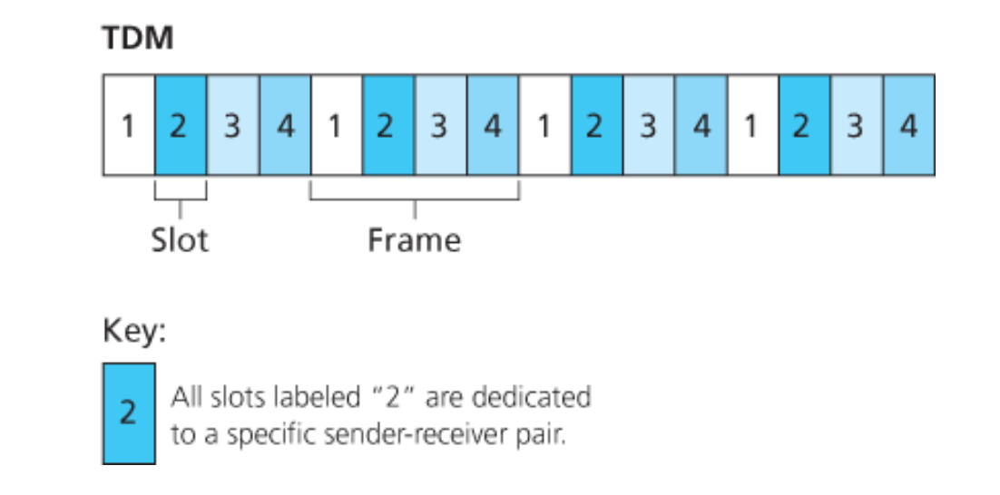
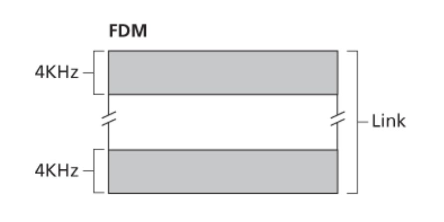

## 채널 분할 프로토콜이란
- 채널을 공유하는 모든 노드가 브로드 캐스트 채널의 대역폭을 분할할 수 있게 채널을 나누어서 공유하는 방식
  - 시간: 시분할 다중화 (Time Division Multiplexing, TDM)
  - 주파수: 주파수 분할 다중화 (Frequency Division Multiplexing, FDM)
  - 코드: 코드 분할 다중 접속 (Code Division Multiple Access, CDMA)
- 할당된 조각들은 다른 노드와 무관하게 배타적으로 사용된다
- 채널에 부하가 높을 때는 빠르고 공평한 방법이지만,
  - 부하가 적을때는 필요없이 나눈 채널들로 인해 낭비되는 채널이 생기는 비효율성이 발생

## 1. 시분할 다중화 (Time Division Multiplexing, TDM)
- 시간을 시간 프레임(time frame)으로 나누고,
  - 각 시간 프레임을 시간 슬롯(time slot)으로 나눈다
  - e.g. 채널이 4개의 노드를 지원할 경우, 하나의 시간 프레임이 4개의 시간 슬롯으로 나뉘어져 할당
- 노드는 전송할 패킷이 있을 때마다,
  - TDM 프레임에서 자신에게 할당된 시간 슬롯 동안 패킷 비트들을 전송한다
- 채널이 *N*개 노드를 지원하고, 채널 전송률이 *R* pbs 라면, 각 노드는 *R*/*N* bps의 전송률을 가진다

### 시분할 다중화의 단점
- 전송할 패킷이 있는 노드가 단 하나의 경우에도 노드의 전송률은 평균 *R*/*N* 으로 제한된다
- 노드가 전송 순서상 자신의 차례를 항상 기다려야 한다

## 2. 주파수 분할 다중화 (Frequency Division Multiplexing, FDM)
- *R* pbs의 채널을 다른 주파수로 나눠서,
  - 각 주파수를 N개의 노드 중 하나에게 할당한다
  - 각 주파수는 *R*/*N* 의 대역폭을 가진다

### 주파수 분할 다중화의 단점
- 시분할 다중화와 동일한 단점을 가진다
  - 전송할 패킷을 가진 노드가 단 하나라도 *R*/*N*의 대역폭으로 한정된다

## 3. 코드 분할 다중 접속 (Code Division Multiple Access, CDMA)
- 채널을 공유하는 각 노드에게 다른 코드를 할당 하면,
  - 노드는 전송하는 데이터 비트들을 자신의 유일한 코드로 인코딩한다
- 여러 노드들이 동시에 전송할 수 있고 다른 노드들에 의해 간섭(interfere)되더라도,
  - 각 수신자들이 송신자의 인코딩된 데이터 비트를 정확하게 수신할 수 있다
  - (수신자가 송신자의 코드를 안다고 가정)

## 참고
- [컴퓨터 네트워킹 하향식 접근 6장](https://gaia.cs.umass.edu/kurose_ross/index.php)
- [채널 분할 프로토콜](https://junhoahn.kr//noriwiki/index.php/%ec%b1%84%eb%84%90_%eb%b6%84%ed%95%a0_%ed%94%84%eb%a1%9c%ed%86%a0%ec%bd%9c)
