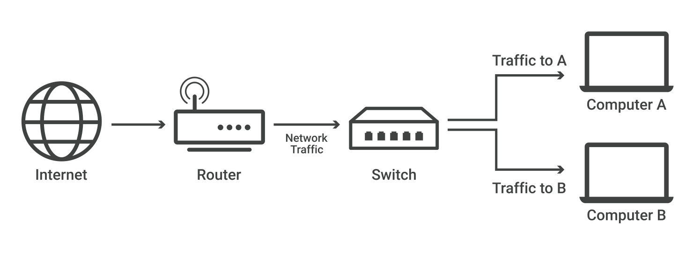

## 네트워크 스위치란
- 네트워크(종종 근거리 통신망, 즉 LAN) 내의 장치를 연결하고 해당 장치와 데이터 패킷을 주고받는 역할을 수행
- 라우터와 달리 스위치는 여러 장치의 네트워크가 아닌,
  - 의도된 단일 장치(다른 스위치, 라우터, 사용자 컴퓨터일 수 있음)로만 데이터를 전송한다
- 스위치라고하면 통상 2계층 상에서 동작하는 *L2 스위치*를 말한다
- 가정과 소규모 사무실에는 인터넷 액세스를 위한 라우터가 필요하지만,
  - 많은 양의 이더넷 포트가 필요하지 않는 한 대부분 네트워크 스위치가 필요하지 않다
- 그러나 컴퓨터가 수십 대나 수백 대 있는 대규모 사무실, 네트워크, 데이터 센터에는 일반적으로 스위치가 필요하다

***L2 스위치***
- 네트워크 스위치는 OSI 계층 2(데이터 링크 계층) 또는 계층 3(네트워크 계층)에서 작동할 수 있다
  - 계층 2는 대상 MAC 주소(정의는 아래 참조)를 기반으로 데이터를 전달
  - 계층 3은 대상 IP 주소를 기반으로 데이터를 전달
  - 일부 스위치는 둘 다 수행할 수 있다
- 스위치는 대부분 계층 2 스위치로, 대부분 이더넷 케이블을 사용하여 네트워크의 장치에 연결된다

## 참고
- [네트워크 스위치란? - cloudflare](https://www.cloudflare.com/ko-kr/learning/network-layer/what-is-a-network-switch/)
- [Switch   스위치 - 정보통신기술용어해설](http://www.ktword.co.kr/test/view/view.php?nav=2&no=6313&sh=%EC%8A%A4%EC%9C%84%EC%B9%98)