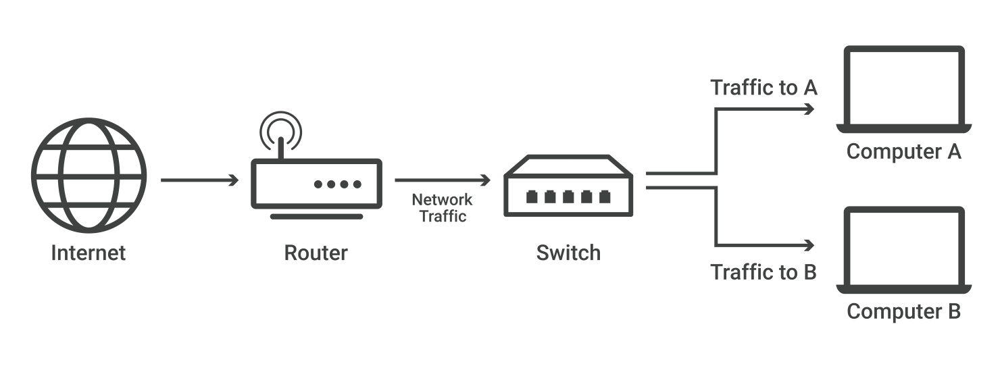
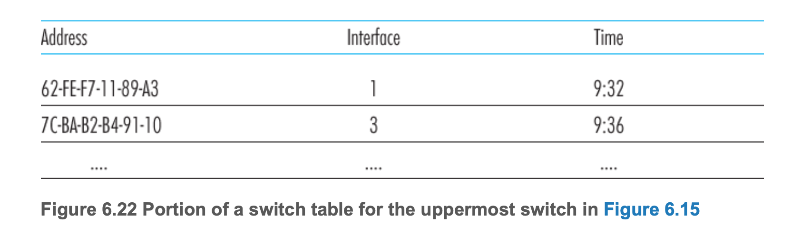
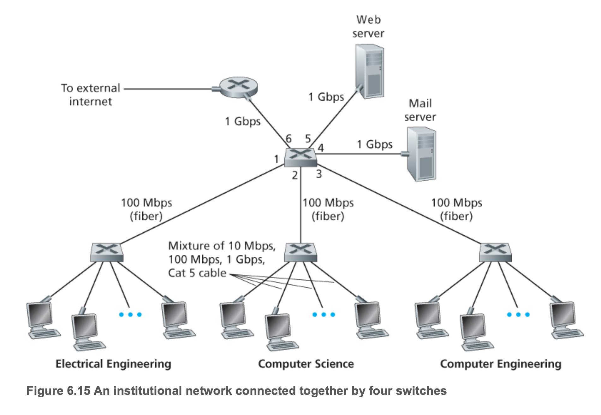
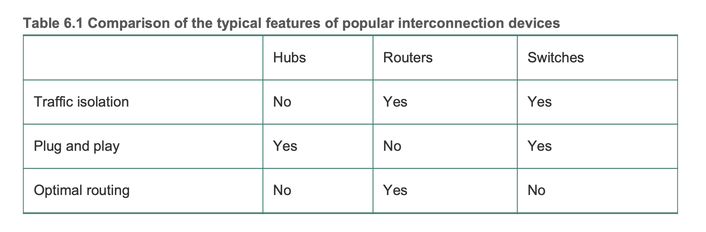

## 네트워크 스위치란
- 네트워크(종종 근거리 통신망, 즉 LAN) 내의 장치를 연결하고 해당 장치와 데이터 패킷을 주고받는 역할을 수행
- 라우터와 달리 스위치는 여러 장치의 네트워크가 아닌,
  - 의도된 단일 장치(다른 스위치, 라우터, 사용자 컴퓨터일 수 있음)로만 데이터를 전송한다
- 스위치라고하면 통상 2계층 상에서 동작하는 *L2 스위치*를 말한다
- 가정과 소규모 사무실에는 인터넷 액세스를 위한 라우터가 필요하지만,
  - 많은 양의 이더넷 포트가 필요하지 않는 한 대부분 네트워크 스위치가 필요하지 않다
- 그러나 컴퓨터가 수십 대나 수백 대 있는 대규모 사무실, 네트워크, 데이터 센터에는 일반적으로 스위치가 필요하다

***L2 스위치***
- 네트워크 스위치는 OSI 계층 2(데이터 링크 계층) 또는 계층 3(네트워크 계층)에서 작동할 수 있다
  - 계층 2는 대상 MAC 주소(정의는 아래 참조)를 기반으로 데이터를 전달
  - 계층 3은 대상 IP 주소를 기반으로 데이터를 전달
  - 일부 스위치는 둘 다 수행할 수 있다
- 스위치는 대부분 계층 2 스위치로, 대부분 이더넷 케이블을 사용하여 네트워크의 장치에 연결된다

- 스위치는 그 자체가 서브넷의 호스트와 라우터들에게 투명(transparent)하다
- 즉, 호스트/라우터는 프레임을 스위치가 아닌 다른 호스트/라우터를 목적지로 해서 랜상으로 보내며, 중간에 스위치가 프레임을 받아서 다른 노드에게 전달하는 것을 알지 못한다
- 프레임이 스위치 출력 인터페이스들 중 하나에 도착 하는 속도가 그 인터페이스의 링크 용량을 일시적으로 초과할 수 있다
- 이 문제를 해결하기 위해, 라우터 출력 인터페이스가 데이터그램에 대한 버퍼를 갖고 있듯이 스위치 출력 인터페이스도 버퍼를 갖고 있다.

## 포워딩과 필터링
- **필터링(filtering)** : 프레임을 인터페이스로 전달할지 또는 폐기(drop)할지 결정하는 스위치의 기능
- **포워딩(forwarding, 전달)** : 프레임이 전송될 인터페이스를 결정하고 프레임을 해당 인터페이스로 내보내는 기능
- 필터링과 포워딩은 스위치 테이블(swich table)을 이용

## 스위치 테이블

- 스위치 테이블에는 랜상의 모든 호스트와 라우터는 아니지만 일부 노드에 대한 엔트리가 포함되어 있다
- 엔트리에는 아래 정보를 담는다
  1. MAC 주소
  1. 그 MAC 주소로 가게 하는 스위치 인터페이스
  1. 해당 엔트리가 테이블에 만들어진 시점
- 스위치는 자가학습(self learning)을 하며 자신의 테이블을 구축한다
  1. 스위치 테이블은 초기에 비어 있다.
  1. 인터페이스로 수신한 각 프레임에 대해 스위치는 프레임의 출발지 정보를 스위치 테이블에 저장한다
  1. 일정 시간이 지난 후에도 스위치가 해당 주소를 출발지 주소로 하는 프레임을 수신하지 못하면 테이블에서 이 주소를 삭제한다.

## 링크 계층 스위치의 특성
**충돌 제거**
- 스위치로 구축된 랜에는 충돌로 인해 낭비되는 대역폭이 없다.
- 스위치는 프레임을 버퍼링하며 어느 시점이든 세그먼트에 하나 이상의 프레임을 전송하지 않는다

**이질적인(heterogeneous) 링크들**
- 스위치는 링크들을 별개로 분리하기 때문에 랜의 각 링크는 상이한 속도로 동작할 수 있으며 상이한 매체를 사용할 수 있다

- 그림 6.15의 최상단 스위치는 3개의 1 Gbps 1000BASE-T 동선, 2개의 100 Mbps 100BASE-FX 광섬유, 1개의 100BASE-T 동선에 연결될 수 있다.
- 따라서 스위치는 기존 장비를 새로운 장비와 함께 사용할 수 있게 해준다.

**관리**
- 스위치는 향상된 보안을 제공할 뿐만 아니라 네트워크 관리를 쉽게 할 수 있게 해준다.
- 스위치는 대역폭 사용, 충돌률, 트래픽 종류에 대한 통계치를 수집하며, 이 정보를 네트워크 관리자가 사용할 수 있게 해준다
- 이 정보는 문제를 디버깅해서 정정하고, 랜을 나중에 어떻게 개선해야 할지에 대한 계획을 세우는데 사용된다

## 허브, 라우터, 스위치 비교

## 참고
- [네트워크 스위치란? - cloudflare](https://www.cloudflare.com/ko-kr/learning/network-layer/what-is-a-network-switch/)
- [Switch   스위치 - 정보통신기술용어해설](http://www.ktword.co.kr/test/view/view.php?nav=2&no=6313&sh=%EC%8A%A4%EC%9C%84%EC%B9%98)
- [컴퓨터 네트워킹 하향식 접근 6장](https://gaia.cs.umass.edu/kurose_ross/index.php)