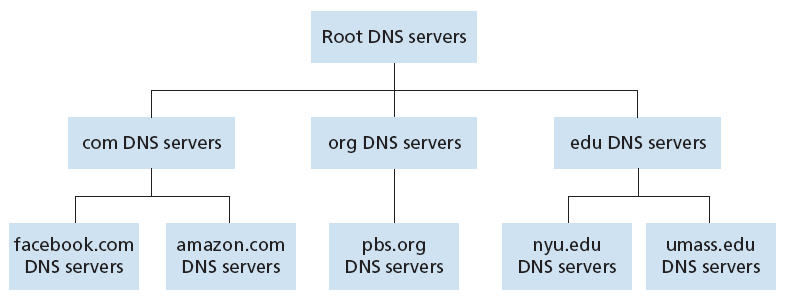

## DNS의 구조
- Domain Name System
- 도메인 이름을 IP주소로 변환하는 분산 데이터베이스 시스템
- 하나의 DNS 서버가 모든 매핑 정보를 가지고 있는 대신, 여러 개의 서버들이 전 세계 곳곳에 위치하여 계층적인 구조를 형성

**Root DNS 서버**
- root DNS 서버는 TLD DNS 서버의 IP주소를 제공하는 역할을 한다.
- 전 세계에 12개 기관에 의해 관리되는 13개의 루트 서버가 존재

## TLD(Top level domain server)
- `.com`, `.net`, `.kr` 과 같은 top-level domain 별로 존재하는 DNS 서버
- authoritative DNS 서버의 IP 주소를 제공하는 역할을 한다

## Authoritative DNS 서버
- 실제로 우리가 원하는 도메인에 대한 IP주소를 매핑하는 DNS 서버
- 구글을 예로 들면 google.com authoritative DNS 서버에 google.com 뿐만 아니라 `www.google.com`, `apis.google.com`, `play.google.com` 과 같이 서브 도메인에 대한 IP주소도 모두 저장된다.
- 각기관은 각자의 도메인을 관리하는 Authoritative DNS server를 가진다.

## Local DNS 서버
- 도메인에 따른 IP주소를 얻기 위해 아래와 같이 질의 할 수 있다.
  - `https://www.hanyang.ac.kr` > `Root DNS` > `.kr` > `ac.kr` > `hanyang.ac.kr`
- 항상 Root DNS 서버까지 가는게 아니라 **Local DNS Server**에 물어본다
- 우리(클라이언트)가 도메인 이름에 대한 IP주소를 찾고자 할 때 가장 먼저 찾아가는 DNS 서버

## DNS 레코드
- RR format: (name, value, type, ttl)
- TTL(Time To Live)는 해당 레코드가 DNS 캐시에 얼마 동안 저장되는지를 나타내는 정보
- DNS 질의를 하면 NS와 A의 페어를 계속 받아 찾아간다

**type**
- **A**: Address, value로 해당 도메인의 IPv4 주소를 가진다.
- **NS**: Name Server, 어떤 도메인에 대한 네임서버를 매핑하는 데 사용
- AAAA: IPv6의 주소를 매핑
- CNAME: 어떤 도메인이 다른 도메인의 별칭(alias)인 경우 CNAME 타입 레코드가 사용

| Name | Value | Type | TTL |
| -- | -- | -- | -- |
| example.com | 100.100.123.1 | A | 14400 |
| .com | dns.com | NS | 14400 |
| example.com | 0000:8a2e:0370:7334 | AAAA | 14400 |
| hello.example.com | example.com | CNAME	14400 |

## DNS가 UDP를 사용하는 이유

### 1. 빠른 속도
- TCP의 경우 데이터 전송 시작 전에 3-way-handshaking 과정이 있는 반면, UDP는 연결 설정에 드는 비용이 없다.
- DNS는 신뢰성보다 속도가 더 중요한 서비스이기 때문에 UDP가 더 적합하다.
- UDP는 512 bytes를 넘어가지 않는 패킷만 전송이 가능하고 오버헤드가 없어서 속도가 빠른데, DNS가 전송하는 데이터 패킷 사이즈가 매우 작으므로 UDP가 유리하다.

### 2. 연결 상태를 유지할 필요가 없다.
- TCP는 호스트 간의 연결 상태를 유지한다.
- 이때 TCP의 패킷 안에는 여러 정보가 담겨 있지만, UDP는 어떤 정보도 기록하지 않고 유지할 필요도 없다.
- DNS 서버는 TCP보다 많은 클라이언트를 수용할 수 있으므로 연결 상태를 유지하지 않고 정보 기록을 최소화할 수 있는 UDP를 채택하였다.

## 참고
- [DNS란 무엇일까](https://jaehyeon48.github.io/network/dns/)
- [2.4 DNS: 인터넷의 디렉터리 서비스 - github](https://github.com/IT-Book-Organization/Computer-Networking_A-Top-Down-Approach/tree/main/Chapter_2/2.4%20DNS%3A%20%EC%9D%B8%ED%84%B0%EB%84%B7%EC%9D%98%20%EB%94%94%EB%A0%89%ED%84%B0%EB%A6%AC%20%EC%84%9C%EB%B9%84%EC%8A%A4)