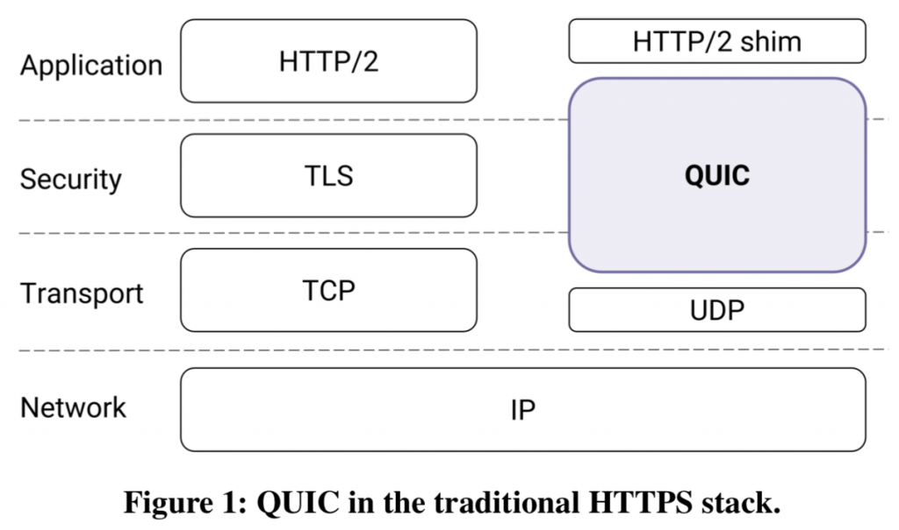

## HTTP/3
- HTTP/3는 웹상에서의 정보 전달을 지원하는 Hypertext Transfer Protocol (HTTP)의 주요 개정 버전
- HTTP/3는 QUIC를 기반으로 동작한다.

## QUIC
- QUIC 프로토콜은 2012년에 Google에서 개발했으며, 벤더 중립적인 표준 단체인 인터넷 엔지니어링 태스크포스(IETF)에서 새로운 HTTP/3 표준을 만들기 시작하면서 채택되었다
- QUIC은 사람들이 하루 종일 이동하면서 끊임없이 하나의 네트워크에서 다른 네트워크로 전환하는 스마트폰을 휴대하는 모바일 중심의 인터넷 사용을 위해 설계되었다
- QUIC는 UDP기반의 프로토콜. UDP로 전환하면 온라인 검색 시 연결 속도가 빨라지고 사용자 경험이 향상된다
- QUIC은 단일 연결에서 여러 데이터 스트림을 멀티플렉싱(multiplex)하는 암호화된 범용 전송 계층 프로토콜

## HTTP/3에서 UDP 기반의 QUIC 프로토콜을 사용하는 이유
- TCP는 신뢰성 있는 데이터 전송을 위해 Handshake 과정이 포함되어있다.
- 데이터를 주고받기까지 최소 두 번(TCP 연결 & TLS 연결)의 라운드 트립 딜레이가 발생한다.
- CPU, 네트워크는 점점 빨라지지만 빛의 속도는 변하지 않기 때문에 절대적으로 걸리는 시간을 줄이는 데 한계가 있다.
- UDP는 네트워크 레이어로부터 받은 데이터에 단순히 포트와 IP 정보만 추가된 전송 계층의 프로토콜이다. 이 위에 신뢰성을 보장해줄 수 있는 QUIC를 만들었다.

## 새 버전의 HTTP가 필요한 이유
- 스마트폰이 WiFi에서 셀룰러 데이터로 전환될 때(예: 집이나 사무실을 떠날 때) 성능이 저하되는 문제 해결 방법 개발
- 패킷 손실의 영향 감소 - 하나의 정보 패킷이 목적지에 도달하지 못하면 더 이상 모든 정보 스트림을 차단하지 않는다.(HOL 차단 이라고 알려진 문제)
- 더 빠른 연결 설정: QUIC를 사용하면 TLS 버전 협상이 암호화 및 전송 핸드셰이크와 동시에 이루어집니다.
- 제로 왕복 시간(0-RTT): 이미 연결된 서버의 경우 클라이언트는 핸드셰이크 요구 사항(통신 방법을 결정하기 위해 서로를 인정하고 확인하는 과정)을 건너뛸 수 있습니다.
- 보다 포괄적인 암호화: QUIC의 새로운 핸드셰이크 접근 방식은 HTTP/2에서 대폭 업그레이드된 암호화를 기본으로 제공하며 공격 위험을 완화하는 데 도움이 됩니다.

***TLS***
- Transport Layer Security, 전송 계층 보안
- 인터넷 상에서 통신할 때 주고받는 데이터를 보호하기 위한 표준화된 암호화 프로토콜

***TLS 버전 협상***
- TLS version negotiation
- HTTPS는 항상 암호화된 대화에서 클라이언트와 서버 모두에서 지원하는 가장 높은 프로토콜 버전을 협상한다
- 연결을 설정할 때 클라이언트는 사용 가능한 가장 높은 프로토콜을 사용하여 서버에 메시지를 보낸다
- 서버가 동일한 버전을 지원하는 경우 해당 버전을 사용하여 메시지를 보낸다
- 서버가 클라이언트에서 제공하는 버전을 지원하지 않는 경우 서버 메시지는 사용할 수 있는 가장 높은 버전을 지정한다

***HOL 차단***
- head-of-line blocking
- 패킷 라인이 첫 번째 패킷에 의해 대기열에 있을 때 발생하는 성능 제한 현상

## 참고
- [(번역) HTTP/3 - 차세대 웹 프로토콜에 대해 알아야하는 모든 것](https://velog.io/@sehyunny/everthing-you-need-to-know-about-http3)
- [HTTP/3에 대하여](https://changhoi.kim/posts/network/about-http3/)
- [HTTP/3란? - cloudflare](https://www.cloudflare.com/ko-kr/learning/performance/what-is-http3/)
- [TLS 1.2를 사용하도록 설정하는 방법 - microsoft](https://learn.microsoft.com/ko-kr/mem/configmgr/core/plan-design/security/enable-tls-1-2)
