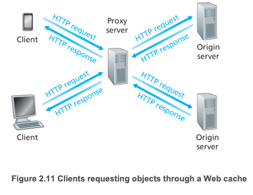

## 웹 캐싱
- Web cache, 프록시 서버(proxy server)라고도 함
- 자체의 저장 디스크를 가지고 있어 최근 호출된 객체의 사본을 저장 및 보존한다.
- 일반적으로 웹 캐시는 ISP가 구입하고 설치한다.
- CDN의 사용을 통해 웹 캐시는 인터넷에서 점진적으로 중요한 역할을 하고 있다.
- CDN 회사는 인터넷 전역을 통해 많은 지역적으로 분산된 캐시를 설치하고 있으며, 이를 통해 많은 트래픽을 지역화하고 있다.

***ISP***
- Internet Service Provider, KT, LG, SK 등 인터넷 서비스 제공자

***네트워크 대역폭(bandwidth)***
- 시간 동안 한 지점에서 다른 지점으로 최대 데이터 양을 전송하는 네트워크 통신 링크의 용량
- 대역폭은 수도관을 통해 흐를 수 있는 물의 양과 같다. 파이프가 크면 더 많은 물이 흐른다.
- 대역폭 <> 속도
  - 속도는 데이터를 전송할 수 있는 속도, 파이프를 통해 흐르는 물의 속도
  - 대역폭은 해당 속도에 대한 용량, 파이프의 직경
- 참고
  - [네트워크 - 대역폭 (Bandwidth) 이란? 속도와 다르다?](https://m.blog.naver.com/dreamxpeed/222115245259)

***CDN***
- Content Distribution Network, 컨텐츠 분배 네트워크
- CDN은 다수의 지점에 분산된 서버들을 운영하며, 비디오 및 다른 형태의 웹 컨텐츠 데이터의 복사본을 저장한다.
- 어떤 사용자가 지역 클러스터에 없는 컨텐츠를 요청하면 중앙 서버나 다른 클러스터로부터 전송받아 사용자에게 서비스하는 동시에 복사본을 만들어 저장한다.
- 인터넷 캐시와 마찬가지로 클러스터의 저장공간이 가득차면 자주 사용되지 않는 컨텐츠 먼저 삭제된다.
- priavate CDN: 컨텐츠 제공자가 소유한 사설 CDN, 유튜브는 구글의 CDN을 통해 분배
- third-party CDN: 제 3자가 운영하는 CDN, Akamai, Limelight, Level-3