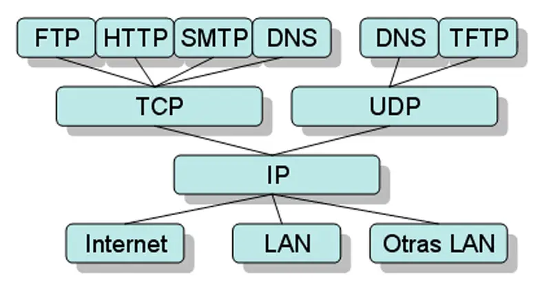

## IP 란

- Internet Protocol, 인터넷 프로토콜
- 네트워크의 두 호스트 간에 통신할 때 주소를 지정하고 전송 계층의 정보를 패킷으로 분할/조립하며, 패킷을 IP 주소에 따라 목적지에 전송하는 통신 규약.

## IP의 특성
**비연결성(connectionless)**:
- IP에서 정보는 패킷(packet)이라고 하는 작은 단위로 나뉘어 전송된다
- 송신 호스트에서 수신 호스트로 패킷을 보낼 때 IP로 전송하면 패킷 전송 전에 송수신 호스트 간 경로를 미리 설정할 필요가 없다
- 패킷마다 목적지 주소를 표기하여 전송하고, 전송망의 라우터들은 패킷이 도착하면 해당 패킷의 헤더에 포함된 목적지 주소를 확인하고 주소에 따라 설정된 다음 라우터로 패킷을 전달하는 과정으로 최종 목적지까지 패킷을 전달한다.

**비신뢰성(unreliability)**:
- IP는 송신기에서 전송한 패킷이 수신기에 오류나 문제없이 정확하게 전달이 되었는지를 확인하지 않고 보장하지도 않는다
- 이러한 특성을 최선형(best effort)라고도 하며 어떠한 것도 보장하지 않고 데이터 전송에 최선을 다한다는 의미이다

## IP 패킷

## 참고
- [IP - TTA정보통신용어사전](https://terms.tta.or.kr/dictionary/dictionaryView.do?subject=%EC%9D%B8%ED%84%B0%EB%84%B7+%ED%94%84%EB%A1%9C%ED%86%A0%EC%BD%9C)
- [라우팅이란? | IP 라우팅 - cloudflare](https://www.cloudflare.com/ko-kr/learning/network-layer/what-is-routing/)