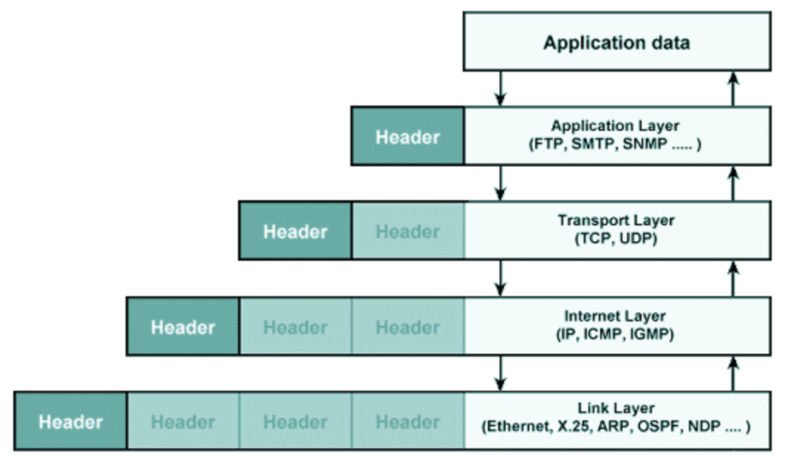

## PDU

- Protocol Data Unit, 프로토콜 데이터 단위
- OSI 7계층모델과 같이 계층화된 구조에서, 임의의 한 프로토콜과 관련되어 같은 계층에 존재하는 두 통신 개체 간에 서로 주고 받게되는 헤더(제어정보) 및 데이터(SDU, Payload)가 합쳐진 캡슐화된 운반체
- 해당 계층에서만 처리되는 특정한 헤더를 붙이게 됨
- PDU 구성은 PCI와 SDU로 구성된다
  - PCI(Protocol Control Information): 헤더 정보(발신지 주소, 수신지 주소, 순서 번호, 오류검출용 FCS 등)
  - SDU (Service Data Unit): 전송하려는 데이터
- OSI 계층별 PDU
  - 5-6-7 (응용 계층) PDU – **데이터**
  - 4(전송 계층) PDU – **세그먼트**
  - 3(네트워크 계층) PDU – **패킷**
  - 2(데이터 링크 계층) PDU – **프레임**
  - 1(물리 계층) PDU – **비트**

## 참고
- [프로토콜 데이터 단위 - wiki](https://ko.wikipedia.org/wiki/%ED%94%84%EB%A1%9C%ED%86%A0%EC%BD%9C_%EB%8D%B0%EC%9D%B4%ED%84%B0_%EB%8B%A8%EC%9C%84)
- [PDU, SDU   Protocol Data Unit, Service Data Unit   프로토콜 데이터 단위, 서비스 데이터 단위](http://www.ktword.co.kr/test/view/view.php?m_temp1=310)