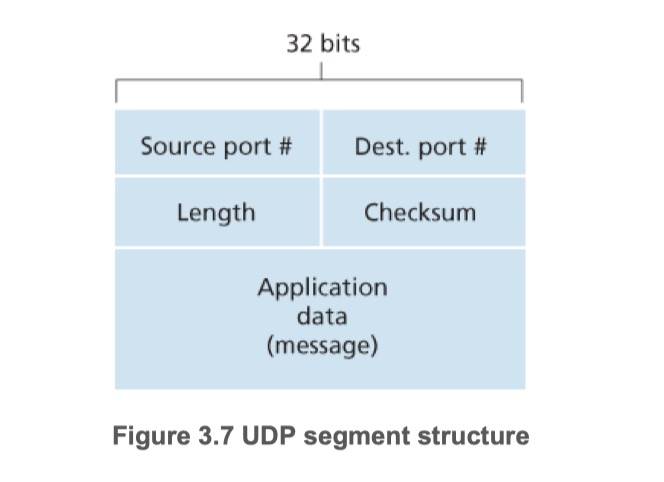
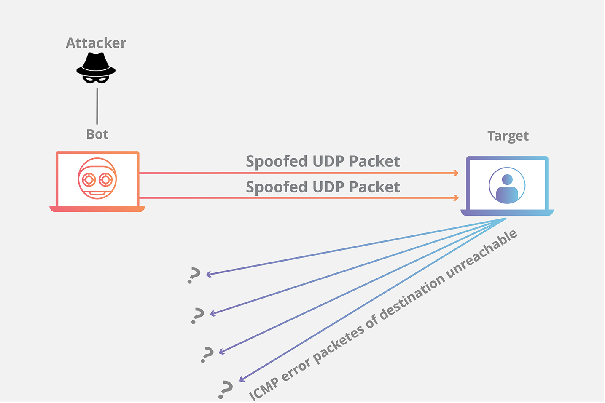

## UDP
- User Datagram Protocol, 사용자 데이터그램 프로토콜
- 트랜스포트 계층 프로토콜이 할 수 있는 최소 기능으로 동작
- 다중화/역다중화 기능과 간단한 오류 검사 기능을 제외하면 IP에 아무것도 추가하지 않는다
- 비디오 재생 또는 DNS 조회와 같이 시간에 민감한 전송을 위해 사용된다.

## UDP의 장점
| 정리 | UDP | TCP |
| -- | -- | -- |
| 무슨 데이터를 언제 보낼지에 대해서 애플리케이션 레벨에서 더 정교한 제어 | - 애플리케이션 프로세스가 데이터를 UDP에 전달하자마자 UDP는 데이터를 UDP 세그먼트로 만들고, 그 세그먼트를 즉시 네트워크 계층으로 전달한다 | - 혼잡제어 메커니즘으로 인해 즉시 전송이 안될 수 있다. - 신뢰적인 전달이 얼마나 오래 걸리는지에 관계없이 목적지가 세그먼트의 수신 여부를 확인응답할 때까지 데이터의 세그먼트 재전송을 계속한다. - 실시간 애플리케이션은 최소 전송률을 요구할 수 있다. - 조금의 데이터 손실은 허용할 수 있는 경우 맞지 않다. |
| 연결 설정이 없음 | - UDP는 공식적인 사전준비 없이 전송하기 때문에 어떤 지연도 없다 - 전송 중에 패킷이 손실되어 DDoS 공격의 형태로 악용될 수 있다 | - 데이터 전송 전에 세 방향 핸드셰이크를 사용한다 - HTTP 문서로 된 웹페이지는 신뢰성이 중요하기 때문에 UDP보다는 TCP 사용 |
| 연결 상태가 없다 | - UDP는 연결 상태를 유지하지 않으며, 연결 상태에 대한 그 어떠한 파라미터도 기록하지 않는다. - 애플리케이션 프로그램이 UDP에서 동작할 때 좀 더 많은 액티브 클라이언트를 수용할 수 있다. | - 종단 시스템에서 연결 상태를 유지한다 - 이 연결 상태는 수신 버퍼와 송신버터, 혼잡 제어 파라미터, 순서 번호와 확인 응답 번호 파라미터를 포함 - 이 상태 정보가 TCP의 신뢰적인 데이터 전송 서비스를 구현하고 혼잡 제어를 제공를 제공하는데 필요하다 |
| 작은 패킷 헤더 오버헤드 | - 세그먼트마다 8바이트의 헤더 오버헤드 | - 세그먼트마다 20바이트의 헤더 오버헤드 |

## UDP 세그먼트 구조

- 애플리케이션 데이터는 UDP 데이터그램의 데이터 필드에 위치한다
- UDP 헤더는 2바이트씩 구성된 단 4개의 필드만 갖는다
- 포트번호: 다중화, 역다중화를 위해 존재, 정확한 프로세스에게 애플리케이션 데이터를 넘기게 해준다
- 길이: 헤더를 포함하는 UDP 세그먼트의 길이(바이트 단위), UDP 세그먼트마다 데이터 필드의 사이즈가 다르기 때문
- 체크섬: UDP 세그먼트와 IP헤더 일부 필드를 계산, 수신 측에서 세그먼트에 어떤 오류가 있는지 체크하기 위해 사용

## UDP Flooding 공격

- UDP에는 핸드셰이크가 필요하지 않으므로 공격자는 먼저 해당 서버의 통신 시작 권한을 얻지 않고도 대상 서버에 UDP 트래픽을 폭주시킬 수 있다
- 일반적인 UDP Flooding 공격은 많은 개수의 UDP 데이터그램을 대상 컴퓨터의 임의 포트로 보낸다.
- UDP 패킷을 수신하면 해당 운영 체제에서 관련 애플리케이션을 확인하고, 해당 애플리케이션이 없으면 전송자에게 '목적지 도달 불가(Destination Unreachable)' 응답 패킷을 알린다.
- 서버는 ICMP(Internet Control Message Protocol) 응답을 사용해 원래 UDP 패킷을 전달할 수 없음을 알려준다.
- 대상 서버의 리소스가 빠르게 소진되어 일반 트래픽과 정상적인 사용자가 사용할 수 없게 된다.

## 참고
- [UDP란? - cloudflare](https://www.cloudflare.com/ko-kr/learning/ddos/glossary/user-datagram-protocol-udp/)
- [UDP 플러드 DDoS 공격이란 무엇일까요? - akamai](https://www.akamai.com/ko/glossary/what-is-udp-flood-ddos-attack)