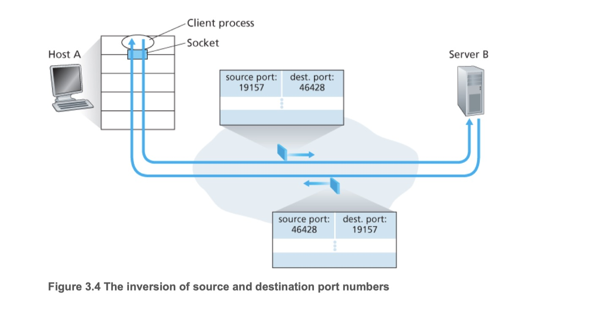
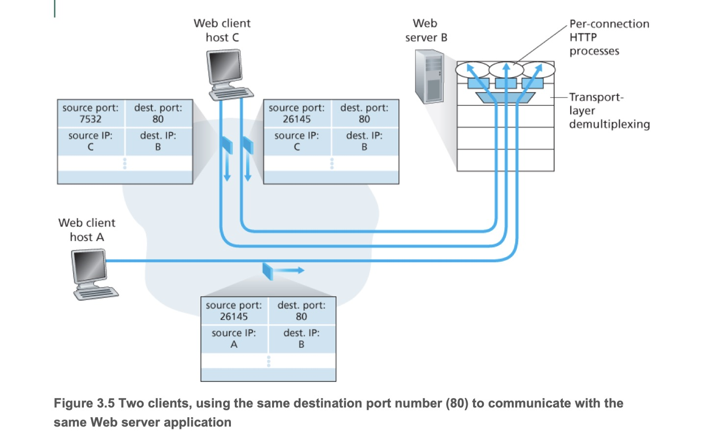
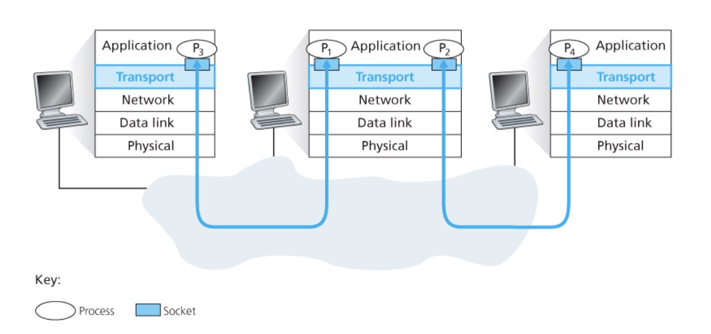
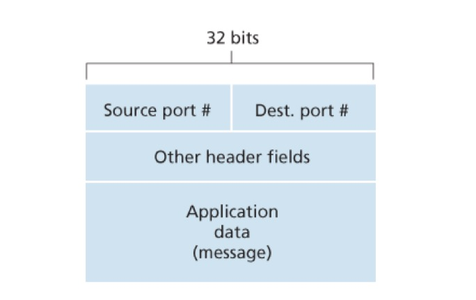

## 다중화(multiplexing)
- 송신 호스트에서 캡슐화된 세그먼트들을 네트워크 계층으로 전달하는 작업
- 트랜스포트 계층이 소켓으로부터 외부로 나가는 데이터를 모으고, 각 데이터에 헤더 정보(이후 역다중화에 사용)를 더해 캡슐화하한다

## 역다중화(demultiplexing)
- 수신 호스트에서 트랜스포트 계층 세그먼트의 데이터를 올바른 소켓으로 전달하는 작업
- 각각의 트랜스포트 계층 세그먼트는 수신 소켓을 식별하기 위한 필드 집합을 가지고 있고 이를 검사하여 해당 소켓으로 보낸다.

### UDP 역다중화
- UDP 소켓은 포트번호로 식별된다.
- 수신 호스트의 UDP 소켓은 세그먼트 안의 목적지 포트번호를 보고 해당 포트번호로 식별되는 소켓에 전달한다

### TCP 역다중화
- TCP 소켓은 출발지와 목적지의 각 IP주소, 포트번호 총 4개 요소의 집합(four-tuple)으로 식별된다.
- 수신 호스트의 TCP 소켓은 세그먼트 안의 4개 요소의 집합을 사용해 식별되는 소켓에 전달한다

## 추가 정보
### 다중화와 역다중화의 필요성
- 네트워크 계층이 제공하는 **호스트** 대 **호스트** 전달 서비스에서, 호스트에서 동작하는 애플리케이션에 대한 **프로세스** 대 **프로세스** 전달 서비스로 확장한다
- 목적지 호스트에서의 트랜스포트 계층은 바로 아래의 네트워크 계층으로부터 세그먼트를 수신
- 트랜스포트 계층은 호스트에서 동작하는 해당 애플리케이션 프로세스에게 이 세그먼트의 데이터를 전달하는 의무를 진다

### 다중화와 역다중화에서의 소켓
- 소켓은 프로세스와 네트워크간의 데이터를 전달하는 출입구 역할을 한다
- 소켓은 유일한 식별자를 가지며 UDP 소켓인지 TCP 소켓인지에 따라 포맷이 다르다
- 수신자의 트랜스포트 계층은 프로세스에 데이터를 직접 전달하지 않고 소켓에게 전달한다.

### 트랜스포트 계층 세그먼트 구성

- 각 세그먼트는 세그먼트가 전달될 적절한 소켓을 가리키는 특별한 필드를 갖는다.
- 출발지 포트번호 필드(source port number field)
- 목적지 포트번호 필드(destination port number field)