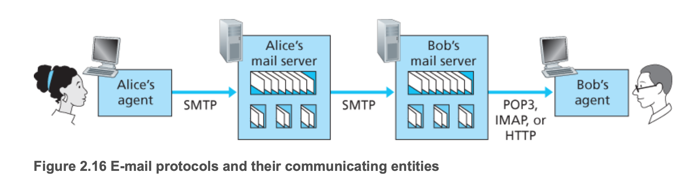

## 인터넷 전자메일

- 송신자는 SMTP 프로토콜을 사용해 메일서버로 메일전송을 요청한다
- 수신자가 메일 서버에 있는 자신의 전자메일을 확인 위해 SMTP 프로토콜을 사용할 수 없다. SMTP는 푸시(push) 프로토콜이기 때문
- 아래 두 가지 방법으로 조회 가능
  1. 웹 기반 전자메일 어플리케이션(ex. 지메일)이 HTTP를 사용, 이 경우 수신자의 메일서버가 HTTP 통신을 위한 인터페이스를 가지고 있어야 한다.
  1. 전형적인 메일 클라이언트(ex. 아웃룩)를 사용, IMAP을 사용해 통신

***SMTP***
- Simple Mail Transfer Protocol
- 전자메일을 전송하기 위한 프로토콜
- 정보교환 매체를 7비트인 US-ASCII 텍스트를 사용해야 한다.
  - 8비트를 사용 하는 유럽(독일,프랑스) 언어, 16비트를 사용하는 동양권(한국,중국,일본) 언어 및 이진 멀티미디어 데이터를 보내기 위해서는 ASCII로 변환하고 SMTP 전송 후에 원래 메시지로 변환 필요
  - 이에 사용되는 것이 MIME
- 이전에는 SMTP에 포트 25만 사용했다. 현재는 포트 465, 587, 2525를 추가로 사용할 수도 있다
  - 25: SMTP 서버 사이를 연결하는 데 가장 많이 사용된다. 스팸 발송자가 이 포트를 악용해 스팸을 대량 전송하려고 하므로, 현재는 최종 사용자 네트워크의 방화벽에서 이 포트를 차단할 때가 많다
  - 465: 보안 소켓 계층(SSL) 암호화와 함께 SMTP에 사용하도록 지정되었습니다. 하지만 SSL은 Transport Layer Security(TLS)으로 대체되어, 최신 이메일 시스템에서는 이 포트를 사용하지 않는다
  - **587**: 현재 이메일 제출용 기본 포트, 이 포트를 통과하는 SMTP 통신은 TLS 암호화를 이용한다
  - 2525: SMTP와 공식적으로 연결되어 있지는 않지만, 일부 이메일 서비스에서는 앞서 언급한 포트가 차단되었을 경우 이 포트로 SMTP 전송이 제공된다.

***MIME***
- Multipurpose Internet Mail Extensions
- ASCII가 아닌 문자 인코딩을 이용해 영어가 아닌 다른 언어로 된 E-mail을 보낼 수 있는 방식을 정의하며 그림, 음악, 영화 같은 8비트짜리 이진 파일을 전자 우편으로 보낼 수 있도록 한다
- MIME 규격은 전자우편 메시지 상단에 있는 전통적인 SMTP 헤더에 MIME 헤더를 추가한다.
  - MIME-Version               : 에이전트를 지원하는 MIME 버전을 표시
  - Content-Type               : 전송 데이타의 type/subtype[우편물 유형]과 character-set[사용된 문자세트]을 표시
  - Content-Transfer-Encoding  : 전송 데이타의 body를 인코딩한 방법[인코딩 방식]을 표시 

***IMAP***
- Internet Message Access Protocol
- 전자메일을 수신하기 위한 프로토콜
- IMAP를 사용하면 모든 장치에서 어디서나 전자 메일에 액세스할 수 있다.
- IMAP를 사용하여 전자 메일 메시지를 읽을 때 실제로 다운로드하거나 컴퓨터에 저장하지 않는다.

***POP***
- Post Office Protocol Version
- 전자 메일 서비스에 문의하고 모든 새 메시지를 다운로드하여 작동
- PC에서 다운로드되면 전자 메일 서비스에서 삭제되므로 이후 동일한 컴퓨터에서만 액세스할 수 있다.

## 참고
- [SMTP(Simple Mail Transfer Protocol), MIME](https://byeong9935.tistory.com/22)
- [EMAIL의 인코딩과 디코딩](https://vencedor.tistory.com/16)
- [단순 전자우편 전송 프로토콜(SMTP)이란? - cloudflare](https://www.cloudflare.com/ko-kr/learning/email-security/what-is-smtp/)
- [IMAP란? - cloudflare](https://www.cloudflare.com/ko-kr/learning/email-security/what-is-imap/)
- [IMAP 및 POP 이란? - microsoft](https://support.microsoft.com/ko-kr/office/imap-%EB%B0%8F-pop-%EC%9D%B4%EB%9E%80-ca2c5799-49f9-4079-aefe-ddca85d5b1c9)