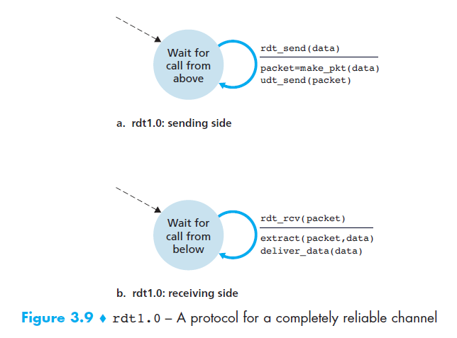
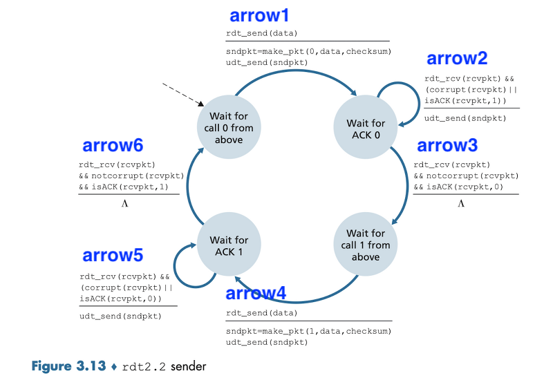
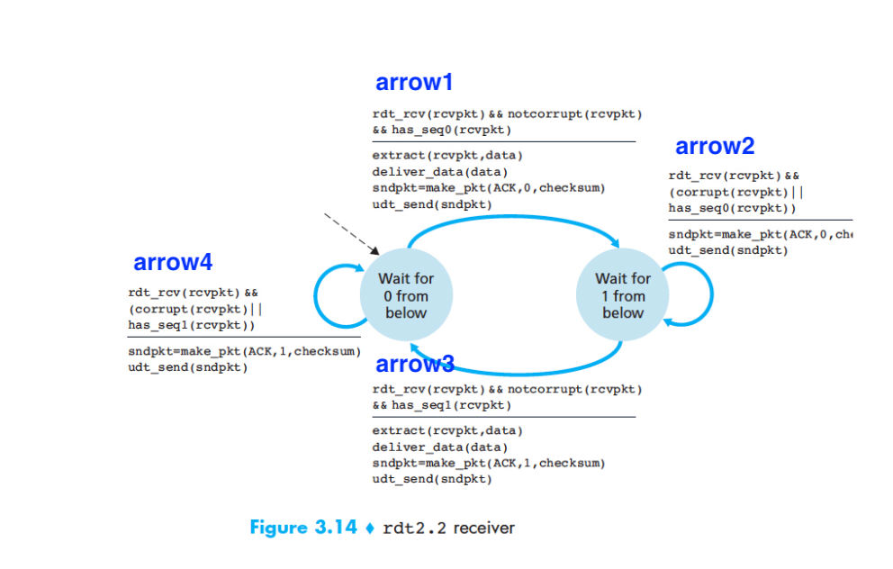
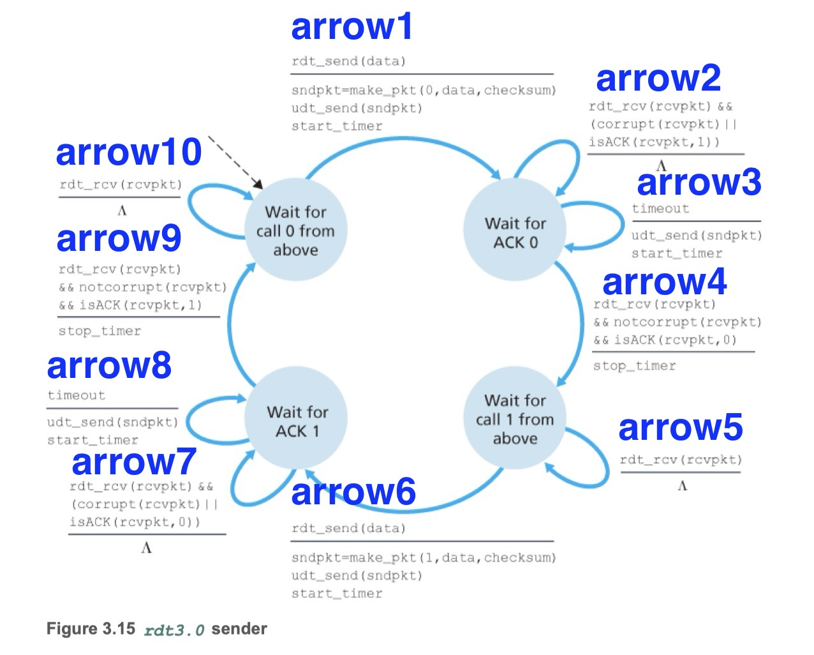
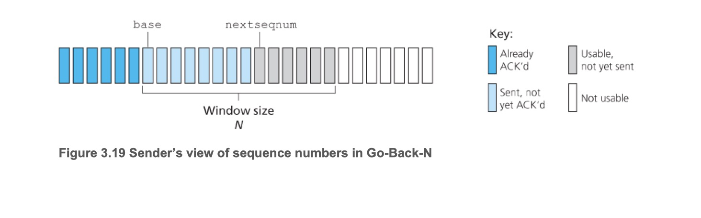
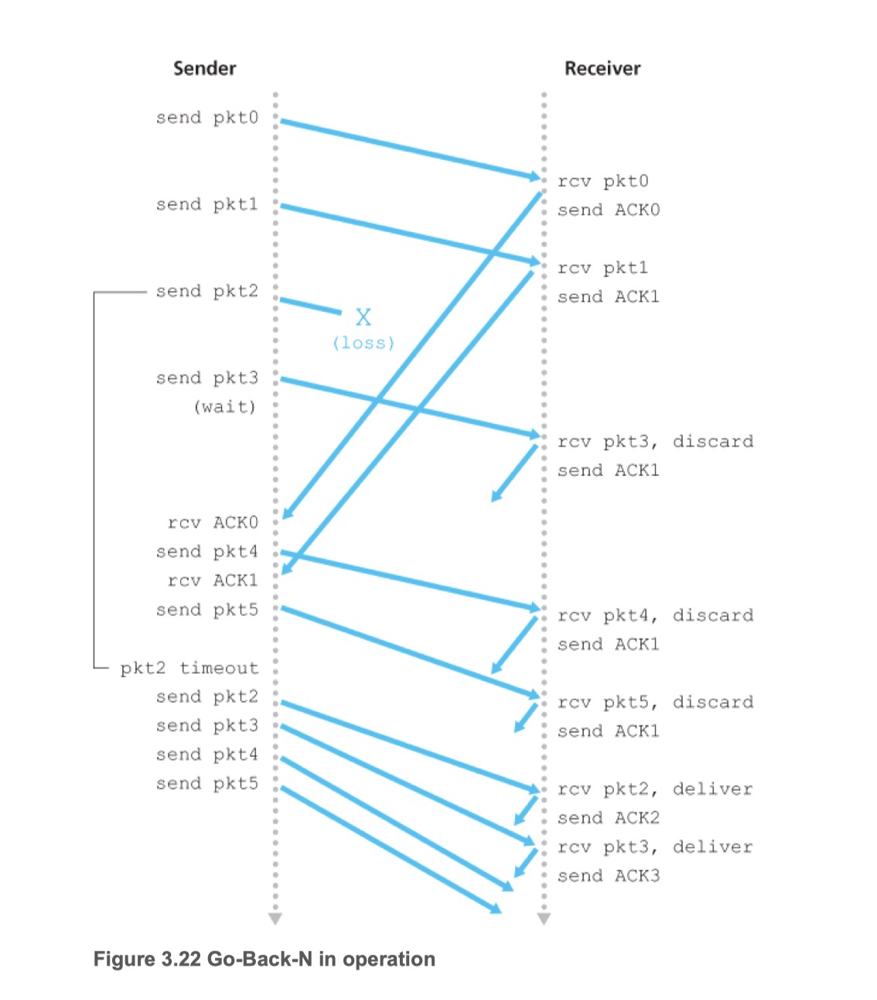
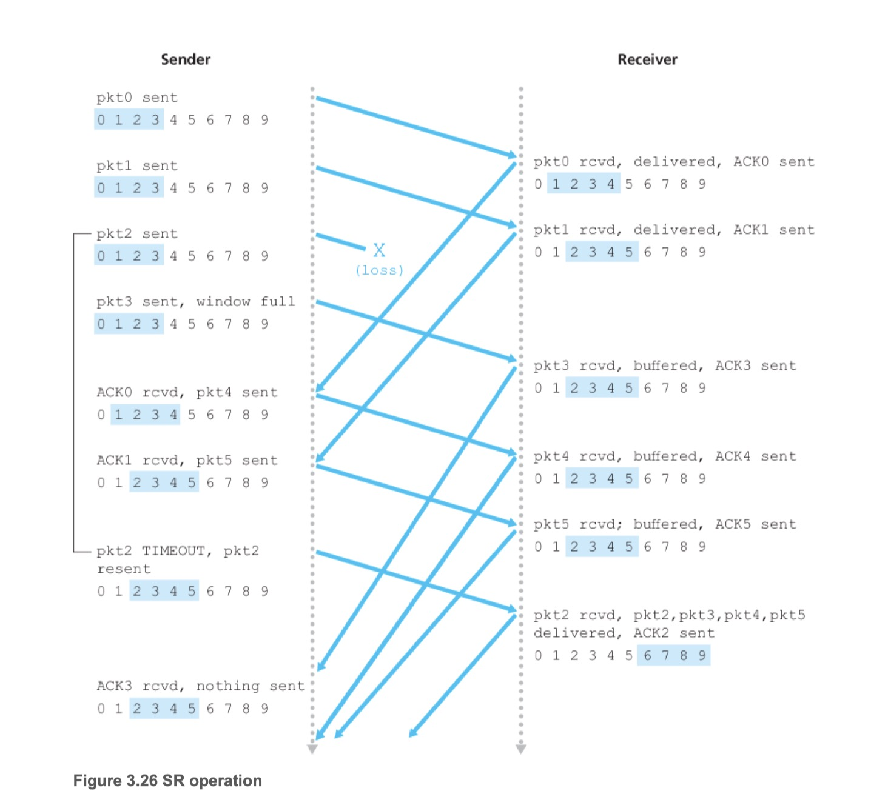

## 신뢰적인 데이터 전송 프로토콜
- TCP는 인터넷 애플리케이션에게 아래와 같은 서비스를 제공 한다
  1. 신뢰적인 채널에서는 전송된 데이터가 손상되거나 손실되지 않는다.
  2. 모든 데이터는 전송된 순서 그대로 전달된다.
- 이 작업은 신뢰적인 전송 프로토콜의 아래에 있는 계층이 신뢰적이지 않을 수 있어서 어려워진다.
- 그 예로, TCP는 비신뢰적인 종단 간의 네트워크 계층(IP)의 바로 상위에 구현된 신뢰적인 데이터 전송 프로토콜이다.

## 완벽하게 신뢰적인 채널상에서의 신뢰적인 데이터 전송: rdt1.0
- 송신자와 수신자 FSM은 각각 하나의 상태만 가지고 있다.
- 오류가 생길 수 없으므로 수신자는 어떤 피드백도 제공할 필요가 없다.
- 수신자는 송신자가 데이터를 송신하자마자 수신할 수 있다고 가정하였다.

**송신자**
- 이벤트
  - **rdt_send(data)**: 상위계층으로부터 데이터를 받아들인다
- 액션
  - **packet=make_pkt(data)**: 데이터를 포함한 패킷을 생성한다
  - **udt_send(packet)**: 패킷을 채널로 송신한다

**수신자**
- 이벤트
  - **rdt_rcv(packet)**: 하위의 채널로부터 패킷을 수신한다
- 액션
  - **extract(packet, data)**: 패킷으로부터 데이터를 추출한다
  - **deliver_data(data)**: 데이터를 상위 계층으로 전달한다

## 비트 오류가 있는 채널상에서의 신뢰적인 데이터 전송: rdt2.2
- 2.0, 2.1 생략
- 송신자는 4개의 FSM, 수신자는 2개의 FSM을 가지고 있다.
- 오류가 있을 수 있으므로 수신자는 피드백을 제공해야 한다
- 송신자는 오류 검출을 위해 패킷에 체크섬을 필드를 추가한다
- 송신자는 패킷에 순서번호(sequence number)를 추가한다
  - 수신자는 순서번호를 체크하여 수신된 패킷이 재전송인지 아닌지 알 수 있다
- 수신자는 수신한 패킷에 대한 응답으로 ACK(acknowledgements) 메시지를 보낸다
  - 오류가 있는 패킷을 수신한 경우 이전에 정상 수신한 패킷의 순서번호를 포함한다
  - 오류가 없는 패킷을 수신한 경우 수신한 패킷의 순서번호를 포함한다

**송신자**

arrow1
- 이벤트
  - **rdt_send(data)**: 상위계층으로부터 데이터를 받아들인다
- 액션
  - **sndpkt=make_pkt(0, data, checksum)**: 순서번호, 데이터, 체크섬을 포함하여 패킷을 생성한다
  - **udt_send(sndpkt)**: 패킷을 채널로 송신한다

arrow2
- 이벤트
  - **rdt_rcv(rcvpkt) && (corrupt(rcvpkt) || isACK(rcvpkt, 1))**: 하위의 채널로부터 패킷을 수신한다. 패킷에 오류가 있거나 ACK에 포함된 순서번호가 송신한 패킷의 순서번호와 다른 경우이다.
- 액션
  - **udt_send(sndpkt)**: 패킷을 채널로 송신한다

arrow3
- 이벤트
  - **rdt_rcv(rcvpkt) && notcorrupt(rcvpkt) && isACK(rcvpkt, 0)**: 하위의 채널로부터 패킷을 수신한다. 패킷에 오류가 없고 ACK에 포함된 순서번호가 송신한 패킷의 순서번호와 같은 경우이다.
- 액션
  - 없음

arrow4, arrow5, arrow6은 각각 arrow1, arrow2, arrow3와 동일한 형식의 액션과 이벤트를 가진다.

**수신자**

arrow1
- 이벤트
  - **rdt_rcv(rcvpkt) && notcorrupt(rcvpkt) && has_seq0(rcvpkt)**: 하위의 채널로부터 패킷을 수신한다. 패킷에 오류가 없고 패킷에 포함된 순서번호가 받아야 하는 순서번호와 동일한 경우이다.
- 액션
  - **extract(packet, data)**: 패킷으로부터 데이터를 추출한다
  - **deliver_data(data)**: 데이터를 상위 계층으로 전달한다
  - **sndpkt=make_pkt(ACK, 0, checksum)**: ACK, 수신한 패킷의 순서번호, 체크섬을 포함하여 패킷을 생성한다
  - **udt_send(sndpkt)**: 패킷을 채널로 송신한다

arrow2
- 이벤트
  - **rdt_rcv(rcvpkt) && (corrupt(rcvpkt) || has_seq0(rcvpkt))**: 하위의 채널로부터 패킷을 수신한다. 패킷에 오류가 있거나 패킷에 포함된 순서번호가 받아야 하는 순서번호와 다른 경우이다.
- 액션
  - **sndpkt=make_pkt(ACK, 0, checksum)**: ACK, 이전에 정상 수신한 패킷의 순서번호, 체크섬을 포함하여 패킷을 생성한다
  - **udt_send(sndpkt)**: 패킷을 채널로 송신한다

arrow3, arrow4은 각각 arrow1, arrow2와 동일한 형식의 액션과 이벤트를 가진다.

## 비트 오류와 손실 있는 채널상에서의 신뢰적인 데이터 전송: rdt3.0
- 어떻게 패킷 손실을 검출할 것인가, 패킷 손실이 발생했을 때 어떤 행동을 할 것인가
- 송신자가 패킷을 잃어버렸다고 확신할 정도로 충분한 시간을 기다릴 수 있다면 데이터 패킷은 간단하게 재전송 될 수 있다.
  - 송신자가 어떤 패킷을 손실했다는 것을 확신하기 위해 얼마나 오랫동안 기다려야 할까
  - 왕복시간(RTT)에 수신측이 패킷을 처리하는 데 필요한 시간만큼 기다린다
- 실제 상황에서 채택한 접근 방식은 송신자가 패킷 손실이 일어났다는 보장은 없지만 손실이 일어났을 만한 그런 시간을 현명하게 선택하는 갓이다
- 송신자 대 수신자 채널에서 중복 데이터 패킷(duplicate data packet)의 가능성을 포함한다

**송신자**

arrow1
- 이벤트
  - **rdt_send(data)**: 상위계층으로부터 데이터를 받아들인다
- 액션
  - **sndpkt=make_pkt(0, data, checksum)**: 순서번호, 데이터, 체크섬을 포함하여 패킷을 생성한다
  - **udt_send(sndpkt)**: 패킷을 채널로 송신한다
  - **start_timer**: 타이머를 시작한다

arrow2
- 이벤트
  - **rdt_rcv(rcvpkt) && (corrupt(rcvpkt) || isACK(rcvpkt, 1))**: 하위의 채널로부터 패킷을 수신한다. 패킷에 오류가 있거나 ACK에 포함된 순서번호가 송신한 패킷의 순서번호와 다른 경우이다.
- 액션
  - 없음

arrow3
- 이벤트
  - **timeout**: 타임아웃 발생
- 액션
  - **udt_send(sndpkt)**: 패킷을 채널로 송신한다
  - **start_timer**: 타이머를 시작한다

arrow4
- 이벤트
  - **rdt_rcv(rcvpkt) && notcorrupt(rcvpkt) && isACK(rcvpkt, 0)**: 하위의 채널로부터 패킷을 수신한다. 패킷에 오류가 없고 ACK에 포함된 순서번호가 송신한 패킷의 순서번호와 같은 경우이다.
- 액션
  - **stop_timer**: 타이머를 정지한다

arrow5
- 이벤트
  - **rdt_rcv(rcvpkt)**: 하위의 채널로부터 패킷을 수신한다.
- 액션
  - 없음

arrow6, arrow7, arrow8, arrow9, arrow10은 각각 arrow1, arrow2, arrow3, arrow4, arrow5와 동일한 형식의 액션과 이벤트를 가진다.

## 윈도

- 용어
  - base: 확인응답이 안된 가장 오래된 패킷의 순서번호
  - nextseqnum: 사용되지 않은 가장 작은 순서 번호(전송될 다음 패킷의 순서 번호)
  - window: 순서번호의 범위
  - N: 확인응답이 안 된 패킷의 최대 허용 수, 윈도 크기(window size)
- 영역
  - [0, base-1]: 송신되었고 확인응답이 된 패킷에 대응
  - [base, nextseqnum-1]: 송신되었지만 확인응답되지 않은 패킷에 대응
  - [nextseqnum, base+N-1]: 상위계층으로부터 데이터가 도착하면 바로 전송될 수 있는 패킷에 대응
  - [:base+N]: base에 해당하는 패킷의 확인응답이 도착할 때까지 사용할 수 없는 영역

## GBN(Go-Back-N)
- 송신자는 확인응답을 기다리지 않고 여러 패킷을 전송한다
- 수신자는 정확하게 수신된 패킷이라도 순서가 틀렸다면 버린다
- 장점은 수신자 버퍼링이 간단하다는 점
  - 순서가 잘못된 패킷을 저장하고 이후 도착 후에 상위 계층으로 전달하는 방식을 취하지 않아도 된다.
- 단점은 많은 재전송이 필요할 수 있다는 점

**GBN 동작방식**

- 송신자가 전송한 pkt2가 손실되어 수신자에게 전달되지 않은 채 pk3가 도착, 수신자는 pk3를 버리고 송신자에게 pk2를 보내라는 의미의 ACK1를 보낸다
- 송신자는 전송한 pk2에 상응하는 ACK2를 받지 못한채 타임아웃이 되어 pk2를 재전송한다
- 수신자는 pk2를 정상적으로 수신하고 이후 도착하는 pk3, pk4, pk5를 차례로 수신한다

## SR(Selective Repeat)
- 송신자는 전송한 패킷이 손실되었거나 손상된 상태로 수신자에게 도착했다고 의심되는 패킷만을 재전송한다
- 수신자는 정상적으로 수신하지 못한 패킷 이외는 버퍼에 저장하고 빠진 패킷을 수신하면 일련의 패킷을 모아서 상위 계층으로 전달한다

**SR 동작방식**

- 송신자가 전송한 pkt2가 손실되어 수신자에게 전달되지 않은 채 pk3, pk4, pk5가 도착, 수신자는 이들을 버퍼에 저장하고 이들 각각의 ACK를 보낸다
- 송신자는 전송한 pk2에 상응하는 ACK2를 받지 못한채 타임아웃이 되어 pk2를 재전송한다
- 수신자는 pk2를 정상적으로 수신하고 윈도를 옮긴다.