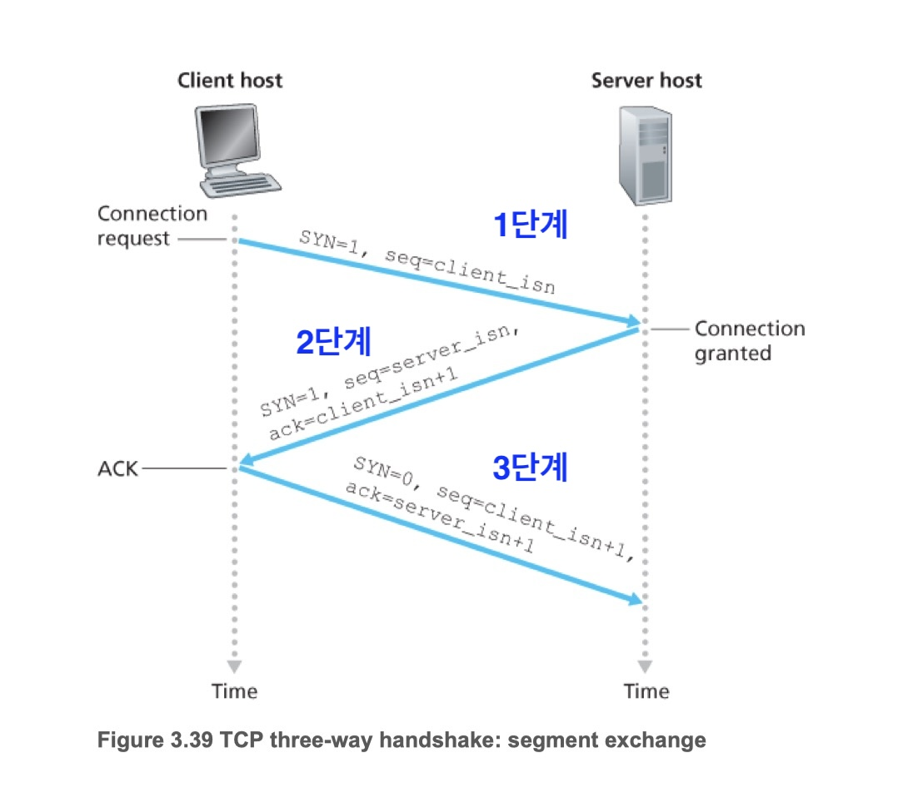
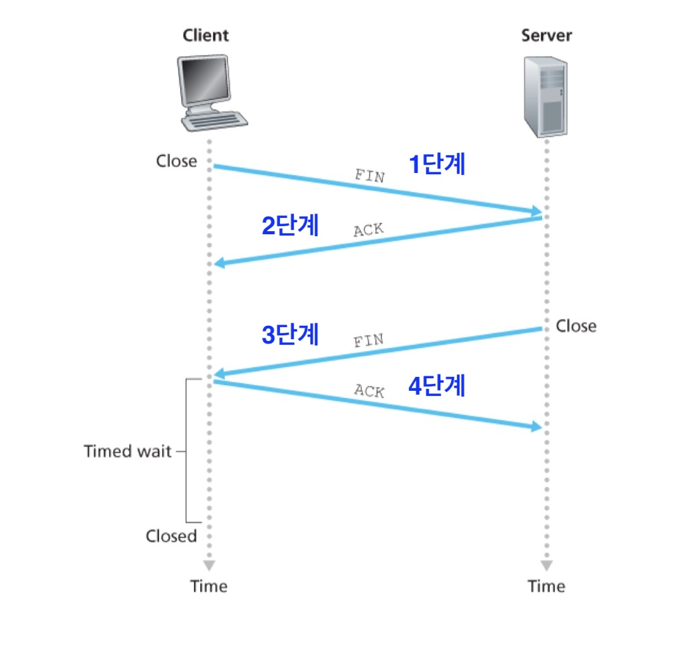
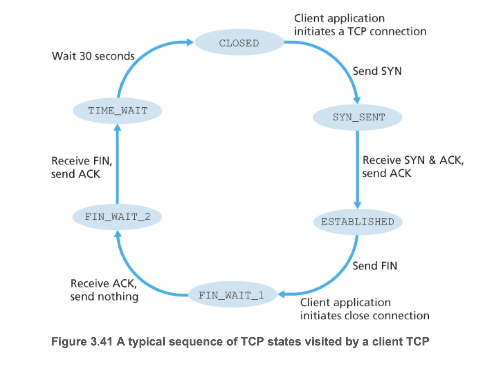
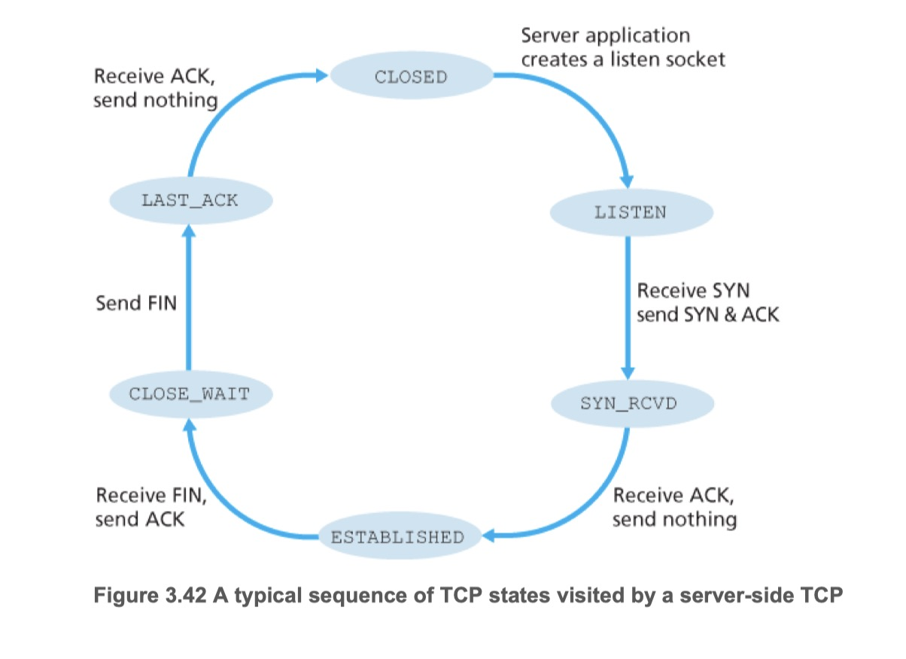

## TCP 세 방향 핸드셰이크(3-Way Handshake)

**1단계**
- 해당 세그먼트는 애플리케이션 계층 데이터를 포함하지 않는다.
- **SYN=1**: TCP 세그먼트 헤더에 SYN 비트라고 불리는 하나의 플래그 비트를 1로 설정, *SYN 세그먼트*라고 부른다
- **seq=client_isn**: 최초의 순서번호(client_isn)를 임의로 선택하여 순서번호 필드에 입력
  - 특정 보안 공격[CERT 2001-09, RFC 4987]을 피하고자 client_isn 의 선택을 임의 추출한다

**2단계**
- 서버는 수신한 데이터그램으로부터 TCP SYN 세그먼트를 추출하고 연결에 TCP 버퍼와 변수를 할당한다. 
  - 세 방향 핸드셰이크를 완료하기 전에 변수와 버퍼를 할당할 경우 TCP는 SYN 플러딩으로 알려진 서비스 거부 공격에 취약하다
- 클라이언트 TCP로 연결 승인 세그먼트를 송신한다
- 해당 세그먼트도 애플리케이션 계층 데이터를 포함하지 않는다.
- 만약 연결을 수락하지 않는 경우 RST 플래그 비트를 1로 설정하여 송신한다
  - UDP의 경우 ICMP 데이터그램 전송
- **SYN=1**: SYN 비트를 1로 설정
- **seq=server_isn**: 서버의 최초의 순서번호(server_isn)를 선택하여 순서번호 필드에 입력
- **ack=client_isn + 1**: ack는 클라이언트가 보내온 순서번호에 1을 더한 값을 입력, *SYNACK 세그먼트*라고 부른다

**3단계**
- 클라이언트는 연결 승인 세그먼트를 수신하고 연결에 버퍼와 변수를 할당한다
- 서버로 연결 승인 세그먼트를 확인하는 세그먼트를 송신한다
- 애플리케이션 계층 데이터를 포함할 수 있다
- **SYN=0**: 연결이 설정되었기 때문에 SYN 비트는 0으로 설정
- **seq=client_isn+1**: 순서번호를 증감
- **ack=server_isn + 1**: 연결 승인 세그먼트를 수신하였음을 나타냄

***SYN 플러드 공격(flood attck)***
- TCP 세 방향 핸드셰이크에서 서버는 수신된 SYN에 대한 응답으로 연결 변수와 버퍼를 할당하고 초기화한다
- 그 다음 서버는 SYNACK를 보내고 클라이언트의 ACK 세그먼트를 기다린다
- 만약 클라아언트로 부터 응답이 오지 않으면(종종 1분 이상 후에) 서버가 절반만 열린 연결을 종료하고 할당된 자원을 회수한다
- 이를 이용해 서비스 거부(Denial of Service, DoS) 공격을 하여 서버의 연결 자원을 소비 시키는 것
- 현재는 *SYN 쿠키* 라고 불리는 방법을 사용하여 대응한다

***SYN 쿠키***
- 서버가 SYN 세그먼트를 수신하였을 때 반만 열린(half-open) TCP 연결을 만들지 않고, 해시 함수로 만든 초기 순서번호를 가진 SYNACK 세그먼트를 송신
  - 서버만 아는 비밀번호 + SYN 세그먼트의 출발지와 목적지 IP주소와 포트번호를 해시함수에 사용
- 합법적인 클라이언트가 ACK 세그먼트를 회신하면 ack에 할당된 값(서버의 초기 순서번호 + 1)을 동일한 해시함수로 검증한다
- 그 결과가 올바르면 소켓을 가지고 완전하게 열린 연결을 만든다

## TCP 연결 종료

**1단계**
- **FIN**: TCP 세그먼트 헤더에 FIN 비트라고 불리는 하나의 플래그 비트는 1로 설정

**2단계**
- **ACK**: 확인 응담

**3단계**
- **FIN**: FIN 비트가 1로 설정된 종료 세그먼트를 송신

**4단계**
- **ACK**: 확인 응담

## 클라이언트와 서버의 TCP 상태 전이
**클라이언트의 TCP 상태 전이**

**서버의 TCP 상태 전이**

