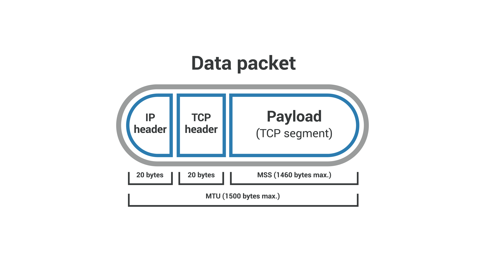

## MSS
- Maximum Segment Size, 최대 세그먼트 크기
- MSS는 페이로드라고 하는 패킷의 헤더가 아닌 부분을 측정
- 패킷에서 IP 헤더, TCP 헤더는 제외한 영역의 최대 크기를 말한다

***MTU***
- Maximum Transmission Unit, 최대 전송 단위
- 네트워크에 연결된 장치가 받아들일 수 있는 최대 데이터 패킷 크기
- IP 헤더, TCP 헤더, TCP 데이터를 모두 포함하는 길이

## MSS 옵션 값의 통보/협상
- TCP 연결설정을 위한 초기 SYN 세그먼트를 전송할 때 MSS 옵션에 그 값을 포함시켜 전달함
- SYN 제어 비트가 설정된 상태에서, 처음 왕복하는 2개의 세그먼트 (SYN 세그먼트, SYN+ACK 세그먼트)에서 만 나타남
  - 이것이 추후에 나타나면 이를 무시
- TCP는 양방향이므로 참여 양단 호스트별로(각 방향으로) 다른 MSS 값이 사용됨
  - 연결에 참여하는 두 장비가 서로 다른 MSS 값을 갖을 수도 있음

## MSS 옵션값의 미지정(기본), 지정(명시), 기타값
**미지정(기본)하는 경우**(소량 데이터인 경우)
- 기본 MSS 옵션 값 : 536 바이트 (IPv4)
  - 미 지정시 기본값 536 바이트가 사용됨

**지정(명시)하며 전달하는 경우**(대량 데이터인 경우)
- TCP 연결설정 시에, 양끝단 TCP 장치들 간에 자신이 속한 네트워크의 MTU 값에서 40 바이트(IP 헤더,TCP 헤더를 합친 개략치)를 뺀 값을 통보
- 고속 컴퓨터(큰 MSS 요구)와 저속 컴퓨터(작은 MSS 요구) 간의 협상으로 볼 수 있음

**기타**
- 값 65535: 무한 크기 값 (주로, IPv6의 점보그램에 사용됨)
  - 그 한계는, PMTU에서 60 바이트 (IPv6 헤더 40 + TCP 헤더 20)를 뺀 값
- 값 1460: 이더넷 경우의 전형적인 값 (이더넷 MTU 1500 - IPv4 헤더 20 - TCP 헤더 20)

***IPv6 점보그램(Jumbogram)***
- IPv4에서 최대 패킷 크기는 65,535바이트(2^16-1)
- 점보그램은 65,535 보다 더 큰 IPv6 패킷
- IPv6에서 점보그램 옵션을 이용하면 특정 호스트 사이에는 임의로 큰 크기의 패킷을 주고 받을 수 있도록 제한이 없어짐

***PMTU***
- Path MTU(Maximum Transmission Unit)
- 네트워크 경로 상에서 전송할 수 있는 데이터 패킷의 최대 크기
- 네트워크 상에서 통신을 할 때, 데이터는 여러 노드 및 링크를 거쳐 목적지에 되는데 이 경로 상에는 각각 처리할 수 있는 최대 크기의 데이터가 제한되어 있다
- PMTU 값은 이러한 각 단계에서의 최대 전송 단위(MTU) 크기를 의미하며 전체 통신 경로 상에서의 최소 MTU 값이다

## 참고
- [최대 세그먼트 크기(MSS)란? - cloudflare](https://www.cloudflare.com/ko-kr/learning/network-layer/what-is-mss/)
- [MSS, TCP MSS   Maximum Segment Size   TCP MSS 옵션, TCP 최대 세그먼트 크기 - 정보통신기술용어해설](http://www.ktword.co.kr/test/view/view.php?m_temp1=836)