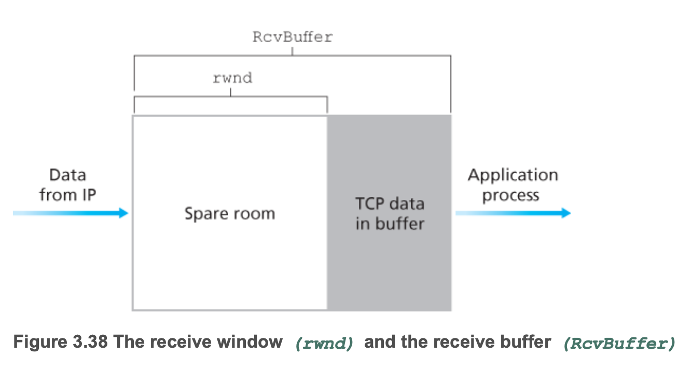
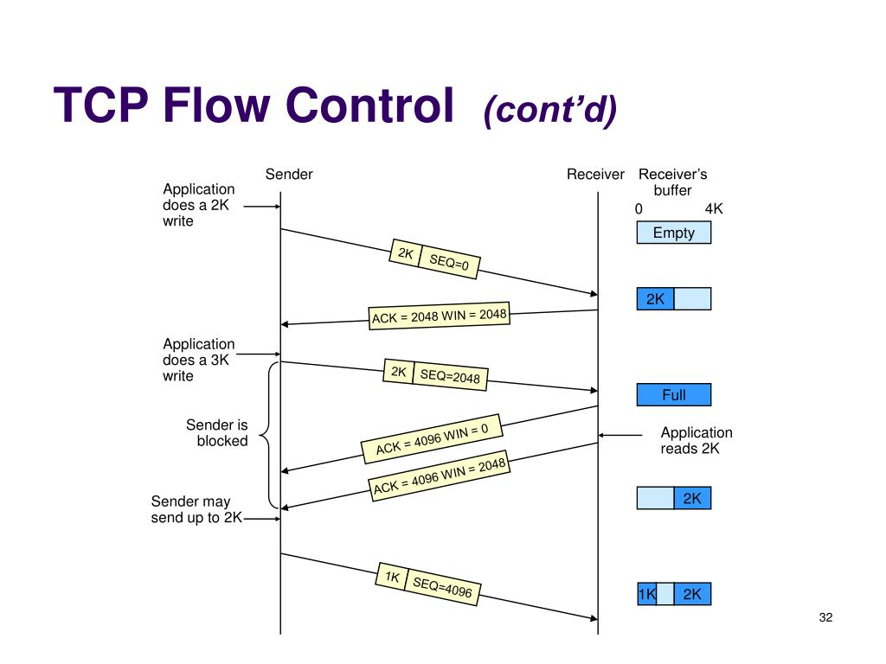

## 흐름 제어 서비스(flow-control service)
- 송신자가 수신자의 버퍼를 오버플로 시키는 것을 방지하기 위해 TCP가 제공하는 기능
- 수신하는 애플리케이션이 읽는 속도와 송신자가 전송하는 속도를 같게 한다

## 흐름 제어 방법
- 송신자가 수신 윈도(recieve window)라는 변수를 유지하여 흐름 제어를 제공
- 수신 윈도는 수신 측에서 가용한 버퍼 공간이 얼마나 되는지를 송신자에게 알려주는데 사용

**수신버퍼와 수신윈도**

- RcvBuffer: 수신 버퍼
- rwnd: 수신 윈도, 버퍼의 여유 공간
- `RcvBuffer - [LastByteRcvd - LastByteRead]`
  - [LastByteRcvd - LastByteRead]: 위 그림에서 회색으로 칠해진 *TCP data in buffer* 에 해당
    - LastByteRcvd: 수신 버퍼로부터 읽힌 데이터 스트림의 마지막 바이트의 번호
    - LastByteRead: 수신 버퍼에 저장된 데이터 스트림의 마지막 바이트의 번호

**TCP 연결과 수신윈도**

- 수신자는 송신자에게 보내는 TCP 세그먼트 헤더의 *receive window* 필드에 버퍼의 여유 공간(rwnd)를 입력
- 송신자는 연결되어 있는 동안 다음 내용을 보장한다.
- `LastByteSent - LastByteAcked <= rwnd`
  - LastByteSent - LastByteAcked: 전송 확인응답이 안 된 데이터의 양
    - LastByteSent: 송신된 데이터 스트림의 마지막 바이트의 번호
    - LastByteAcked: ACK 응답을 받은 송신된 데이터 스트림의 마지막 바이트의 번호
- rwnd의 값보다 작은 확인응답 안 된 데이터의 양을 유지함으로써 송신자는 수신자의 수신 버퍼에 오버플로가 발생하지 않는다는 것을 확신한다.
- 수신자의 수신 버퍼에 여유 공간이 없음을 알린 후 송신자에게 전송할 게 없다면 수신자의 에플리케이션 프로세스가 버퍼를 비우더라도 송신자가 이를 알 방법이 없다.
- TCP는 전송할 데이터가 있거나 전송해야 할 확인 응답을 가진 경우에만 세그먼트를 전달하기 때문
- 이러한 문제를 해결하기 위해 TCP 명세서는 송신자가 수신자의 수신 윈도가 0일 때 1바이트의 데이터로 세그먼트를 계속해서 전송하도록 요구한다
- 수신자의 수신 윈도가 0이 아닌 응답이 수신되면 송신자는 다시 데이터를 전송한다

## UDP와 흐름 제어
- UDP는 흐름 제어를 제공하지 않는다
- 만약 연속적인 UDP 세그먼트를 전송하는 경우, UDP는 대응하는 소켓(프로세스의 문)의 '앞에' 위치한 유한 크기의 버퍼에 세그먼트를 쌓을 것이다
- 프로세스는 버퍼로부터 한 번에 하나의 전체 세그먼트를 읽는다
- 프로세스가 버퍼로부터 빠르게 세그먼트를 읽지 못한다면 버퍼는 오버플로될 것이고 세그먼트를 잃어 버릴 것이다