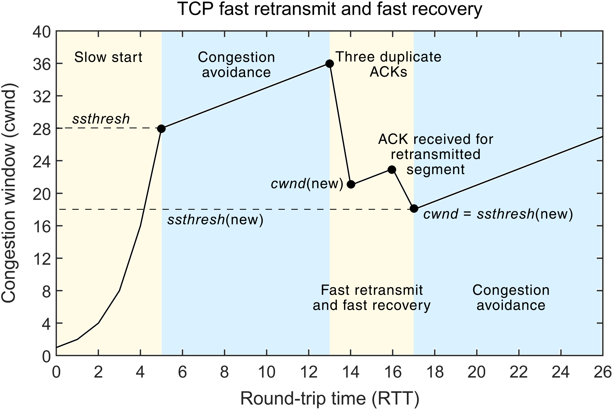
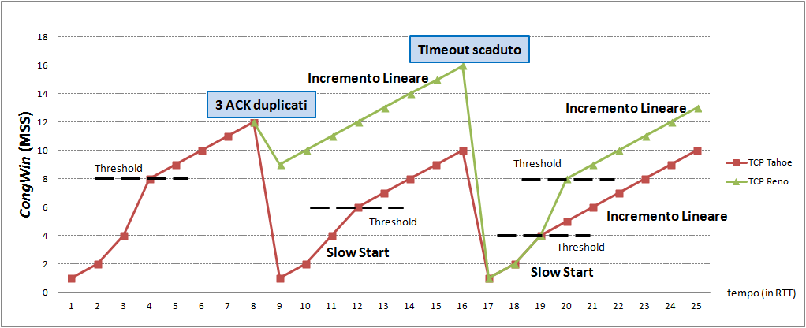

## TCP 혼잡 제어
- 네트워크 혼잡(Network Congestion)을 감지하고 대처하여 효율적인 데이터 전송을 유지하는 메커니즘
  - 트래픽 증가로 인해 라우터/스위치 버퍼의 큐잉 지연시간 증가 및 오버플로우 발생
- 패킷 손실을 감지하고 전송 속도를 동적으로 조절하여 네트워크 혼잡을 최소화

**TCP의 혼잡 징후의 판단 요소**
- TCP 타이머(타임아웃): 심각한 혼잡
- 중복 ACK(3 duplicate ACKs): 경미한 혼잡

**TCP의 혼잡 제어의 대응 방식**
- 혼잡 윈도우(Congestion Window)의 크기 조절
  - 혼잡 윈도우 크기(cnwd) 조정에 의해 세그먼트 전송률(transmission rate) 축소 조정

***혼잡 윈도우(Congestion Window, cnwd)***
- 전송될 수 있는 바이트 수를 결정하는 요소 중 하나
- 송신자는 혼잡 윈도우 크기를 동적으로 조절하며, 초기에는 작게 시작하여 네트워크 응답에 따라 증가함
- 혼잡을 감지하면 혼잡 윈도우 크기를 감소시켜 데이터 송신을 제한하고 네트워크 혼잡을 완화함

## TCP 혼잡제어 방식

**슬로우 스타트(Slow Start)**
- 혼잡 발생 상황을 미리 예방하기 위해, 세그먼트 송신율을 사전 억제하는 방식
- 연결이 초기화될 때, 혼잡 윈도우 크기는 작은 값으로 시작하여 RTT 마다 2배로 증가 시킨다
  - 이는 패킷 손실이 발생하지 않을 때까지 계속된다

**혼잡 회피(Congestion Avoidance)**
- 슬로우 스타트 구간에서 혼잡 윈도우는 지수적(exponential)으로 증가
- 혼잡 윈도우가 임계치(ssthresh, slow start threshold)에 도달하거나 넘어가면 선형적(linear)으로 증가하도록 속도를 조정하는 알고리즘
- RTT 마다 혼잡윈도우를 1씩 증가
- ACK 기준 cnwd = cnwd + (1/cnwd)

**빠른 복구(Fast Recovery)**
- 3개의 중복 ACK에 의한 빠른 재전송 시에 적용: 경미한 혼잡 상황
- 정상 ACK가 수신되어 오류 복구가 완료되면 슬로우 스타트(Slow Start) 구간을 건너 뛰고 혼잡 회피 단계로 진입
- 알고리즘
  1. 임계치를 현재 혼잡 윈도우의 1/2로 설정(ssthresh = cnwd / 2)
  1. 손실된 세그먼트 재전송
  1. 혼잡 윈도우를 임계치 + 3으로 설정(cnwd = ssthresh + 3)
  1. 여전히 중복 ACK를 수신하면 cnwd = cnwd + 1, 새로운 세그먼트 추가 전송 가능
  1. 정상 ACK를 수신하면 cnwd = ssthresh, 혼잡 회피 단계로 진입

**빠른 재전송(Fast Retransmit)**
- 정상적인 재전송 큐 과정을 따르지 않고, 중간 누락된 세그먼트를 빠르게 재전송
- 송신 측은 자신이 설정한 타임아웃 시간이 지나지 않았어도 바로 해당 패킷을 재전송 할 수 있기 때문에 빠른 전송률을 유지할 수 있다.

## TCP 혼잡제어 구현 명칭
- 아래 구현 별칭들은 모두 관례적으로 미국 도시명(특히,도박 도시)에서 따옴

**TCP Tahoe**
- Jacobson의 혼잡제어 매커니즘을 기반으로, Fast Recovery를 제외한 기타 모든 기능 포함
  - 슬로우 스타트(Slow Start) + 혼잡 회피(Congestion Avoidance) + 빠른 재전송(Fast Retransmit)
- 혼잡 인식
  - Timeout
  - 중복 ACK
- 알고리즘
  1. 임계치를 현재 혼잡 윈도우의 1/2로 설정(ssthresh = cnwd / 2)
  1. 슬로우 스타트 개시
  1. 혼잡 윈도우가 임계치에 도달하거나 넘어가면 혼잡 회피(혼잡 윈도우를 선형적으로 증가)
- BSD Network Release 1.0 (BNR1) (1988년)

**TCP Reno**
- 위 Tahoe 구현에 Fast Recovery 등도 추가 
  - 슬로우 스타트(Slow Start) + 혼잡 회피(Congestion Avoidance) + 빠른 재전송(Fast Retransmit) + 빠른 복구(Fast Recovery)
- 혼잡 인식(tahoe와 동일)
  - Timeout
  - 중복 ACK
- 알고리즘
  1. Timeout 발생시 Tahoe 버전과 동일하게 동작
  1. 3개 중복 ACK 발생 시 빠른 복구(Fast Recovery) 알고리즘 적용
- BSD Network Release 2.0 (BNR2) (1990년)

## 참고
- [TCP Congestion Control TCP 혼잡제어 - 정보통신기술용어해설](http://www.ktword.co.kr/test/view/view.php?m_temp1=5536)
- [컴퓨터네트워크 제19강 TCP 혼잡 제어(Congestion Control) - 한국기술교육대학교박승철교수](https://www.youtube.com/watch?v=R2dWNQTABcI&list=LL&index=1)