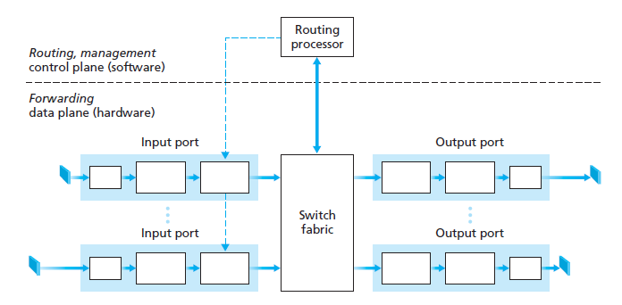

## 라우터

**입력 포트**
- 들어오는 링크의 반대편에 있는 링크 계층과 상호 운용하기 위해 필요한 링크 계층 기능을 수행한다
- 검색 기능을 수행
- 포워딩 테이블을 참조하여 도착된 패킷이 스위치 구조를 통해 라우터 출력 포트를 결정한다

**스위치 구조**
- 라우터의 입력 포트와 출력 포트를 연결한다
- 스위치 구조는 라우터 내부에 포함되어 있다

**출력 포트**
- 스위치 구조에서 저장한 패킷을 저장하고 필요한 링크 계층 및 물리 계층 기능을 수행하여 출력 링크로 패킷을 전송한다

**라우팅 프로세서**
- 제어 평면 기능을 수행
- 기존 라우터에서는 라우팅 프로토콜을 실행하고 리우팅 테이블과 연결된 링크 상태 정보를 유지 관리하며 라우터의 포워딩 테이블을 계산한다
- SDN 라우터에서는 원격 컨트롤러와 통신하여 원격 컨트롤러에서 계산된 포워딩 테이블 엔트리를 수신하고 라우터의 입력 포트에 이러한 엔트리를 설치한다

### 검색기능
- 패킷의 목적지 주소의 프리픽스를 포워딩 테이블의 엔트리와 매치
- 라우터는 최장 프리픽스 매치 규칙(longest prefix matching rule)을 사용한다

### 스위칭
- HOL(head-of-the-line) 차단(블로킹)
- drop-tail 정책
  - 들어오는 패킷을 저장할 메모리가 충분하지 않을 때 도착한 패킷을 삭제

## 참고
- [[Computer Network] Structure of Router | 라우터의 설계 구조](https://dad-rock.tistory.com/241)