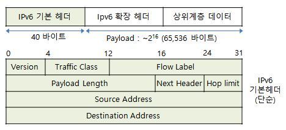

## IPv6
- IPv4(현재의 인터넷 프로토콜)의 한계를 극복하기 위해 개발
  - 주소 표현의 제약으로 인한 주소고갈, 멀티미디어서비스 대응 미약 등
- *IETF*의 IPng WG(2001.11 IPv6 으로 개칭)에서 표준화시킨, 차세대 인터넷 프로토콜

***IETF***
- Internet Engineering Task Force, 인터넷기술표준화위원회
- 인터넷의 표준화를 다루기 위해, 1986년 *IAB*의 하부조직으로 설립된 표준화 포럼(Forum)

***IAB***
- Internet Architecture Board, Internet Activity Board, 인터넷아키텍처위원회
- 인터넷의 전반적인 구조 발전과 관련된  기술적이고 정책적인 문제를 다루는 단체

## IPv6 특징 (장점)
- 주소영역이 기존 32 bit에서 128 bit로 대폭 확장
  - 넓어진 주소공간(약 32억->1038)으로 다양한 IP주소 할당 방식이 가능
- 다수의 사용자들에게 전송할 수 있는 멀티캐스트 기능
  - *Unicast*, *Multicast* 이외 *Anycast*라는 새로운 주소 개념 도입
- 주소체계가 계층구조(Hierarchy)를 가능케함
  - CIDR 기반 계층적 할당. 확장된 주소계층.
- 기본 헤더가 단순화되고 유연화됨
  - 40 바이트의 고정길이(IPv4는 가변적임)로 간소화, 따라서 더욱 빠른 처리 가능
- *확장 헤더*를 통한 확장성 지원
  - 향상된 확장 기능 및 옵션 제공.
  - 기존 IPv4의 옵션필드(IP 헤더 옵션)들이 모두 확장 헤더 필드로 옮겨짐
- 보안 문제에 대한 해결책 제시
  - 인증, 암호화, 무결성 기능 제공
- 이동성(Mobility) 지원
  - 주소 자동 설정(Address Auto-configuration) 기능
    - 임의의 LAN 상에서 MAC 주소를 라우터가 제공한 프리픽스와 결합하여 고유의 IP 주소를 생성할 수 있게하는 기능
  - 바인드 업데이트(Bind Update) 기능
  - 자동 네트워킹 등
- 서비스품질(QoS)의 보장 (자원할당의 지원)
  - 헤더에 QoS를 보장하기 위해 Traffic class(Priority) 및 Flow label 필드를 둠, 차등형 QoS 지원
  - 고속의 멀티미디어 전송에 적합
- 기존 IPv4에서 IPv6로의 호환성, *터널링(Tunneling)*과 같은 IPv4/IPv6 전환 기술 제공
  - 단, IPv4에로의 역방향 호환성은 없음

***Unicast, Multicast, Anycast***
- 유니캐스트는 1:1 통신방식
- 멀티캐스트는 1:N 통신방식
- 애니캐스트는 1:가장 가까운 1 간의 통신방식
  - 동일한 주소를 가지는 여러 목적지 장비들 중 출발지 장비와 가장 가까운 장비가 응답을 하는 통신방식

***IPv6 확장 헤더***
- IPv6는 기본 고정 헤더 뒤에 선택적인 확장 헤더들이 뒤따라올 수 있음
- IPv6 확장헤더 옵션에 따라 IPv6 라우터에서 특별한 처리가 필요하나
  - 라우터 부하경감을 위해 대부분의 헤더가 종단 호스트에서 처리하도록 설계되어짐

***터널링(Tunneling)***
- 2개의 IPv6 호스트 사이에 IPv4 망이 있을 경우에, IPv6 패킷을 IPv4 패킷 속에 캡슐화하여 사용하는 기술
  - 호스트와 라우터 간의 터널은 자동으로 설정
  - 라우터 간의 터널은 수동으로 설정

## IPv6 기본헤더(Basic Header) 필드 (8개)

- Version (4 비트)
  - IPv4 이면 4 (0100), IPv6 이면 6 (0110)
- Traffic Class 또는 Priority (8 비트)
  - IPv4일때의 *TOS* 필드와 유사
    - IP 패킷마다 서로 다른 서비스 요구사항을 구분하기 위함
    - 민감한 실시간 응용 및 긴급하지 않은 데이터 패킷 간의 차별적 구분 가능
- Flow Label (20 비트)
  - IP를 연결지향적 프로토콜로 사용할 수 있게 함
    - 실시간 서비스 등 같이 우선권을 주기위하여 특정 트래픽 Flow에 대한 라벨링
- Payload length (16 비트)
  - 페이로드부의 길이 (확장헤더 + 상위계층 데이터) < 216(65536) 까지 가능
- Next header (8 비트)
  - 기본헤더 다음에 위치하는 확장 헤더의 종류를 표시
    - IPv4의 프로토콜 번호와 같은 역할
      - e.g.  0: Hop-by-Hop Options Header for IPv6
      - e.g. 58: ICMPv6 (ICMP for IPv6)
- Hop limit (8 비트)
  - 버젼 4일때의 TTL과 같은 역할
- Source address (128 비트)
  - 발신처 주소
- Destination address (128 비트)
  - 목적지 주소
    . 만일, *소스 라우팅*일 경우에 다음 라우터 주소를 나타냄

***TOS(Type of Service)***
- IP 패킷 헤더 내 서비스 유형 및 혼잡 알림을 나타내는 8 비트 필드

- 우선순위 설정용  
- Bit 0-2 :  Precedence (우선순위 8단계)
  - 000: Routine (Normal)
  - 001: Priority
  - 010: Immediate
  - 011: Flash
  - 100: Flash Override
  - 101: Critical
  - 110: Internetwork Control (OSPF에서 셋팅됨)
  - 111: Network Control

- TOS 설정용
  -  Bit 3: Delay (지연) => 0: 보통의 지연, 1: 높은 지연
  -  Bit 4: Throughput (처리율) => 0: 보통 처리율, 1: 높은 처리율
  -  Bit 5: Reliability (신뢰성) => 0: 보통 신뢰성, 1: 높은 신뢰성
  -  Bit 6: Minimum Cost (최소비용)
  -  Bit 7: 항상 0으로 세팅됨 => 사용안함

***소스 라우팅(Source Routing)***
- 패킷을 보내기 전에 송신측에서 수신측까지 가는 모든 경로를 리스트로 만들어 두어,
  - 이를 패킷의 헤더에 넣어 보내는 방식

## 참고
- [IPv6, IPng   IP Next Generation, Internet Protocol version 6 - 정보통신기술용어해설](http://www.ktword.co.kr/test/view/view.php?nav=2&no=883&sh=IPv6)
- [IETF   Internet Engineering Task Force   인터넷기술표준화위원회 - 정보통신기술용어해설](http://www.ktword.co.kr/test/view/view.php?m_temp1=566&id=643)
- [IAB   Internet Architecture Board, Internet Activity Board - 정보통신기술용어해설](http://www.ktword.co.kr/test/view/view.php?m_temp1=1172&id=643)
- [IPv6의 통신방식 - 한국인터넷정보센터](https://www.xn--3e0bx5euxnjje69i70af08bea817g.xn--3e0b707e/jsp/resources/vsix/anycast.jsp)
- [IPv6 Extension Header, IPv6 Option   IPv6 확장 헤더, IPv6 옵션 - 정보통신기술용어해설](http://www.ktword.co.kr/test/view/view.php?m_temp1=3252&id=1065)
- [IPv4/IPv6 Transition Technology   IPv4/IPv6 전환 기술, IPv4/IPv6 변환 기술 - 정보통신기술용어해설](http://www.ktword.co.kr/test/view/view.php?m_temp1=3061&id=427)
- [IPv6 Basic Header   IPv6 기본 헤더, IPv6 헤더 - 정보통신기술용어해설](http://www.ktword.co.kr/test/view/view.php?m_temp1=3251&id=1065)
- [Source Routing   소스 라우팅 - 정보통신기술용어해설](http://www.ktword.co.kr/test/view/view.php?m_temp1=1956&id=851)
- [ToS, TOS, ECN   Type of Service, Explicit Congestion Notification - 정보통신기술용어해설](http://www.ktword.co.kr/test/view/view.php?m_temp1=2051)